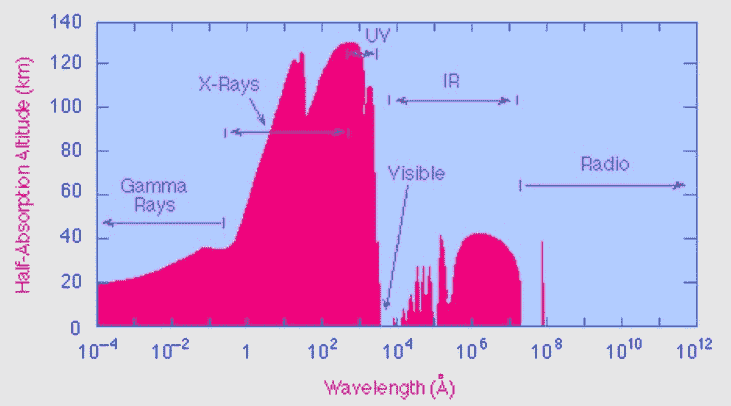

# (大气)橱窗里的那件衬衫多少钱？

> 原文：<https://hackaday.com/2021/10/26/how-much-is-that-shirt-in-the-atmospheric-window/>

夏天现在已经成为记忆，但是随着地球绕着太阳转，那些炎热多汗的日子肯定会很快回来。在一个受苦受难的人的层面上，你能做些什么呢？毕竟，一个人只能脱掉这么多衣服来帮助降温。在有人想出用沙丘制作这种泳衣的方法之前，我们需要一个临时的解决方案来包裹自己。

我们已经看到了可能用于冷却建筑物的最白的油漆，然后几个月后我们看到了一种更新、更白、更获奖的油漆[。这种涂料的工作原理是被动冷却。由于它的颜色和成分，它反射大部分光线并吸收一些热量，这些热量被辐射到中红外光谱中。它通过滑出地球的大气层窗口进入太空来实现这一点。现在，一个位于中国](https://hackaday.com/2021/04/16/new-whitest-paint-might-help-fight-climate-change/)[的团队已经将被动冷却原理应用于织物](https://arstechnica.com/science/2021/07/new-fabric-passively-cools-whatever-its-covering-including-you/)。

## 等等，什么是大气窗口？

从技术上讲，有两个大气窗口——一个在红外光谱，另一个在无线电光谱。为了讨论的目的，我们只关心红外窗口。但是让我们倒回去一点。

What gets absorbed. Image via [University of Rochester’s Department of Physics and Astronomy](https://www.pas.rochester.edu/~blackman/ast104/windows.html)

太阳辐射的能量不仅仅包括我们看到的光和感受到的热。地球上层大气吸收伽马射线、x 射线和光谱中的一些紫外线。把高层大气想象成一张毯子，保护地球免受这些有害射线的伤害。

毯子上有一个洞——或者一个窗户，如果你愿意的话——在红外范围的低端(大约 8-14 微米)，让可见光和热进来，因为没有大气气体吸收该波长。那是一个好洞；这是可居住星球的标志。所以，这就是大气窗口的含义——光和热可以双向流动。窗户让光和热进来，但更重要的是，它也让光和热逃走。这样一来，地球变得温暖而舒适，但还没到致命的程度。

## 宇宙的结构

所以，回到布料上。重申一下，被动冷却材料通过反射几乎所有的入射光来工作，防止这些高能光子加热表面。这些材料还能从它们覆盖的物体中吸收热量并散发出去。

被动冷却像建筑这样的东西是一种设置好就忘记的事情。另一方面，衣服必须柔韧、透气，而且必须经得起反复洗涤。那么，这种布料是如何工作的呢？它的大部分反射性来自二氧化钛粉末，就像某些防晒霜中的物质。这些二氧化钛纳米颗粒被嵌入到由 PLA 制成的纤维中，这些纤维在中红外光谱中发出辐射(散热)。

然后，织物进一步涂上聚四氟乙烯(PTFE)，它能反射紫外光谱中二氧化钛不能反射的部分。聚四氟乙烯是疏水的，所以它会排斥外面的水和里面的汗。这种织物是编织在一起的，而不是针织的，并且具有精心计算的孔径。在测试中，这种织物反射了超过 92%的阳光。该团队用他们的布料半覆盖一件背心，并让某人穿着它坐在阳光下。他们用红外摄像机监测人体，发现被织物覆盖的一侧比没有织物的一侧平均凉爽 3 摄氏度。

## 请给我一件衬衫——用一个快乐的扳手

这种材料似乎符合所有的条件——透气、耐洗，而且(我们认为)足够舒适，可以在沙漠中穿一整天。它也被认为是可生物降解的，但我们不得不怀疑汗液、洗衣液和[双重摩擦](https://www.greenhousefabrics.com/blog/what-are-double-rubs)可能对纤维在足够长的时间内被动冷却某人的能力产生什么影响。因为它大部分是塑料的，我们想知道它是什么感觉。

它有你想要的任何颜色，只要是白色的。好消息是可以绣花。染色是万万不可的，因为它会失去它的功能。但是如果你能对它进行修饰，你可能会使它在视觉上变得有趣并且仍然可行。由这种神奇面料制成的衬衫可能会比我们在 90 年代非常喜欢的 Hypercolor 衬衫价格更高，但至少它不会用生动的颜色向世界宣布我们的焦虑。但如果你需要不惜一切代价保持凉爽，一件大气的开窗衫可能就是你的不二之选。