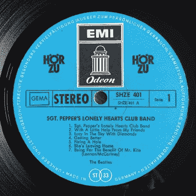

# 调频收音机，老一代人的选择

> 原文：<https://hackaday.com/2021/08/26/fm-radio-the-choice-of-an-old-generation/>

如果不是疫情颠覆了今年夏天的许多娱乐和游戏，我的许多朋友会在本月早些时候去荷兰的 MCH 黑客营旅行。我有一个关于这个活动的游戏的想法，我和一个朋友打算在营地周围隐藏一套低功率调频发射机作为数字站，让玩家找到并解决他们将发送的数字难题。我甚至从中国买了几个便宜的调频发射模块进行评估，并在北安普敦郡的一个住宅区发送了一个芯片调里克·阿斯特利，从中获得了一些乐趣。

对我这样一个伴随着调频广播长大的人来说，我的青少年时代是在英国广播公司调频广播 1 台的声音中度过的，以这种方式解谜是绝对有意义的，但这是对我个人的提醒，我发现我的一些朋友在这个问题上有不同意见。当然，他们认为这是一个伟大的想法，但他们温和地提醒我，孩子们现在不听任何传统的广播电台，而是他们的音乐流，所以很少有人有办法收听我的数字电台。甚至对我来说，我只在车里用它来收听 BBC Radio 4，而浏览 FM dial 的剩余部分是为了听一些简单的音乐、老歌和古典音乐。它正在成为老年人的媒介，不可避免的是，就像之前的我一样，它最终会衰落。

这有两个角度可能会拘留临时黑客；首先，从广播和无线电频谱的角度来看，这意味着什么，然后它如何影响我们的一些项目。

## 为逐渐消失的观众转向数字化

If you grew up listening to this, do you listen to FM? KarleHorn, [CC BY 3.0](https://commons.wikimedia.org/wiki/File:Label_LP_Sgt_Pepperjpg.jpg)

7 月，我们纪念了北美大陆上最后几家模拟 NTSC 电视台的消失。这些抵制者是所谓的“FrankenFM”电台，其声音副载波正好位于调频广播波段之下，因此可以通过调频转盘最底部的接收器接收到，为小众受众服务。奇怪的是，如果你住在一个附近，你会注意到它并没有消失，因为尽管模拟电视停止了，但调频载波仍然存在，因为 ATSC 3.0 数字广播标准中有一个特殊的怪癖，允许该频道的广播公司在模拟音频的同时发射更窄的数字多路复用。但是，考虑到最后一段中提到的年轻听众中的人口结构从 FM 转移，他们是否赢得了留在广播乐队的权利，这个乐队的日子就像刚刚被关闭的 NTSC 电视频道一样屈指可数了？

在美国，高清收音机作为 FM 的最终数字替代品已经有了一点进展，或者与模拟电台同步，或者仅作为数字电台，而在欧洲和其他地方，DAB 标准已经有了不同的影响。爱尔兰共和国[完全放弃了 DAB](https://hackaday.com/2021/03/07/the-digital-radio-era-partially-ends-in-ireland/)，挪威[完全放弃了 FM](https://www.radioworld.com/columns-and-views/norways-fm-shutdown-six-months-later) 用于新系统，而在英国，政府雄心勃勃的转换计划遭到了公众的冷漠，主要是因为作为 DAB 的第一个采用者，该国基本上仍停留在劣质的第一版上。因此，随着年轻听众逐渐长大成人，不再使用收音机，世界各地的许多政府仍在敦促转向数字广播，调频广播的日子只会越来越难过。

## 最后一个模拟第一个项目

因此，如果调频正在慢慢摆脱这个凡人的线圈，这对我们的社区意味着什么？我们很多人听调频广播吗？也许我们中的一两个人会，但是我想的影响不是老黑客。模拟收音机有一个有用的特性，就是可以通过简单易懂的组件来使用，所以它仍然是让年轻人接触电子产品的入门药物之一。

在过去的日子里，一个启动项目可能是一个晶体收音机，尽管随着调幅广播的衰落和点接触二极管变得罕见，这可能已经被搁置，但用一两个晶体管甚至[树莓皮的时钟发生器](https://hackaday.com/2012/12/10/transmit-fm-using-raspberry-pi-and-no-additional-hardware/)制作调频发射机仍然很常见。的确，今天有 Pi 的孩子可能会通过流媒体应用程序为广播体验建立一个媒体服务器，但在这里重要的是方法而不是最终结果。点燃一生兴趣的火花对每个人来说都是不同的，很难不感到其中一个火花正在变得暗淡。也许在评论中，你会有自己的想法，怎样才能引起一个对模拟电子产品有偏好的孩子的兴趣。

标题:来自美国的 Joe Haupt， [CC BY-SA 2.0](https://commons.wikimedia.org/wiki/File:Vintage_Fisher_200-T_FM_Tuner,_Made_In_USA,_Circa_1967_-_1969_(33834451005).jpg) 。