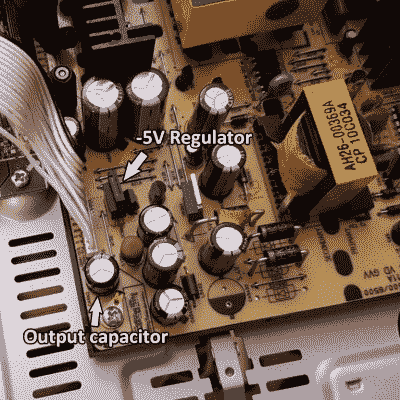

# 有缺陷的电解电容并不总是看起来很糟糕

> 原文：<https://hackaday.com/2021/07/18/faulty-electrolytic-caps-dont-always-look-bad/>

旧的电解电容器因不能像以前那样工作而臭名昭著，但是坏的电容器到底是什么样子，它会导致什么样的问题？通常坏的瓶盖会漏水或膨胀，但也不总是这样。在[Zak Kemble]的案例中，一个坏帽子[导致他的三星 HT-C460 家庭影院系统简单地显示“PROT”，然后自动关闭](https://blog.zakkemble.net/repairing-a-samsung-ht-c460-home-cinema-system/)。幸运的是，更换麻烦的瓶盖解决了所有问题，但首先发现问题并不那么简单。对设备进行目视检查，如上图所示，没有发现任何明显的问题。没有一个电容器看起来有什么异常，但无论如何其中一个就是问题所在。

The output cap had developed an internal short, but visually looked fine.

第一个可识别的问题是发现-5 V 电源仅输出约-0.5 V，两个 0805 尺寸的小电阻上有 6 V 的压降，这表明有东西吸收的电流远远超过其应有值。

测试显示-5 V 调节器没有故障，通过排除过程[Zak]最终移除了-5 V 输出上的 470 uF 输出电容，问题消失了！检查电容器没有发现任何外部故障迹象，但它出现了内部短路。[Zak]更换了有问题的帽子(并更换了其他帽子，以确保安全)，现在他期待着让他的家庭影院系统使用更多年。

当一个 PSU 断气时，坏电容几乎总是被指责，但我们之前已经看到过[找出哪个是坏的并不总是容易的](https://hackaday.com/2021/01/26/chasing-down-bad-caps-to-save-a-troubled-psu/)。对[Zak]的故障诊断有很大帮助的一件事是找到电源的完整原理图，只需搜索他在上面找到的零件号。一个很好的提醒，它总是值得扔一个零件号到搜索引擎；你可能会走运！