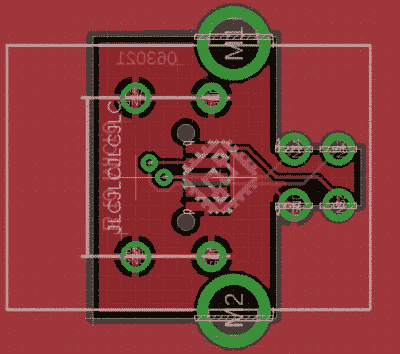

# 巧妙的 PCB 为 Arduino Uno 带来了微型 USB

> 原文：<https://hackaday.com/2021/07/21/clever-pcb-brings-micro-usb-to-the-arduino-uno/>

即使越来越多的设备转向 USB-C，Arduino Uno 仍然自豪地拥有一个相对古老的 B 型端口。毫不夸张地说，许多黑客读者只在身边保留一根这样的电缆，因为他们仍然有一根或两根需要偶尔插入的电缆。

为了至少让事情朝着正确的方向发展，[sjm4306]最近着手创建一个[简单的电路板，让他可以安装一个微型 USB 连接器，取代 Uno 最初的 Type-B](https://hackaday.io/project/180814-usb-b-to-micro-usb-adapter-pcb) 。当然，PCB 上没有元件，它只是将原始通孔尺寸调整为安装母微型 USB 端口所需的表面贴装焊盘的紧密组合。

Making castellated holes on the cheap.

设计很简单，但正如[sjm4306]在下面的视频中解释的那样，实际上这里发生的事情比你想象的要多。为了避免额外的费用，他让板屋做城堡状的洞，他通过让板的轮廓穿过标准衬垫的中心来欺骗系统。

在显微镜下，你可以看到这种方法的缺点。当钻头从电路板边缘穿出时，一些孔被撕裂，其中一些孔非常糟糕[sjm4306]提到可能没有足够的焊盘可供实际使用。虽然它们可能并不十分吸引人，但它们中的大多数都是可以使用的。为了安全起见，他说任何想在自己的设计中使用他的技巧的人应该订购比他们认为实际需要的更多的板子。

当然，你可以一路走来，用 USB-C 端口改造 Uno，[就像我们过去看到的设备一样](https://hackaday.com/2019/06/17/wireless-mouse-power-up-logitech-mx-master-gets-usb-c-and-big-battery/)。但是[最新最棒的 USB 接口可能有点复杂](https://hackaday.com/2020/05/12/neat-and-tidy-usb-c-conversions-for-legacy-devices/)，特别是对于 DIY 小工具，所以我们不能责怪他选择更可靠的方法。

 [https://www.youtube.com/embed/c1nMM70-RdU?version=3&rel=1&showsearch=0&showinfo=1&iv_load_policy=1&fs=1&hl=en-US&autohide=2&wmode=transparent](https://www.youtube.com/embed/c1nMM70-RdU?version=3&rel=1&showsearch=0&showinfo=1&iv_load_policy=1&fs=1&hl=en-US&autohide=2&wmode=transparent)

