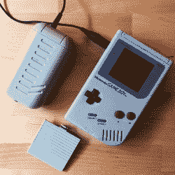

# 一个脂肪细胞为一个游戏机制造了 4AA 包装

> 原文：<https://hackaday.com/2021/07/31/a-lipo-cell-makes-a-4aa-pack-for-a-gameboy/>

昔日的电子玩具是人们渴望的奇妙物品，但也有需要电池的致命缺陷。电池比一般年轻人的零花钱还要贵，被纠缠的父母通常不愿意每隔几天就拿出来支持不间断的游戏习惯。这是[Sen]为任天堂 Game Boy 解决的问题，而不是切割设备和焊接电线，结果是[一个单元整齐地插入现有的 4AA 电池外壳](https://hackaday.io/project/180890-usb-rechargeable-lipo-pack-for-original-gameboy)。

Much more convenient than Nintendo’s own effort!

从电气上来说，这是一个简单的连接 Adafruit 模块和一个 pouch cell 的例子，但这并不是这个例子中工作的本质。取而代之的是，大量的工作和迭代已经进入 CAD 设计，以达到完美的包装。这对于今天的游戏机玩家来说肯定是一个福音，但更重要的是，它应该对拥有更多采用四节 AA 电池的设备的人有兴趣。我们中的大多数人可能会保留几包 AAs，以备不时之需，也许与此同时，像这样的东西可能是一个方便的东西。

更传统的转换诉诸于极端的手段，就像这个游戏男孩的颜色一样。