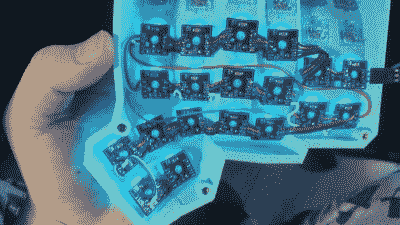

# 十个项目赢得了最新一轮的 Hackaday 奖

> 原文：<https://hackaday.com/2021/07/27/ten-projects-won-the-refresh-work-from-home-life-round-of-the-hackaday-prize/>

我们在这里，一年，改变成这个疫情，如果你是新的开始每天在家工作，肯定它现在已经失去了光泽。我们让你退后一步，评估 WFH 生活中哪些地方可以做得更好，你从那里开始，创造出我们做梦也想不到的非常有用的东西。从 100 多个参赛作品中，评委们选出了 10 个项目，每个项目的创作者都获得了 500 美元的奖金，并将在 10 月进入 2021 年黑客日奖的最后一轮。

你的原型是一堆乱七八糟的电线吗？还是你花了太多时间来确保每一件套头衫都裁剪到完美的长度？无论哪种方式，你最好使用 [breadWare，它采用一个标准的试验板，并将连接过程变成一个软件解决方案](https://hackaday.io/project/180394-breadware)。没错——借助少量模拟 CMOS 开关芯片，包括电源轨在内的任何轨都可以相互连接。

 也许你很想打造完美的键盘来装点你的工作站，但又害怕手工布线。[将每个按键开关焊接到它自己的小印刷电路板上](https://hackaday.io/project/180154-pcb-for-handwired-keyboards)，让自己轻松一些。

如果你的家庭办公室有时被需要立即关注的小人占据，你无疑会欣赏[的价值，这种设备可以在不再感测到你的存在时自动停用你的网络摄像头和麦克风](https://hackaday.io/project/180761-present-availability-sensing-for-zoom-meetings)。

你可能已经把糟糕的办公室照明抛在脑后，但是你仍然长时间暴露在蓝光下。这个项目旨在通过室内照明复制当前的室外光温度[来避免这一点。别忘了——空气质量也同样重要，所以偶尔打开一扇窗户，给自己](https://hackaday.io/project/180427-making-work-from-home-lighting-work-for-me)[一盏智能灯，它能给你精确的数字](https://hackaday.io/project/180792-loralamp-airquality)。

这是 2021 年 Hackaday 奖五个挑战中的第二个，这意味着下面链接的十个决赛选手将在 10 月底之前充实和完善他们的项目，然后进行最后一轮评审。与此同时，我们以[重新想象支持性技术挑战](https://hackaday.com/2021/07/19/reimagine-supportive-tech-for-the-newest-hackaday-prize-challenge/)开始了下一轮。向我们展示您将如何让电子产品和设备变得更易访问，更模块化、更易破解或更经济实惠。

## 在家办公挑战的十名决赛选手:

*   [劳拉灯空气质量](https://hackaday.io/project/180792)
*   [保持畅通](https://hackaday.io/project/180723)
*   [到场！Zoom 会议的可用性检测](https://hackaday.io/project/180761)
*   [面包器皿](https://hackaday.io/project/180394)
*   [用于手工键盘的 PCB](https://hackaday.io/project/180154)
*   [无摄像头的手势/模式识别:TOF！](https://hackaday.io/project/180123)
*   [让在家工作的照明为我工作](https://hackaday.io/project/180427)
*   [太阳能展示柜 v2.0](https://hackaday.io/project/180857)
*   [pnpasist](https://hackaday.io/project/179878)
*   [雷电瞄准镜](https://hackaday.io/project/180090)

如果你喜欢这些，花点时间放松一下，仔细阅读挑战赛的全部参赛作品。你应得的。

The [HackadayPrize2021](https://prize.supplyframe.com) is Sponsored by: