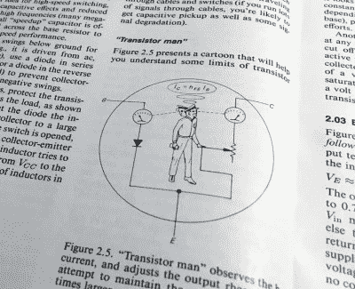

# 了解音频:放大器螺母和螺栓

> 原文：<https://hackaday.com/2021/08/24/know-audio-amplifier-nuts-and-bolts/>

随着我们沿着高保真和音频系统的轨迹，从听众的耳朵到音乐源，我们到达了放大器。在上一篇文章中，我们首次介绍了失真以及一些放大器特性会如何影响失真，接下来我们将继续讨论，看看放大器本身。你会遇到哪些类型的音频放大电路，它们的相对优缺点是什么？

## 一些放大器基础知识

Horowitz and Hill’s Transistor Man

如果你对晶体管有所了解，很可能它是一个三端器件，其输出引脚构成分压器的一部分，分压器的状态取决于输入引脚上的电压。《电子艺术》有这样一幅漫画:一个人站在双极晶体管内部，一边调整集电极和发射极之间的可变电阻，一边看着基极上的安培计。

在其导通范围内适当偏置，晶体管可以表现为线性器件，其中分压器电压以线性关系响应于输入而移动，因此输出上的电压是输出上的电压的放大版本。这是最简单的晶体管放大器，因为不同类型的放大器用字母分类，所以它被称为 A 类放大器。

A 类放大器的线性度使其成为寻求低失真的音频设计人员的良好选择，但它也有一个缺点。分压器的作用意味着无论它处于什么状态，它总是通过电流，因此晶体管必须总是能够以热的形式耗散功率。这使得 A 类放大器的效率非常低，因此一个足以驱动扬声器的放大器也必须发射与它提供给扬声器的功率相同的功率，但作为热量。因此，A 类功率放大器需要额外的冷却，以免它们变得不舒服地热，并消耗不必要的功率。市场上有 A 类音频功率放大器，但它们仍然不常见。

## 鱼与熊掌兼得:AB 类

A theoretical Class AB amplifier. The diodes ensure that the transistors are in their class A conducting region around the centre point. Fvultier, [CC BY-SA 4.0](https://commons.wikimedia.org/wiki/File:Electronic_Amplifier_Class_AB_Bipolar.svg).

A 类的低效率来自其晶体管持续导通，很可能将偏置降低到晶体管处于关断位置但仅在信号出现并推动其导通时导通的程度。这种类型的放大器被称为 B 类放大器，它通常只放大输入波形的一部分。它解决了 A 类的低效率问题，但给输出带来了严重的失真，这就是为什么除了在一些非常早期的电子管收音机中，你不会遇到它作为音频放大器的简单形式。

假设一个 B 类电路可以无失真地放大波形周期的一半，一个明显的进步是将两者结合起来；一个放大周期的上半部分，另一个放大周期的下半部分。其思想是，完整的放大波形可以从两个放大器中重构，并产生低失真和高效的结果。

这在一定程度上是可行的，但这样的电路仍然会保留一些失真，因为两个波形相遇的点几乎不可能在没有某种中断的情况下实现，这种小故障被称为*交越失真*。这个问题的解决方案来自于巧妙的偏置，它使 B 类晶体管在几乎所有的范围内工作，但也给它们足够的偏置，使它们在 A 类晶体管的中点工作，在该中点，放大器的两半从一个切换到另一个。这种配置被称为 AB 类放大器，它提供非常低的失真以及非常重要的功率效率，并构成了绝大多数模拟高保真放大器。

您可能希望我们现在转到字母表的下一个字母，描述 C 类放大器，但最终的音频配置是 D 类放大器。(C 类放大器是开关方波放大器，效率高，但失真大。它们对音频没有好处，但在射频功率放大器中有用途，LC 电路可以滤除由此产生的谐波。)

## 全数字音频放大器:D 类

大多数黑客读者都熟悉脉宽调制的概念，即通过向负载发送导通时间与关断时间比率可变的脉冲来改变输送给负载的能量。这是多少微控制器产生一个伪模拟输出，用于 LED 亮度或电机速度的线性控制，仅举两个例子。给定足够高的开关频率，PWM 可以用于编码快速变化的模拟信号，例如音频，因此 PWM 流可以被馈送到高功率缓冲器，以产生音频输出。

A basic Class D amplifier. Rohitbd, [CC BY-SA 3.0](https://commons.wikimedia.org/wiki/File:Pwm_amp.svg).

实际的 D 类放大器以这种方式使用 PWM，其输出晶体管简单地操作高速开关。这与 C 类放大器有些许相似之处，但不同之处在于，D 类放大器的开关频率是信号频率的许多倍，而 C 类放大器则以其信号频率工作。D 类放大器产生高功率 PWM 脉冲序列，通过低通滤波器网络将其转换为高功率音频，以驱动扬声器。D 类放大器的优势在于它可以提供极高的效率，这意味着它可以比线性电路更小、更轻，并且对热量管理的需求更少。

还有几类放大器值得一提，E 类和 F 类是更多的 RF 放大器，它们依靠具有短脉冲的脉冲谐振 LC 网络来获得输出，G 类和 H 类是 AB 类放大器的变体，其 PSU 可以变化以最小化恒定电流。您可能会遇到提供 G 类和 H 类放大器的 IC，但从音频角度来看，它们可以被视为更高效的 AB 类放大器。

我们已经了解了您在高保真系统以及您拥有的每一台音频制作设备中会发现的放大器背后的电路拓扑。那么，问题是:A 级、AB 级和 D 级哪个更好？答案并不是一成不变的，因为放大器的性能不一定取决于它的原理，而是取决于它的设计者如何执行它。有可能在所有上述拓扑结构中制造音频放大器，它们要么真的很糟糕，要么听起来很精致，所以也许最好不要太纠结于此。A 类放大器给你吹嘘的权利，让你的房子温暖，AB 类放大器是你会在大多数高保真音响中找到的，D 类放大器会更轻更酷。放大器:好了，我们修好了！