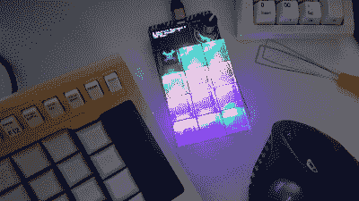
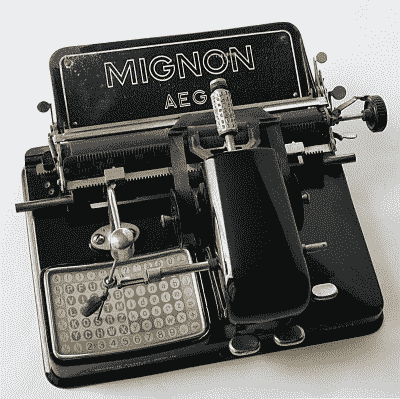
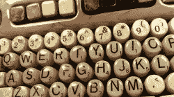

# 和克里斯蒂娜一起“基宾”:有索引打字机的那个

> 原文：<https://hackaday.com/2021/08/25/keebin-with-kristina-the-one-with-the-index-typewriters/>

你可能已经注意到，我忘了为最后一篇文章写一段介绍性的段落——我想，我只是太兴奋了，没有进入键盘和键盘配件。我不能保证我在这里总有话要说，但是这周我肯定会说:谢谢你给我的所有建议！读者使 Hackaday 变得伟大，这个小小的键盘综述专栏也不例外。精彩的饲料，伙计们！

## 卡米纳·查莫隆

[![[deshipu]'s DIY keyboard with various center modules](img/a24ca7954d6c302335a257a620bb1c03.png)](https://hackaday.com/wp-content/uploads/2021/08/deʃhipu-Kamina.png) 

这是【deʃhipu]'s 日报司机。轰鸣！像任何值得拥有烙铁的键盘发烧友一样，[deʃhipu]一直在尝试终极键盘——理想情况下，一个运行 CircuitPython 并成为高速打字的伟大日常驱动程序的键盘。

最新的版本是卡米娜，它是一个一分为二的整体，有一个细长而不拥挤的大脑。[deʃhipu]从拆分普朗克布局开始，展开它，添加一个数字行，最终，在右手边多了一列凯尔巧克力。只要开叉适合你的肩膀，一件式开叉就很棒，因为一切都在原位。当你移动它的时候，它的两个部分就像一个整体一样移动，你不必像两件式的那样去打乱它的位置。当然，因为是他自己设计的，所以很合适。

这里真正酷的是中心模块概念。它很实用，看起来很漂亮，只要不妨碍打字，看起来很理想。到目前为止，[deʃhipu]已经制作了几个不同的版本，带有操纵杆、编码器和按钮，目前正在制作一个带有[home 按钮](https://hackaday.io/project/180472-home-button-for-keyboards)的版本，为手机制作，以利用其内置的光学触摸板。

## 埃斯里尔尼斯看起来不错

这是[es rille NISSE 键盘](http://www.esrille.com/keyboard/)，它有两种尺寸！好吧，这两种尺寸看起来没什么不同，但关键的间距规格却不一样。对我来说，这看起来像一个更好的 Alice 和正交布局。这些蝙蝠翅膀美女对我来说是新的，但它们已经存在了几年，可能在日本以外很难发现。虽然 Esrille 似乎不制造任何其他键盘，但他们确实制造了一种基于 Raspberry Pi 计算模块的便携式 PC。

Image via [Esrille](http://www.esrille.com/en/keyboard.html).

我喜欢一件式开叉，如果做得好的话，这件看起来非常完美。我哪里知道？你可以打印出一个手工纸版来试试这两个尺寸中的任何一个。我没有走那么远，但你可以打赌，我在一个新标签中打开了小尺寸的图片[，并把手放在屏幕上测试布局。](http://www.esrille.com/keyboard/img/papercraft-175.png)

我特别喜欢这个东西上的拇指串和里面的键，但我认为最里面的拇指键使用起来太痛苦了，我可能只会用我的食指。我很想买一个，但是有点太贵了，尤其是小的那个更贵。(那是怎么回事？)好消息是固件是开源的。除此之外，人们还可以制作自己的纸艺模型。查看[xahlee]的网站上的评论和更多尼塞犬和类似的基布犬的照片。

## 看看这个:制作双镜头聚氨酯键帽

键帽上贴图例的方法不止一种，双摄法绝对是最持久的。双镜头键帽有点像它们听起来的样子——它们由两部分组成；一个用于图例，一个用于键帽的其余部分。双摄键帽很牛逼，因为你感觉不到图例，也不可能让它们磨掉。它们是永恒的，制作它们需要一个复杂的过程。

这个戏剧性的视频设置为*骑女武神*并没有提供太多的解释，但你会看到这个为期三天的过程中的每一步都在感觉上超过了五分钟。它从一个用乐高积木做的模具开始，所以你可能认为这是你可以在一个周末轻松完成的事情，但它很快就变得复杂了。

非常感谢[因内·莱姆斯特拉]和[赞·阿特金斯]为我们提供的提示。系统起作用了！

 [https://www.youtube.com/embed/VIRkCXVwoXk?version=3&rel=1&showsearch=0&showinfo=1&iv_load_policy=1&fs=1&hl=en-US&autohide=2&wmode=transparent](https://www.youtube.com/embed/VIRkCXVwoXk?version=3&rel=1&showsearch=0&showinfo=1&iv_load_policy=1&fs=1&hl=en-US&autohide=2&wmode=transparent)

## 新热点:Adafruit 的 RP 2040 Macropad

我得到了我的阿达果阿达盒这个星期和(剧透警报！)它以他们的[基于 Raspberry Pi RP2040 的 macropad](https://learn.adafruit.com/macropad-hotkeys) 为特色。这里的想法是，你可以滚动和选择不同的宏组配置文件与旋转编码器给你几乎无限的绑定在一个小包装。您可以使用 RGB 来区分菜单，并在有机发光二极管上获得足够的空间来显示匹配矩阵中出现的 12 个键的简短标签。

Check out that glowy Jolly Wrencher!

Adafruit 用 Kailh reds(线性开关)发出了这些，这完全不是我的果酱，但我知道 linears 很受欢迎，我想与其让一群人陷入烦恼，不如保持沉默。我一开始用了十几个 Cherry MX clears，但是那些都是全黑外壳，也不允许 RGB 通过(尽管我觉得它们看起来很酷)。这里的图片是 Kailh box whites，它有透明的上部外壳，顶部有随附的半透明 DSA 键帽。

是的，左上角是一个快乐的扳手！我非常幸运地收到了一个制作了 16 年的极其限量版的 Hackaday 键帽(感谢 pt！).如果你错过了我们与 Adafruit 工作人员的 [Python Your Keeb Hack Chat](https://hackaday.io/event/180454-python-your-keyboard-hack-chat-with-adafruit) ,那就去看看这个键帽双摄美照的视频吧。我还不确定我会用我的宏面板做什么。我倾向于与工作相关的快捷方式，或者可能创建某种需要转动旋转编码器并以某种方式按键的游戏。

## 历史噼啪声:索引打字机

The AEG Mignon, which had interchangeable fonts and character sets. Image via [Wikimedia Commons](https://commons.wikimedia.org/wiki/File:Mignon_Mod.4,Bj.1924.jpg)

索引打字机发明于 1880 年，到 20 世纪 40 年代就不再流行了。之所以这样称呼它们，有两个原因:或者是因为它使用指针从字符索引中进行选择，或者是因为您使用食指来操作指针。

在这两种情况下，指针都机械地链接到打印字符的相应类型元素，在做出选择后，您只需推动一个控制杆即可进行键入。第二个杠杆完成空格键的工作。

这些年来，有几种不同风格的索引打字机，许多设计都很有趣。与打字机相比，它们都相对小巧轻便，而且没有键盘，制造成本更低。因此，索引打字机主要面向忙碌的作家。

索引打字机仍然以手持压纹机的形式存在，这种形式早于今天的电子标签制造商。许多标签制作机和索引打字机是按字母顺序排列的，有些有自己的非 qwerty 布局。

## 以防你错过了

你听说过磁性霍尔效应按键开关吗？你打赌他们是克拉克的高度。嗯，[【risk able】用现代的手法让它们重新流行起来。这些是磁分离开关，在某种意义上说，启动迫使两个磁铁分开，是的。但它们也是磁悬浮开关——键帽中没有弹簧，而是有第三块磁铁来帮助它返回原位。](https://hackaday.com/2021/08/02/mag-lev-switches-are-the-future-of-clacking/)

[![[riskable]'s clacky magnetic switches](img/d5469a19627c87c540203f56d80705d7.png)](https://hackaday.com/2021/08/02/mag-lev-switches-are-the-future-of-clacking/mag-lev-void-keyswitches-800/)

有什么比 IBM 型更好的？如果你问我们，我会说不多，但后来我们看到[史蒂夫·m·波特]拿走了所有这些可爱的弯曲弹簧开关，[给它们手工制作的木制键帽，上面有拼字瓷砖贴面](https://hackaday.com/2021/08/03/wooden-keyboard-with-scrabble-tiles-goes-the-extra-mile/)。多么高分的身材啊！

* * *

有关于键盘的热门提示吗？通过发送一两个链接来帮助我。不想让所有的黑客抄写员看到它？欢迎[直接给我发邮件](mailto:kristinapanos@hackaday.com?Subject=[Keebin' Fodder])。