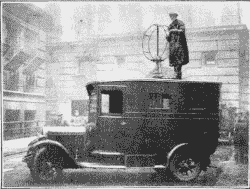
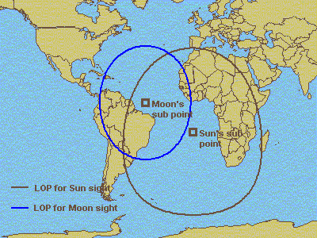
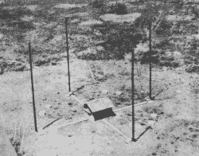
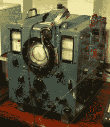

# 收音机在哪里？测向简史

> 原文：<https://hackaday.com/2021/08/19/wheres-that-radio-a-brief-history-of-direction-finding/>

我们认为无线电导航和测向是相当现代的东西。然而，它可能会让你吃惊，方向发现几乎和无线电一样古老。1888 年，Heinrich Hertz 注意到当环形天线处于一个方向时信号最强，旋转 90 度时信号最弱。到了 1900 年，实验者注意到偶极天线表现出类似的行为，不久之后天线就开始旋转，以最大化信号或定位发射机。

British radio direction finding truck from 1927; public domain

当然，有一个问题。实际上，你无法分辨天线的哪一侧是指向信号的环路还是偶极子。因此，如果天线指向北方，信号可能指向北方，但也可能指向南方。尽管如此，在某些情况下，这已经足够了。

约翰·斯通在 1901 年为这样的系统申请了专利。著名的无线电实验家德·福雷斯特也在 1904 年拥有了[一个新颖的系统](https://patents.google.com/patent/US771819A/en?oq=771%2c819)。这些系统都存在各种各样的问题。在短波频率下，多径传播会干扰接收机，而长波信号需要非常大的天线。大多数天线都是可移动的，但是有些——比如马可尼的一个——使用了多个元件和一个开关。

但是，在一些特殊情况下，这些限制是可以接受的。例如，20 世纪 30 年代，当泛美航空公司需要在海洋上空驾驶飞机时，在泛美航空公司之前就在 RCA 工作的 Hugo Leuteritz 在机场使用环形天线来定位飞机上的发射机。因为你知道飞机必须在天线的哪一边，双向探测不成问题。

## 基本导航

无线电导航在很大程度上归功于普通的天体导航和测量。你看到的不是灯塔、太阳或星星，而是无线电发射机。

Using the sun and moon gives two circles (lines of positions) and you can assume your ship is not over dry land around Argentina or Paraguay. Public domain.

假设你在一个有旗杆的地里，你知道旗杆的确切位置和高度。如果你在野外的某个地方，想知道自己在哪里，可以用杆子。你看着杆子，测量与杆子的角度。既然知道了高度和角度，就可以用几何学在你必须在的杆子周围画一个圆。

当然，你可以在圆圈上的任何地方——航海家称之为位置线。但是如果你有两根杆子呢？你可以画两个圆。如果你幸运的话，这两个圆将恰好在一点相交，这就是你所在的位置。然而，更常见的是有两个点——据推测——一个离你应该在的地方很远，一个离你应该在的地方很近。

即使是简单的一对环，如果它们相距足够远，你也可以做同样的动作。如果站一显示 30 度的角度(或 210 度；二号站显示 300 度角，您可以通过绘制两条线并记录它们的交叉点来进行三角测量。

## 丰富

A 2 MHz Adcock installation; public domain

即便如此，还是需要更好的东西。1909 年，埃托雷·贝利尼和亚历山德罗·托西引进了一项创新。Bellini-Tosi 系统使用两个直角天线为线圈供电。第三个线圈在线圈内部移动来寻找方向。这使得大型天线保持静止。到 20 世纪 20 年代，这种情况非常普遍，一直持续到 20 世纪 50 年代。

到 1919 年，英国工程师弗兰克·阿德考克(Frank Adcock)提出了一个使用四个垂直天线的系统，这些天线要么是单极天线，要么是偶极天线。这种安排将天线连接起来，有效地形成一个忽略水平极化信号的方形回路，从而减少了天波的接收。阿德考克天线经常与贝里尼-托西探测器一起使用。

## 雷击

Huff Duff gear; Photo by Rémi Kaupp CC-BY-SA-3.0

1926 年，英国人罗伯特·沃森-瓦特试图探测闪电来帮助飞行员和水手避开风暴。闪电信号的速度非常快，但一名经验丰富的操作员只需要大约一分钟就可以排列好贝里尼-托西探测器。通过耦合一个 Adcock 天线和一个示波器，瓦特能够迅速锁定一个闪电或无线电发射机。

军用高频测向仪(huff-duff)在战争中被证明是非常宝贵的。德国 U 艇保持短距离传输以避免被发现，但有了哈夫达夫，这并不重要。德国人没有搞清楚技术进步，估计 25%的潜艇沉没是由于哈夫达夫。

## 现代

现代系统使用锁相环和其他技术更加复杂。虽然一些早期的系统，如泛美航空公司使用的系统，在飞机上使用发射机，在地面上使用接收机，但大多数系统都是相反的。老式的自动测向装置使用机动天线来定位已知的发射机。现代电视机使用带有多个天线的马可尼系统，尽管在这种情况下开关是电子的。

业余无线电爱好者喜欢猎狐——世界上大多数地方都称之为“无线电运动”的一部分——这基本上是用无线电发射机玩的捉迷藏。你可以在下面的视频中看到更多。

 [https://www.youtube.com/embed/yR2cpd0vQdM?version=3&rel=1&showsearch=0&showinfo=1&iv_load_policy=1&fs=1&hl=en-US&autohide=2&wmode=transparent](https://www.youtube.com/embed/yR2cpd0vQdM?version=3&rel=1&showsearch=0&showinfo=1&iv_load_policy=1&fs=1&hl=en-US&autohide=2&wmode=transparent)

你可能认为 GPS 已经让无线电测向成为过去。然而，如果你仔细想想，GPS 是一种不同形式的无线电测向。不是使用天线的方位，而是测量信号到达时间，但这是相同的想法。时间延迟让你从卫星的已知位置绕一圈。绕着多颗卫星转几圈会给你一个准确的位置。

当然，这项技术与赫兹的环形天线相去甚远。但是无线电导航仍然是现代导航系统的关键部分。