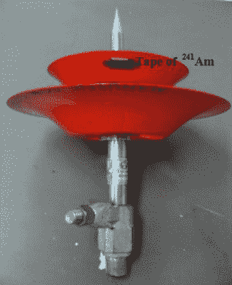
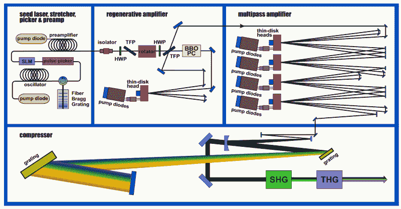
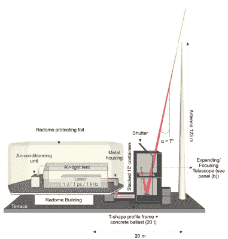

# 激光和闪电:用技术挫败雷神

> 原文：<https://hackaday.com/2021/08/17/of-lasers-and-lightning-thwarting-thor-with-technology/>

我们大多数人不会花那么多时间去思考闪电。我们不时会听到一些奇迹般的新闻故事，关于一个刚刚躲过第四次雷击的人，但除此之外，闪电可能不会在你的日常生活中发挥那么大的作用。除非你在航空航天、无线电或一长串必须应对其破坏性影响的其他行业工作。

自从 18 世纪中期，本·富兰克林进行了他的传说中的风筝实验，人类就一直试图保护东西免受雷击。他发明了第一根避雷针，一根顶端是黄铜的铁竿。他推测指挥会从雷雨云中引出电荷，他是对的。从那时起，避雷针设计领域就没有真正的飞跃。从本质上讲，它们仍然是一根金属棒，可以吸引雷击并将能量安全地分流到地球中。就像本·富兰克林在 18 世纪第一次做的那样，它们今天仍然被安装在建筑物上，以防止雷击，并且做得很好。虽然这对于大多数结构都很有效，比如你的房子，但在某些情况下，一根高高的金属杆是不够的。

## 被动雷电保护(和放射性选项)

有时候，你想要保护的东西是一根高高的金属杆。无线电塔是优秀的避雷针，很难保证云会选择在附近的极点而不是塔本身释放它们被压抑的电子。发射塔或天线上使用的雷电保护类型取决于应用——许多业余无线电爱好者使用避雷器来保护他们的设备。这些小盒子充当天线馈线的通道。它们直接接地，在闪电击中天线的情况下，设计用于为所有额外电荷提供快速接地路径。

我们中的许多人还安装了辅助系统——例如，自动天线断开——以防一些多余的能量“漏过”避雷器。所有这些都是为了保护小屋中昂贵的设备，而不是天线本身，在遭受直接雷击后，您可能需要更换天线。如果我们想完全防止雷击呢？

The radioactive tip of an old lightning rod. Source: [*Management of Radioactive Disused Lightning Rods*](https://inis.iaea.org/collection/NCLCollectionStore/_Public/46/015/46015526.pdf) (PDF)

嗯，传统的避雷针*确实有帮助。正确安装的雷电保护系统(LPS)可以提供大量吸引人的目标，使闪电能够安全击中，从而降低天线或发射塔被击中的几率。科学家们甚至试图找到让这些替代目标更有吸引力的方法。*

早在 20 世纪初，人们认为在杆子顶端拍打一点放射性物质有助于吸引闪电。这个想法是放射性物质会部分电离周围的空气，使这个地区更有吸引力。一些国家在 20 世纪 70 年代采用了这种方法，但很快发现，在实践中，这种方法并不像理论上所说的那样有效。与传统品种相比，没有足够显著的改进，特别是考虑到杂散放射源可能引起的明显的健康和安全并发症。到 1990 年，许多国家已经禁止销售它们，并且它们已经被停止。

不管有没有放射性，防雷系统都会变得笨重。以机场为例。如果我们想在飞机起飞和降落时保护飞机，我们需要用避雷针和接地线覆盖一大片区域……由于显而易见的原因，一大片区域变得飞机无法通行。

## 照亮道路

最近发表的一篇论文也许能够提供一种选择。它详细介绍了激光避雷针(LLR)项目，顾名思义，该项目旨在用光柱制造避雷针。本质上，一束极其强大的激光指向天空，沿途与常规避雷针相交。光束在其体积内电离空气，产生一种“电线”，将雷击引导到避雷针中。LLR 团队已经提出了用于保护建筑物、火箭和机场的系统，甚至推测可以在机场周围使用一系列激光器来保护大片区域(当然，当飞机接近时，激光器可以选择性地关闭)。问题中的激光是一个复杂的系统，由通快公司制造的发射器[发射脉冲。光束被放大到 800W 左右，脉冲频率为 1kHz，每次脉冲持续时间约为 1ps。该系统的绝对最大功率并未给出，但](https://www.trumpf.com/en_INT/press/global-press-releases/press-release-detail-page/Press/a-super-laser-on-saentis-mountain-trumpf-fires-up-laser-lightning-rod-in-swiss-alps/)[团队的领导者 Jean-Pierre Wolf 告诉 CNN，“峰值功率下的单个脉冲相当于世界上所有核电站产生的脉冲”](https://us.cnn.com/2021/07/12/europe/laser-lightning-rod-wolf-spc-intl/index.html)——这听起来可能有点夸张，但我无法在论文中找到准确的数字。

Smoke (okay, hopefully not) and mirrors: a diagram of the laser lightning rod. Source: [*The laser lightning rod project*](https://www.epjap.org/articles/epjap/full_html/2021/01/ap200243/ap200243.html) EPJAP CC-BY 4.0

The LLR system deployed at Säntis. Source: [*The laser lightning rod project*](https://www.epjap.org/articles/epjap/full_html/2021/01/ap200243/ap200243.html) EPJAP CC-BY 4.0

该团队已经建立了该系统的原型，并将其部署在瑞士阿尔卑斯山最高的山峰 Sä ntis 山顶的通信塔上。正如所料，该地区最高的山峰上的高大金属结构对雷击并不陌生。事实上，平均每年它被点击大约 100 次。

LLR 团队将令人咋舌的 *29 吨材料和设备*拖到山顶(听起来有点耳熟？在推特上查看[最近的黑客挑战](https://twitter.com/hackaday/status/1423459499050881031)。经过大约两周的设置和测试，激光器已经准备就绪。七月中旬，第一系列的实验开始了，该团队预计当实验在九月的某个时候结束时，会有一些数据需要处理。与此同时，他们只是希望有一些恶劣的天气。

对于今天的绝大多数防雷需求来说，高功率激光可能有点大材小用(除非你正在建造世界上最安全的业余无线电窝棚，拥有数百万美元，并能说服当地政府让你向天空发射激光)，但这项研究无疑是有趣的。毕竟，当你把激光放入混合物中时，有什么东西不是立刻变冷的吗？我们甚至见过激光车头灯！与许多新技术一样，我们将密切关注这一技术(当然，要有适当的激光安全护眼)，并期待有一天，它不再像《星际迷航》中的天气控制矩阵那样，成为一个可行的甚至无处不在的雷电保护系统。

 [https://www.youtube.com/embed/9XuAX-L2xxo?version=3&rel=1&showsearch=0&showinfo=1&iv_load_policy=1&fs=1&hl=en-US&autohide=2&wmode=transparent](https://www.youtube.com/embed/9XuAX-L2xxo?version=3&rel=1&showsearch=0&showinfo=1&iv_load_policy=1&fs=1&hl=en-US&autohide=2&wmode=transparent)

