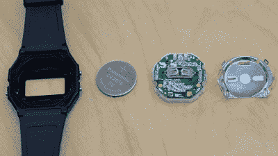

# 手表印刷电路板交换必须在空中

> 原文：<https://hackaday.com/2021/08/08/wristwatch-pcb-swaps-must-be-in-the-air/>

我们看到更多的手表 PCB 交换项目，是因为更多的人在从事这些项目，还是因为我们看到了一个，他们就在我们的脑海里？这个世界可能永远不会知道，但当涉及到设计限制时，这里有一个非常有趣的挑战，既要在注塑成型的外壳内安装您的电子魔法，又要在电力预算中让您的创作依靠电池电力运行。

就在今天早上，我们遇到了乔伊·卡斯蒂洛的传感器手表项目。他选择卡西欧 F-91W 作为捐赠腕表。它拥有卡西欧经典的分段液晶显示屏外观，能够显示小时、分钟、秒以及日期。但额外的好处是，我们知道这些产品具有良好的防水性能，同时还为用户输入提供了三个按钮。当然，它比本周早些时候我们看到的【戴夫·达科】在上工作的[粉色计算器手表的按钮少，但是你会相信哪个呢？](https://hackaday.com/2021/08/01/living-the-dream-new-pcb-for-a-dirt-cheap-calculator-watch/)

 

更换 PCB 尺寸使用相同的电池触点和 CR2016 供电[via[@ Jose Castillo](https://twitter.com/josecastillo/status/1423057482738552834)]

我们看到[Joey]也选择使用 ATSAML22 微控制器，并解释了原因:它包括一个内置的分段 LCD 控制器！如果你和我们一样是外设爱好者，你可以[阅读数据手册](http://ww1.microchip.com/downloads/en/DeviceDoc/60001465A.pdf#_OPENTOPIC_TOC_PROCESSING_d109e261469) (PDF)第 924 页上的 SLCD 控制器，它本身就是一个完整的数据手册。

传感器手表的传感器部分是一个柔性印刷电路板分线点，允许您根据需要更换任何传感器。在[Joey's]工作台上回流的第一个是 BME280 湿度传感器，它显然对所包含的温度测量非常有用，但也许它也可以在水分进入时发出警报？[乔伊]说你可以换其他部分，只要它们在 QFN 或 LGA 的尺码范围内。我们认为 IMU 是合适的，因为那里有很多有趣的交互，比如手表对放置在你面前的位置做出反应，或者接受基于 tap 的输入。

我们认为从捐赠手表开始是明智的，因为完成一个案例，尤其是防水的案例，是 97%的成功。但是当你的 UI 是手表世界独有的时候，有时候你需要[像这个木字钟腕表](https://hackaday.com/2017/08/25/wooden-word-wristwatch-wows-woomies/)一样从头开始。