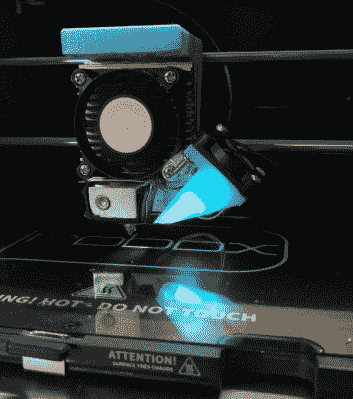

# RAMPS Rebuild 让 Robox 3D 打印机远离垃圾箱

> 原文：<https://hackaday.com/2021/08/07/ramps-rebuild-keeps-robox-3d-printer-out-of-junk-bin/>

3D 打印机是一项了不起的发明，但它像每台长时间运行的机器一样需要维护。[Rob Ward]有一台使用已久的 Robox 3D 打印机，需要进行一些维修，但是将必要的替换部件运送到澳大利亚成本太高。与其看着心爱的打印机作为电子垃圾被废弃，[他决定用更容易获得的组件来重建它。不幸的是，Robox 的专有软件和设计使这有点困难，所以它被认为是大脑移植的最佳途径。](https://hackaday.io/project/175534-robox-recovery)

第一步是推断马达是如何工作的。备用的 RAMPS 1.4 板和 Arduino Mega2560 完成了限位开关和 XYZ 电机的短暂工作。这主要是通过拼接到多氯联苯本身来实现的。鲍登灯丝驱动电机有一个灯丝检测器和一个光学行程传感器，这需要一点额外的调整，但现在具有挑战性的任务是下一个:挤压。

The printer’s new custom hotend.

利用网上拍卖行提供的廉价 CR10 热端，[Rob]开始修改灯丝馈送，以与 Robox 的设计方向不同的方向馈送(灯丝以 90 度角进入库存 Robox)。需要一个风扇来冷却长丝进料线。最初的结果混合了细丝中的许多堵塞和阻塞。一个更好的热端和一个更平滑的路径制造更可靠的打印加工铝支架。

最初的床加热器是一个优秀的加热器，但它是一个 240 VAC 加热器。他不愿意让高电压通过他被黑的系统，他把它们换成了 12 VDC 的粘合垫。MOSFET 和 MOSFET 缓冲器允许床达到可用于 PLA 的温度。[Rob]升级到运行 Marlin 2.x.x 的 GT2560。

有了一台可靠的机器，[Rob]退后一步欣赏自己的作品。然而，转换到饲料是垂直于床面已经减少了他的整体建设高度。通过 OpenSCAD 中的一些建模和标准硅胶袜子的一些巧妙使用，他有了一个解决方案，将电线送入热端的背面，允许回收一些构建高度。

这是一个长达 12 个月的工作，但写起来是一种享受。他在打印机上包含了替换零件的 STL 和 SCAD 文件。如果你有兴趣看到更多的机器被改造，为什么不看看这个被赋予了新大脑的针织机呢？