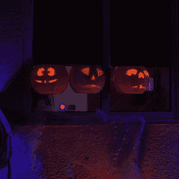
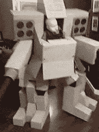

# 新竞赛:万圣节黑客节

> 原文：<https://hackaday.com/2021/08/10/new-contest-halloween-hackfest/>

仿佛万圣节是为硬件黑客而生。当我们为这个大日子装饰我们的房子和我们自己的时候，这个世界正在乞求我们建造一些更聪明的东西。有一件事是肯定的:黑客一族永远不会失望。今年，在赞助商 Digi-Key 和 Adafruit 的帮助下，我们通过[万圣节黑客节(Halloween Hackfest)完全接受了这一点，这是我们今天开始的最新比赛。](https://hackaday.io/contest/180664-halloween-hackfest)

The animated video combined with the 3D-printed prop makes for an excellent effect.

等等，现在不是八月初吗？为什么我们要谈论万圣节？拖延者的 dillema，这就是为什么！现在就开始建造吧，等到这一天真正到来的时候，它将会是史诗般的。给不给糖就捣蛋的人装饰是一个好的开始。对我们来说，投影头像是一个非常酷的派对把戏，比如这些[唱杰克-o-latens](https://hackaday.com/2020/10/30/animated-pumpkins-sing-and-scare-on-halloween/)，或者这些[受迪士尼鬼屋](https://hackaday.com/2011/01/10/halloween-hangover-talking-heads/)启发的无实体头像。或者也许你更像是一个藏在南瓜里的[喷火器](https://hackaday.com/2019/05/10/its-never-too-early-to-prepare-for-halloween-with-flamethrowers/)类型的人？

将一件好的服装变得栩栩如生并不需要太多的技术——几个 LED 灯就能让一件普通的旧公主裙点亮夜晚，并为穿着它的幸运小家伙留下一些永久的记忆。说到记忆，我们怀疑小家伙会记得[这套机甲战士家族服装](https://hackaday.com/2015/12/23/baby-armaments-are-not-to-be-messed-with/)，这就是为什么你总是要把这些事情拍成视频。

 这些年来我们已经看到[送糖果的爪式机器](https://hackaday.com/2018/07/19/mario-candy-machine-gamifies-halloween/)，甚至[一架南瓜钢琴](https://hackaday.com/2017/10/31/pumpkin-piano-promises-a-gourd-time/)。当然，南瓜雕刻本身是一个完整的类别[，五轴数控机床](https://hackaday.com/2020/10/29/five-axis-pumpkin-carving/)是公平的游戏。环顾四周，获得灵感，并建立一些东西！

前三名获奖者将获得 Digi-Key 零件仓库价值 150 美元的购物礼包。如果你的建筑碰巧使用了 Adafruit 板，你的奖励将会翻倍。我们还将向最具艺术价值的项目颁发价值 50 美元的 Tindie 礼品卡。

现在就开始在 Hackaday.io 上创建项目页面。在项目页面的左侧栏中，使用“提交项目至”按钮进入[万圣节黑客节](https://hackaday.io/contest/180664-halloween-hackfest)。从现在起到 10 月 11 日，你可以在你做的食物上撒上~~豆~~南瓜籽。