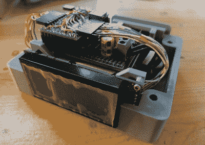

# 精确的数字时钟与 FPGA 保持同步

> 原文：<https://hackaday.com/2021/08/08/accurate-digital-clock-keeps-ticking-with-fpga/>

即使是我们当中最守时的人也满足于将他们的时钟与外部时间源同步，如导航卫星星座、网络时间服务器、频率控制的交流电源，或由、CHU 和 DFC77 等无线电台广播的信号——但[zaphod]不满足。在多年来制造了几个更传统的时钟后，他将目光投向了制造一个不依赖外部同步的[完全隔离的数字时钟](https://hackaday.io/project/180005-a-digital-real-time-clock)(除了在第一次上电时初始化时间)。

 他给自己定的精度目标是卡西欧 F-91W 腕表的精度，规定每月保持+/- 30 秒(约 12 ppm)。设计的核心是一个恒温晶体振荡器，其稳定性在十亿分之一位数。

累积时间的计数器链是在 FPGA 中实现的——不可否认是多余的，但是[zaphod]也想为这个项目学习 FPGA 编程。ATmega328 驱动显示器并执行其他记账任务。整个设计被分割成三个印刷电路板，这些电路板安装在一个定制的 3D 打印外壳中。

[赞福德]做了一份详尽的工作来记录他的构建，包括过程中的错误和失败。我们喜欢他在项目结束时写的诚实的总结，指出了可以改进或应该以不同方式完成的事情。请务必查看 GitHub 库，所有的源代码和 PCB 设计文件都发布在这里。如果你还戴着手表，你的手表有多准？