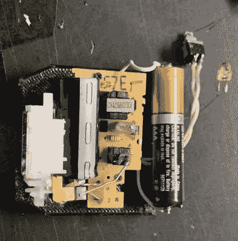

# 定制相机闪光灯专为隐形而打造

> 原文：<https://hackaday.com/2021/08/09/custom-camera-flash-is-built-for-stealth/>

当[约书亚·伯德]开始涉足电影摄影领域时，他被旧技术对光的极度渴望所吸引。临时的照明解决方案产生了复杂的结果，他很快意识到他需要一个真正的相机闪光灯。然而，他在网上找到的所有选项都又大又笨重；在某些情况下比相机本身还大。借用他的话说，“(他)不太想像狗仔队一样出现在聚会上”。因此，他开始创造自己的紧凑型闪光灯。

被一次性相机闪光灯的小尺寸和简单操作所打动，[约书亚]从一台旧富士中取出一个模块，并以此为基础进行设计。一个现有的原理图允许他将点火电路连接到佳能的热靴上，而没有将电容器的 300 伏电压通过相机的风险。完成后，他只需要为整个项目制作一个 3D 打印的外壳，并使用捐赠的一次性部件组装它。

当然，由于它来自一台本该被扔进垃圾桶的相机，这种闪光灯只是为特定的快门速度、光圈和胶片而设计的。体积更大的现成闪光灯有更多的设置可用，在各种环境下更有能力。但是[约书亚]建造了他所需要的东西。他现在有一个光滑，低调的外部闪光灯，在亲密的环境下工作很好。我们很高兴看到摄影结果。

这不是我们看到的第一个给一次性闪光灯注入新生命的摄影黑客。然而，有些人看到的远不止旧闪光灯中的一台摄影设备，而是美学上令人惊叹的结果。

[via [reddit](https://www.reddit.com/r/AnalogCommunity/comments/oumau5/i_couldnt_find_a_small_camera_flash_for_my_canon/)