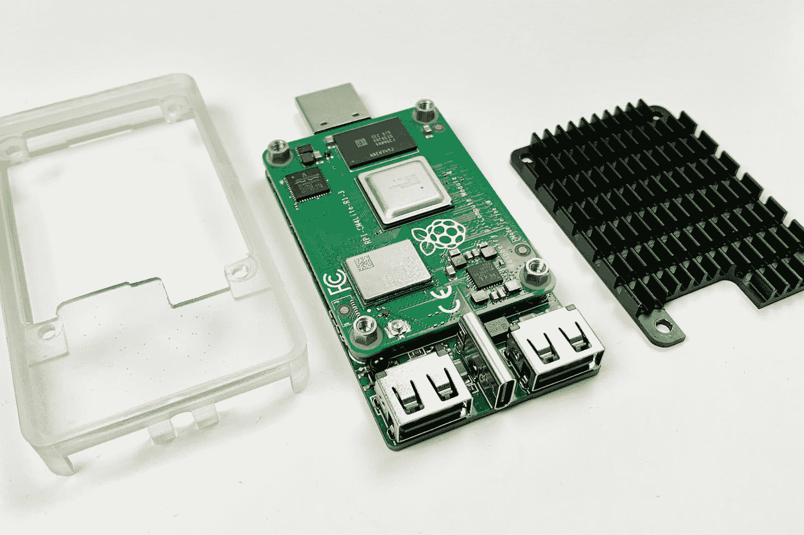
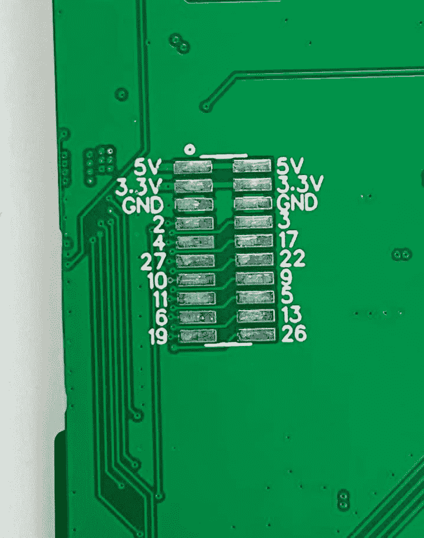

# 你如何在棍子上做树莓馅饼？

> 原文：<https://hackaday.com/2021/08/24/how-do-you-make-a-raspberry-pi-on-a-stick/>

我们同意[magic-blue-smoke]的观点，唯一比标准的 Raspberry Pi 4 更有趣的事情是计算模块外形。如果它们不是注定要嵌入到系统中，那么它们需要一个分线板来使用。每个都可以定制无数的板形状和端口，这才是真正的乐趣所在。我们已经看到了包括定制载板的项目，从 [3D 打印机](https://hackaday.com/2021/05/01/3d-printer-control-board-packs-a-raspberry-pi-compute-module-4/)到 [NAS](https://hackaday.com/2021/04/08/compute-module-4-nas-with-custom-carrier-board/) ，还有一个项目表明我们可以[在家里制作单面板](https://hackaday.com/2020/11/13/easy-carrier-board-for-the-compute-module-4-shows-you-can-do-it-too/)配有高速端口。

[magic blue smoke]利用这种定制分线板的能力作为机会，创建了一个内置树莓 Pi 的可黑客攻击的媒体播放器“stick”。我们喜欢这款 [Raspberry Pi CM4 电视棒](https://hackaday.io/project/180969-raspberry-pi-cm4-tv-stick),它消除了通常将 Pi 的复杂微型 HDMI 端口连接到显示器所需的所有适配器和电缆，并且具有散热器和红外接收器。就像消费媒体播放器 HDMI 棒一样，你需要增加的只是电源。

这似乎是一种超级干净的方式，可以在电视上获得媒体播放器或复古游戏，或者开始开发自己的定制智能电视，而没有现成设备带来的所有安全问题。但是等等，还有呢！[magic-blue-smoke]已经在板上开发了 14 个 GPIO 引脚用于硬件黑客，并计划在未来的版本中添加“流光溢彩”led 的连接。我们希望看到一些红外发光二极管来控制旧的 AV 设备。

14 GPIO Pins, 3.3v and 5v solder pads broken out