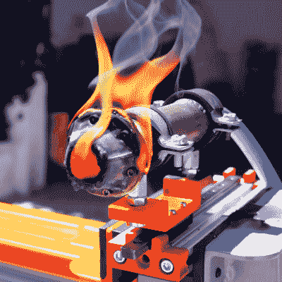

# 通过特殊细丝在家 3D 打印钢铁零件

> 原文：<https://hackaday.com/2021/08/11/3d-printing-steel-parts-at-home-via-special-filaments/>

火箭发动机非常适合从火焰和狂暴中产生推力，但是它们也很难制造。它们需要能够承受高温的高强度材料。然而，[Integza]长期以来一直试图为自己 3D 打印一个工作的火箭发动机。他最近的尝试包括用金属打印气塞设计。

Even steel couldn’t hold up to the fury of the rocket exhaust!

该项目依赖于特殊的金属浸渍 3D 打印机细丝。该零件可以用普通的 3D 打印机打印出来，然后烧制，只留下金属。灯丝可能很粗糙，因此[Integza]使用红宝石喷嘴来处理金属浸渍材料。加工这种材料需要在窑炉中进行中温“脱脂”阶段，去除塑料，然后进行高温烧结，将剩余的金属颗粒粘结成一个有望连续的整体。这一过程对青铜很有效，尽管对钢铁来说有点复杂。

配备了钢制气塞式火箭喷嘴，[Integza]试图使用我们之前见过的他的 [3D 打印火箭燃料。](https://hackaday.com/2021/05/13/hybrid-rocket-engine-combines-ceramic-aerospike-with-3d-printed-fuel/)这种配置确实产生了一些推力，持续时间比[Integza]以前的大多数努力都长，尽管仍然屈服于火箭排气的高温。

不过，总的来说，这是一个在家打印钢铁零件的好例子。你需要一台高质量的 3D 打印机、红宝石喷嘴和一个可控的窑炉，但这是可以做到的。如果你设法打印出一些令人惊叹的东西，请务必给我们写封短信。休息后的视频。

 [https://www.youtube.com/embed/tw9VF1V-Lzc?version=3&rel=1&showsearch=0&showinfo=1&iv_load_policy=1&fs=1&hl=en-US&autohide=2&wmode=transparent](https://www.youtube.com/embed/tw9VF1V-Lzc?version=3&rel=1&showsearch=0&showinfo=1&iv_load_policy=1&fs=1&hl=en-US&autohide=2&wmode=transparent)

