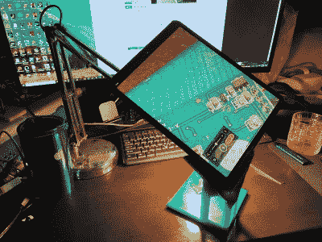

# 为 Hackaday 奖重新设想支持性技术的最后机会是这个周末！

> 原文：<https://hackaday.com/2021/08/20/last-chance-to-reimagine-supportive-tech-for-the-hackaday-prize-is-this-weekend/>

这是最后一个周末[让你支持的技术项目参加 2021 年 Hackaday 奖](https://prize.supplyframe.com/#section-challenges)。目标是找到使制造或使用电子设备更容易的方法。

易访问性是应对这一挑战的一个显而易见的方法。但您也可以考虑数据手册中的参考设计示例。制造商知道你不想重新发明轮子来使用他们的开关模式电源，所以他们会告诉你如何在 PCB 上布局以及选择什么样的器件。现在带着这个想法去做吧。这可能是一种模块化的设计，可以消除电子项目建设中的魔法。但它也可以很容易地瞄准最终用户——可能是通常很昂贵且需要专业知识才能操作的实验室设备，但你已经重新设想它内置了大部分专业知识。

 需要更多的帮助来弄清楚这是怎么回事吗？我们再来看一些已经进入的项目。随着我们周围的设备拥有一流的相机和令人眼花缭乱的屏幕，[Timo]意识到[将一台设备变成检查显微镜](https://hackaday.io/project/181046-quick-and-dirty-high-performance-ee-microscope)，这仅仅是用 3D 打印的支架和台灯完成的。

[Alain]将他的电子知识和廉价模块的可用性很好地用于他不会说话的儿子。[PECS 通信板](https://hackaday.io/project/180642-pecs-communication-board)有一个 16 幅图像的网格，每幅图像都是一个按钮，作为输入。他指出，平板电脑应用程序就是为此而存在的，但耐用性和成本都是他的方法有助于解决的问题。

已经有很多其他优秀的作品参加了这一轮的 Hackaday 奖，但是没有你的作品是不完整的。将选出 10 人每人获得 500 美元奖金，并带着 25，000 美元的大奖进入决赛。立即在 Hackaday.io 上启动您的项目，并使用项目页面左侧的下拉菜单输入。

下周一早上下一轮开始前你有时间。祝你好运！

[hack adayprize 2021](https://prize.supplyframe.com)主办单位: