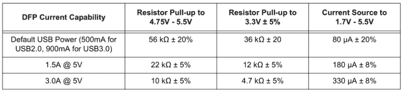
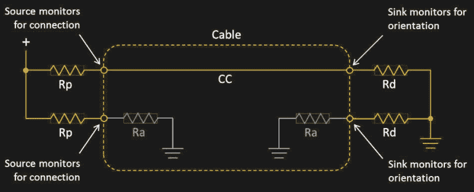
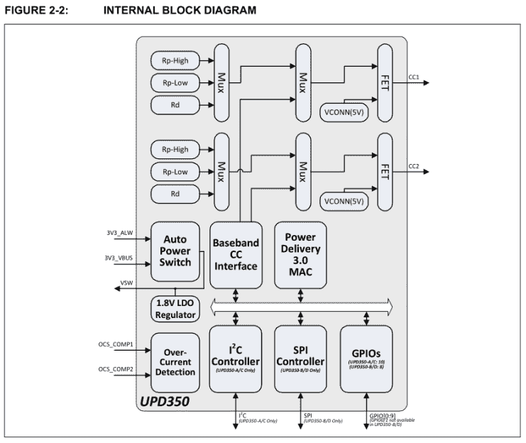
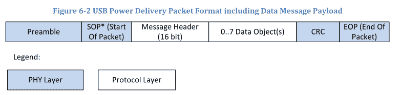
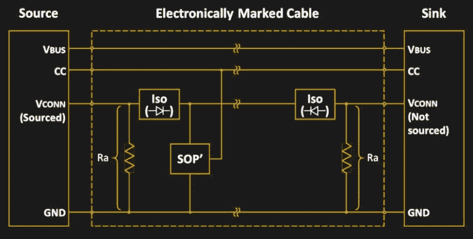

# USB 供电:解开 USB 供电标准

> 原文：<https://hackaday.com/2021/09/16/powering-up-with-usb-untangling-the-usb-power-delivery-standards/>

在工程师眼中 USB 还没有出现之前，直接从 PC 的 I/O 端口给外部设备供电就已经是一件事了。我们中的一些人可能还记得非常常见的 [PS/2](https://en.wikipedia.org/wiki/PS/2_port) 直通引线，它通过这些端口接入 275 mA 电流。当 USB 首次发布时，它最初提供的最大电流为 500 mA，USB 3.0 增加到 900 mA。

在很长一段时间里，这种供电方式只是为了给键盘、鼠标和类似的小设备等外围设备供电，而不是要求这些设备都自带电源适配器。随着连接电脑的设备数量的增加，USB 不仅将成为直接为小型设备供电的主要方式，还将为电池供电的设备充电，并最终更普遍地提供电力。

这就引出了 USB 电力传输(USB-PD)协议。令人困惑的是，USB-PD 包含许多不同的标准，从固定电压充电到可编程电源和可调电压电源。这些模式之间的确切区别是什么，以及如何使用它们？

## 自举通信

为了了解从 USB 端口获取电源在硬件层面上是如何工作的，我们将看看以[微芯片 UPD350](https://www.microchip.com/en-us/product/UPD350) 的形式实现 USB-PD 3.0 修订版(R3.0)的芯片。USB-PD 规范的 3.0 修订版支持高达 100 W 的固定电压充电—标准功率范围(SPR) —当前的[R3.1 标准](https://www.usb.org/document-library/usb-power-delivery)增加了支持高达 240 W 的扩展功率范围(EPR)。额外功率的增加主要通过使用更高的电压来实现:r 3.1 为 48 VDC，而 R3.0 为 20 VDC

尽管 USB-PD 非常突出，但在 5 V 时，它可以汲取高达 3.0 A 的电流，而完全不用担心 USB-PD，这也是 UPD350 支持的一种模式。这在微芯片应用笔记 1953 ( [AN1953](https://www.microchip.com/en-us/application-notes/an1953) )中也有详细描述:

Valid DFP Rp pull-up resistor values (AN1953, section 3.1, table 6)

这些值属于面向下游端口(DFP)一侧的 Rp 电阻，也称为源。通过设置该电阻值，接收器(面向上游的端口，UFP)可以知道源可以提供的最大电流。

Schematic overview of source-to-sink connections with USB-C, including the various resistors on the CCx lines.

在 UPD350 中，当器件在 DFP 模式下工作时，电阻值通过 I ² C 或 SPI 接口设置。在 UFP 模式下，内部 CC 比较器最多可以检测 8 个不同的阈值，这些阈值由 DFP 端的 Rp 电阻设置。其中之一是专有选项:

0.20V
0.40V
0.66V
0.80V
1.23V
1.60V
2.60V
3.0v 专有模式

反之亦然。在 DFP 端，CC 线路上的吸电流电阻允许它知道自己是否连接到 UFP。这使得在源和接收器之间传输高达 15 瓦的功率成为可能。为了获得更大的功率，简单地增加电流并不容易，这就是 USB-PD 的固定电压模式发挥作用的时候。

## 通用以太网总线

将 USB-PD 与以太网进行比较是情有可原的。除了基于分组的通信之外，两者都使用相似的 MAC 和物理接口配置。当谈到理解 USB-PD 时，这实际上是一个使用起来并不可怕的模型，只是 USB-PD 在其核心是一个半双工协议，因为它只能使用单条 CC 线进行通信。

让我们看一下 UPD350 的内部框图，了解其总体布局:

Internal block diagram of the Microchip UPD350 USB-PD controller. (credit Microchip)

图中清晰可见的是 Power Delivery 3.0 MAC，它实现了实际的 USB-PD 协议，同时还提供了与 I ² C 或 SPI 控制器的接口。这可以被认为相当于带以太网的 [MAC](https://en.wikipedia.org/wiki/Medium_access_control) (媒体访问控制)，或者 USB(非 PD) MAC。基带 CC 接口是物理层( [PHY](https://en.wikipedia.org/wiki/PHY) )，在 MAC 和连接到 CC 线路的模拟前端之间进行转换。

在 USB-PD 的所有通信期间，DFP 是总线主机，因此启动所有通信。如上所述，USB-PD 是半双工的，仅使用单条 CC 线进行通信，波特率为 300 kbps。CRC32 用于错误检测，所有报文编码使用 32 位 4b/5b 编码双相标志码(BMC)，也称为差分曼彻斯特编码( [DM](https://en.wikipedia.org/wiki/Differential_Manchester_encoding) )。

USB-PD 的基本消息格式(包括有效载荷部分)在 USB-PD 规范中有详细说明:

USB-PD payload message format. (Credit: USB-IF)

有许多不同的数据对象类型:

*   BIST 数据对象(BDO)-用于物理层合规性测试。
*   功率数据对象(PDO)-公开源的功率能力或接收器的功率要求。
*   请求数据对象(RDO)–由接收器用来向源请求某些电源设置。
*   供应商定义的数据对象(VDO)-传达供应商特定的信息。
*   电池状态数据对象(BSDO)-传达电池状态信息。
*   警报数据对象(ADO)-指示源或接收器上发生的事件。

通常，DFP 将发送其能力列表(源能力 PDO ),然后 UFP 将使用该列表基于其需求选择合适的选项，并使用 RDO 数据对象消息发送对此的请求。然而，这并不是全部，由于涉及更高的电压和电流，其中一些功率级需要有源“电子标记”EMCA 电缆。

## 以巨大的力量

所有 USB-C 电缆预计支持 20V 3 A 电流，总功率为 60 W。为了能够被 USB-PD 控制器检测到更高的电压和电流，USB-C 电缆需要包含一个所谓的 e-marker 芯片，该芯片包含供应商定义的消息(VDM ),其中包含电缆及其功能的详细信息。

这导致布线方案比无标记电缆稍微复杂一些:

USB-C wiring with an electronically marked (e-marked) cable.

在这种情况下，相同的 CC 信号线用于查询嵌入在所附电缆中的芯片。如果 USB-PD 控制器对电缆满足所需电压和电流设置的要求感到满意，它将继续使用超出未标记电缆的功率水平。

这对于 R3.1 USB-PD 标准尤为重要，该标准将电压提高至最大 48 V，作为固定电压 EPR 模式的一部分，同时保持相同的 5 A 最大电流，由于电流是电缆在消耗高功率水平时是否熔化的决定性因素，这很有意义，但提高的电压水平会带来电弧风险，尤其是在插入或拔出 USB-C 电缆时。

理论上，随着更高的电压被新设计的 USB-C 连接器牢固地锁定在 EMCA 电缆之后，这些连接器具有加长的 CC 和 Vbus 引脚，具有活跃 EPR 电压的断开事件应该可以及时检测到，以快速降低电流并防止硬件损坏。

## 比较不同的模式

到目前为止，我们主要研究了 USB-PD 的固定电压模式。顾名思义，它们支持多个固定电压。对于 SPR，这些电压是:

*   5 伏
*   9 伏
*   15 伏
*   20 伏

所有这些都可以选择 3 A 或 5 A 电流水平。

EPR 增加了以下电压，均为 5 A:

*   28 伏
*   36 伏
*   48 伏

出于某些目的，这些电压可能不理想，在这种情况下，可编程电源(PPS)或可调电源(AVS)模式可能更合适。PPS 模式可以与 SPR 一起使用，遵循后者的粗略电压电平，但允许在 3.3 V 和 SPR 电压电平加 1 或 2 V 之间以 20 mV 为步进调整电压。

AVS 模式基本上与 PPS 模式相同，只是从 15 V 作为最低电压电平开始，以 100 mV 为步进，最高可达三个 EPR 电压中的任何一个。PPS 或 AVS 模式下可用的电压与常规固定电压使用的工作原理相同，因为 USB-PD 控制器根据检测到的硬件来确定限值。

## 通用电源总线

事后看来，计算机 I/O 连接器的设计初衷是为了在 USB 设备之间传输数据，结果却演变成了今天的 USB-C 和 USB-PD 规范，这既符合逻辑，也可能有些荒谬。R3.1 USB-PD 规范是否真正成为 USB-PD 的巅峰还有待观察。

随着 USB-C R3.1 EPR 电缆现在能够提供高达 240 W 的功率，人们可能会认为这应该足以为今天和未来的任何笔记本电脑充电。此时，当电弧被认为是 USB-C 规范所关注的问题时，EPR 模式已经为术语“热插拔”带来了新的含义。这使得 USB-PD 的未来可能会带来新的改进，使 PPS 和 AVS 模式更容易使用，或者完全增加新的模式，使设置所需的电压和电流更加容易。

现在，如果你能通过观察设备上的 USB-C 端口来判断它的功能就好了:)