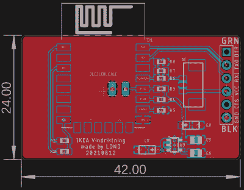

# 被黑的宜家空气质量传感器获得定制 PCB

> 原文：<https://hackaday.com/2021/08/13/hacked-ikea-air-quality-sensor-gets-custom-pcb/>

上个月，我们带来了 IKEA VINDRIKTNING 的消息，这是一款 12 美元的空气质量传感器，可以通过添加 ESP8266 轻松升级，通过网络记录数据。它只需要将几根电线焊接到原来的 PCB 上，由于外壳内有如此多的自由空间，您甚至不必担心安装寄生微控制器；把它贴在箱子里面，然后重新扣上。

现在，我们并不反对这些部件的快速和肮脏的方法，但如果你正在寻找一个稍微更整洁的 VINDRIKTNING 修改，[那么看看这个由[lond]](https://hackaday.io/project/181195-ikea-vindriktning-pcb) 设计的定制 PCB。这种 ESP-12F 板具有 AP2202 电压调节器、Molex PicoBlade 连接器和一个巧妙的设计，使其可以直接滑入传感器外壳内的自由区域。项目描述说成品看起来像是从工厂安装的，我们倾向于同意。

 在软件方面没有什么变化，事实上，ESP-12F 的闪存与[【索伦·贝耶】为他最初改装](https://hackaday.com/2021/07/24/esp8266-adds-wifi-logging-to-ikeas-air-quality-sensor/)时使用的韦莫斯·D1 迷你写的固件相同。也就是说[lond]设计了电路，这样 MCU 就可以很容易地用 FTDI 电缆重新编程，所以仅仅因为你离开了开发板并不意味着你不能继续试验不同的固件版本。

看到这种社区发展总是令人欣慰的，不管它是否是有意组织的。[lond]发现了一个有趣的想法，找到了改进其执行的方法，并将结果公布于众，让其他人从中受益。毫不夸张地说，这正是 Hackaday 在这里推广和促进的事情，所以如果你发现自己受到这些页面上看到的东西的启发而开始一个项目，[一定要给我们写封短信](https://hackaday.com/submit-a-tip/)。