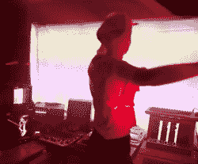

# 互动音乐艺术装置混合了复古、现代、激光和……泡沫？气泡。

> 原文：<https://hackaday.com/2021/08/21/interactive-musical-art-installation-mixes-vintage-modern-lasers-and-bubbles-bubbles/>

Acorn BBC 大师。苹果谎言。Ampex 270 终端。Vectrex 游戏机。在普通黑客的实验室中，你很难找到更多样化的硬件集合。当你添加七个树莓 Pi，五个 CRT 显示器，一个模拟示波器和一个 LED 墙时，你会开始对当前和复古硬件的动物园感到惊讶。什么样的鉴赏家会有这么杂的收藏？这时你会发现烟雾机就在一台 RGB 激光器旁边。

最后，你了解到所有这些不同的随身物品都是联网在一起的。就在那时，你意识到你不仅仅是在和一个多才多艺的黑客打交道——你是在和一个一丝不苟的大师打交道，他花了整整一年的时间完成了一个他 20 年前开始的项目！

AUVERN comes alive in a show of light and sound whenever someone enters its view.

这台机器名为 AUVERN ，是[Owen]创造性思维的产物。利用技术的进步(和大量的空闲时间)，[欧文]费力地将他收集的旧钻机投入使用。

Python 脚本使用 Kinect 传感器的输入来控制运行数字音频工作站软件的 Mac Mini。操作者的位置、姿势和动作被用来整体改变音乐、灯光和多媒体体验。MIDI、以太网和串行通信通过 Raspberry Pi、老式 MIDI 接口等将硬件连接在一起。观看视频下方的技术解释，但不要错过[【欧文】网站](https://auvern.carrd.co/)上的视频，观看奥文如火如荼的迷人演示。

AUVERN 使用了我们之前报道过的 vectrex 32 升级版，我们不可避免地想起了另一个[疫情启发的泡泡机](https://hackaday.com/2020/07/31/the-internet-of-bubble-machines/)。不要忘记通过[提示热线](https://hackaday.com/submit-a-tip/)将你的黑客、项目和创意发送给我们！

 [https://www.youtube.com/embed/eQq5OciGQr8?version=3&rel=1&showsearch=0&showinfo=1&iv_load_policy=1&fs=1&hl=en-US&autohide=2&wmode=transparent](https://www.youtube.com/embed/eQq5OciGQr8?version=3&rel=1&showsearch=0&showinfo=1&iv_load_policy=1&fs=1&hl=en-US&autohide=2&wmode=transparent)

