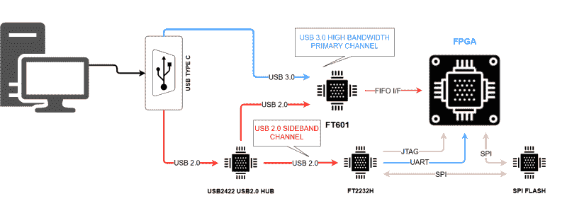

# 当你不能“只是”造一个时，为什么还要买一个新的呢？

> 原文：<https://hackaday.com/2021/08/17/why-buy-a-new-scope-when-you-can-just-build-one/>

2021 年黑客日奖决赛选手 ThunderScope 正在这样做。[Aleska]正在构建一个模块化开源 PC 连接示波器，目标是四个通道和低预算的 100 MHz 带宽。详细的项目日志显示了他是如何动态地学习“范围技术”的，当一个工程师在一个相当复杂的构建中经历起伏时，这是对他思想的一个迷人的观察。

我们喜欢[Aleska]在早期就意识到，保持项目的私密性，只有在“我完成了”的时候才发布它，实际上阻碍了进展，这时你可以从一开始就开放源代码，记录进展，并从一开始就获得很好的反馈。所有这些明显的错误和糟糕的设计选择都会在投入硬件之前被发现并修复。想想省下的时间吧。这是一种需要培养的态度！

## 标准设计

降低硬件设计风险的模块化方法是一个很好的选择，允许在需要时升级或添加替代功能模块。需要将单端前端换成差分前端，还是换成具有其他特殊功能的前端？当然，只要把它取出来，放入替代品，然后开始工作。

## 一个简洁的 USB 3.0 技巧

From numato.com

数据路径从 8 个 1 GBit/s LVDS 通道上的 [HMCAD1511](https://www.analog.com/media/en/technical-documentation/data-sheets/hmcad1511.pdf) ADC 提取样本，并将其送入 Spartan 6 FPGA 上的 SERDES 模块。其中，FIFO 接收解串行(并行)数据，并将其同步到 USB 接口的时钟域，同时在 USB 繁忙时进行缓冲。这允许使用我们在 FTDI 的好朋友提供的[现成的 USB 3.0 FIFO 接口芯片](https://www.ftdichip.com/old2020/Products/ICs/FT600.html)来处理所有这些混乱的接口。

接下来，ADC 本身需要配置，可编程前端也需要配置，更不用说 FPGA 在开发期间需要通过 JTAG 加载其比特流。所有这些“旁道”的东西都是通过一个 USB 2.0 接口芯片处理的(同样来自 FTDI)。

这个[插入 USB 2.0 集线器的巧妙技巧](https://numato.com/kb/usb-3-0-a-cost-effective-high-bandwidth-solution-for-fpga-host-interface/)利用了 USB 3.0 连接器可以并行操作 USB 3.0 超高速端口和高速端口的方式，因此您可以将超高速端口直接连接到 FT601 接口芯片，并在 USB 2.0 路径中插入一个集线器芯片，然后从同一个连接器向其他 USB 2.0 设备供电。一个简单但聪明的技巧，既节省成本又不复杂！

眼尖的人会注意到一些传统的示波器电路功能不见了，特别是硬件触发器。这种设计依赖于现代个人计算机的速度，以使示波器应用程序在连续接收所有样本数据时能够充分实现这一功能。

我们将饶有兴趣地关注这一结果。

The [HackadayPrize2021](https://prize.supplyframe.com) is Sponsored by: