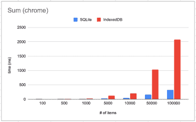

# 网络上的 SQLite:荒谬的

> 原文：<https://hackaday.com/2021/08/24/sqlite-on-the-web-absurd-sql/>

不管你喜欢它还是讨厌它，现代网络浏览器的功能都在以奇怪而疯狂的方式不断增长。web 应用程序离线工作的能力需要一个持久的本地存储解决方案，对于许多人来说，IndexedDB 是唯一的选择，因为它可以在大多数浏览器上工作，并提供类似数据库的界面。然而，正如[James Long]所发现的，IndexedDB 在 chrome 上非常慢，而且查询能力有限。他着手带来一个他熟悉的工具 SQLite，而[把它带到网络浏览器上是荒谬的——SQL](https://jlongster.com/future-sql-web)。

为什么荒谬？部分原因是大多数浏览器(不是 chrome)在 SQLite 之上实现了 IndexedDB。所以对于许多浏览器来说，它只是 SQLite 之上的 SQLite 和 SQLite 之上的 IndexedDB。幸运的是，已经有一个名为 [sql.js](https://github.com/sql-js/sql.js/) 的项目使用 [emscripten](https://emscripten.org/docs/introducing_emscripten/about_emscripten.html) 将基于 C 的 SQLite 编译成 [WebAssembly](https://hackaday.com/2019/04/04/webassembly-what-is-it-and-why-should-you-care/) 。但是，sql.js 使用内存存储支持，刷新页面时所有数据都会丢失。[James]调整了 SQLite 读写块的方法。他增加了一个层来读写 IndexedDB 中的块，而不是内存支持。这意味着只需要读入数据库的一部分，从而带来巨大的性能提升。

这让我们想到了它荒谬的另一个原因。在 chrome(以及 Firefox)上，荒谬的 sql 几乎在每个基准测试中都击败了 IndexedDB。像`SELECT SUM(*) FROM kv`这样的查询会产生惊人的结果。

那么坏处是什么呢？除了需要下载(409KB)和缓存一个有点大的 WebAssembly 文件之外，真的没有其他的了。当然，对于 web 开发来说，这并不是一帆风顺的。原生 sqlite 的运行速度比荒谬 SQL 快 2-3 倍，这表明 IndexedDB 真的有多慢。

针对网络浏览器的其他[存储标准也即将出台](https://web.dev/storage-foundation/)，但是锁定成为一个问题。SQLite 期望同步读写，因为它只是简单的 c。indexed db 和其他存储解决方案是异步的，因为 Javascript 的事件循环非常适合这种模型。荒谬——SQL 通过创建一个与工作进程共享的 SharedArrayBuffer 来解决这个问题。atomics API 用于与缓冲区通信。特别是，`atomics.wait()`允许工作者阻塞主线程执行，直到读或写完成。从 SQLite 的角度来看，操作是同步的。IndexedDB 提供事务，因此可以发生多个连接(例如打开多个选项卡)。多个只读事务可以并行发生，但只能有一个读写事务正在进行中。

为什么不打开你的浏览器开始玩呢？反正你已经[注定要学习 WebAssembly】。](https://hackaday.com/2021/07/15/you-are-doomed-to-learn-webassembly/)