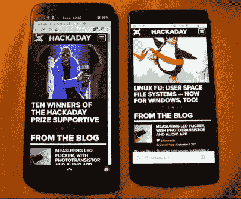
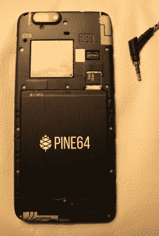

# 渴望一部去谷歌化的智能手机

> 原文：<https://hackaday.com/2021/09/02/pining-for-a-de-googled-smartphone/>

去年夏天，在全球疫情的第一波波动中，我终于可以坐在家里处理我的一些电子项目了，因为我不再每天浪费三个小时通勤到隔间农场，我发现自己订购了一部新的智能手机。不过，不是最新的三星或苹果产品，它们的用户界面枯燥、可预测。这是只支持 Linux 的 pine phone，它没有标准的 Android 界面，而是覆盖在一个隐藏很深的 Linux 内核上。

作为一个有点数字隐私的人，这款手机上没有谷歌软件似乎也很有趣，尽管有很多警告说这是一款仍处于开发阶段的手机，但我似乎可以克服任何障碍，实际上将这款设备用于日常用途。然而，接下来是充满挑战的一年，在它最终可以用满足我以隐私为中心的需求的东西取代普通的 Android 智能手机和基于谷歌的间谍软件之前，它一直在戳、刺激和修补，即使我不得不牺牲一些功能。

## 搭建舞台

首先，有点免责声明。与旗舰 Android 手机相比，这篇文章并不是对 PinePhone 的批评。相反，这是一个进入开源世界的旅程，关于一部智能手机，它被设计成运行 Linux，来自一个愿意走极端使用免费和开源软件的人(例如，我仍然每天使用这台电脑，而不会显得 T2 太疯狂)。Pine64 的开发人员完成了一项令人难以置信的工作，将仅有的一款基于 Linux 的智能手机推向了市场。我也欠 FOSS 社区一大笔债，他们继续为这些设备构建和维护自由软件。尽管体验还没有 iPhone 或 Galaxy 那么精致，但还是很有可能在日常使用中使用，但还是有一些缺失的部分需要承认。

在过去五年左右的时间里，我也一直在努力尽可能地从我的生活中去除谷歌的生态系统。有些事情很简单，比如用鸭鸭 Go 做搜索引擎，火狐做浏览器。有些事情一开始有点麻烦，比如转而使用 ProtonMail 作为电子邮件和日历服务。有些事情仍然非常困难，比如从我的安卓设备上移除谷歌服务。为此，我最初在几年前购买了一台 OnePlus 3T，打算在上面安装 Android 的谷歌化变体[，但也许是因为对在安装过程中不阻止这款 400 美元的设备缺乏信心，我永远无法让自己清除手机出厂时安装的操作系统。现在，Android 手机已经磨损严重，USB 端口不再连接电缆上的数据引脚，所以即使我现在想在上面闪存新的固件，也几乎不可能。](https://lineageos.org/)

## 需要一些(软件)组件

当我第一次购买 PinePhone 时，它预装了 Ubuntu Touch。该发行版曾经是一个官方的 Canonical 支持的软件项目，旨在将 Ubuntu 的易用性带到智能手机世界。Canonical 放弃了这个项目，原因在这里不值得一提，但是因为这个软件是开源的，所以它继续作为 UBports 指导的社区驱动的项目。希望 Ubuntu 的名字意味着我可以很容易地开始使用，我购买了这个设备。大多数东西都是开箱即用的，比如打电话、发短信和上网。也有一些明显的例外，比如缺乏对[双音多频(DTMF)](https://en.wikipedia.org/wiki/Dual-tone_multi-frequency_signaling) 的支持。这些是电话发送的按键音，对应于数字键盘。我一度认为这可能不会影响交易，但我很快发现，没有这种支持，我无法拨入电话会议、查看语音邮件或与任何自动电话系统进行交互。

在研究了这个问题一段时间后，看起来解决方案可能是安装一些替代操作系统中的任何一个，看看它们是否已经解决了这个问题。不同于 Android 手机，Android 手机需要解锁引导程序，安装定制的恢复软件，备份和刷新 rom，如果你走错一步，其中任何一步都可能损坏设备，这在 PinePhone 上非常容易。只需用选择的操作系统对 microSD 卡进行镜像，并将其放入 PinePhone 中，就可以让设备自动启动到该镜像，而不是安装在手机内置内存中的镜像。这使得测试软件变得非常容易，而且非常用户友好。为了解决 DTMF 问题，我尝试了 PostmarketOS，这似乎是所有各种手机 Linux 发行版中最先进的，但这个操作系统远不如 Ubuntu Touch 完善，所以我暂时放弃了，并搁置了手机。

The author’s PinePhone (left) beside a OnePlus 3T. The differences are not obvious on the surface but become apparent quite quickly when used. Note: this photo was not taken with the PinePhone’s camera for several reasons.

我每个月都会回来看看 UBports 包是否已经升级到支持 DTMF，但是我一直很失望，直到大约两个月前我才发现这个功能终于起作用了。在我看来，这也与我的前服务提供商(美国电话电报公司)做出的一个可怕但不令人惊讶的决定相吻合，即开始锁定任何将其 SIM 卡切换到另一个设备的人的服务，除非该设备在白名单上。(美国的其他运营商，如威瑞森，似乎也在以其他方式积极限制设备，所以在把你的 SIM 卡换成 PinePhone 之前，一定要和你的运营商核实一下。)即使在将我的 SIM 卡切换回此前正常工作的一加后，我的服务仍会被锁定，除非我打电话给美国电话电报公司客户服务中心将其重新激活，这是一个相当棘手的问题，而且[通常需要几级升级](https://xkcd.com/806/)。这让我毫不犹豫地选择了一家(到目前为止)没有给我的生活带来麻烦的运营商。

## 慢慢增加选项

随着速度障碍的消除，我终于拥有了一部工作正常的纯 Linux 手机，拥有 2007 年翻盖手机的大部分功能，我开始尝试其他现代智能手机的功能。我知道不要期望一切都完美无缺，但是 Linux 生态系统中有一些明显的缺失。显然，我对失去谷歌地图没什么意见，但 PinePhone 上的 GPS 功能与类似于 [OpenStreetMap](https://www.openstreetmap.org/) 的功能还不能完全取代它。此外，我的国际朋友倾向于使用 WhatsApp 来发短信，但没有一个版本可以用于任何不是基于 Android 或 iOS 的东西。同样，Spotify、Signal 和我的 ProtonMail 日历也无法使用。我还假设各种社交媒体应用程序可能也不可用，但从隐私角度来看，我首先不建议任何人拥有社交媒体账户。

该相机拥有合理的规格，但控制它的应用程序充其量仍在开发中。类似地，虽然有不错的播客和音乐应用，但手机放在口袋里听音乐时会变得不舒服。这是大多数拥有手机的人唯一注意到的抱怨之一，特别是在电池消耗方面，似乎运行单个应用程序的许多功率优化还没有实现。我觉得这款手机本质上就像一台笔记本电脑，除非它完全处于睡眠模式，否则所有的后台进程都在运行，但我仍然没有考虑这款手机，因为我清楚地知道它仍处于开发阶段。

## 快乐的关键是低期望

关于明显缺失的功能，我们已经说得够多了。对我来说，一个注重隐私的人，不想浪费时间盯着手机看，这几乎是完美的。各种硬件都有物理开关，如蜂窝调制解调器、麦克风和摄像头，我一直将前置摄像头开关置于“关闭”位置，因为这些硬件总是让我觉得有点毛骨悚然。在软件方面，Firefox 的移动版已经可以使用，它可以完成我在移动浏览器上需要的几乎所有功能。对我来说，最重要的功能也是完美的:WiFi 热点。除了我的老式苹果笔记本电脑由于某种原因无法连接到它的一个小问题(我通过添加一个小小的 USB WiFi 加密狗而不是使用内置芯片解决了这个问题)，以及另一个问题，我根本无法在 Ubuntu Touch 中使用热点(这已经被修复)，我需要的一切都可以正常工作。

The rear case is easily removed without tools, exposing (from top left, clockwise) a heat sink, six pogo pins, the six hardware kill switches (with 3.5 mm headphone jack for scale), microSD and SIM card slots, and removable/replaceable battery

我也可以很容易地尝试其他操作系统，因为它基本上是鼓励这个设备。我在另一个名为 Mobian(“mobile Debian”)的发行版上取得了巨大的成功，并且现在几乎全职使用这个发行版。Mobian 对我个人来说很棒，因为我从 2005 年开始就在我的个人电脑上使用某种 Debian 版本，我没有兴趣在短期内切换到或学习任何其他东西，Ubuntu Touch(虽然是基于 Debian 的)有一些不必要的困难，Mobian 似乎已经解决了。不过，除了 Mobian 和 Ubuntu，还有一些基于 Arch 的发行版，如果这更符合你的风格的话，除此之外还有很多其他的产品。这款手机和操作系统组合的另一个优秀特性是，我可以像使用任何其他电脑一样使用 SSH 连接，并使用`apt`安装我喜欢的任何软件。例如，这对于安装 Kodi 媒体播放器来说，效果出奇的好。甚至还有一个连接到手机 USB-C 端口的坞站，它本质上是一个功能齐全的 Linux 桌面，带有 Raspberry Pi vibes，但我还没有尝试过。不过，我确实觉得这是一个有趣的特性。

由于隐私问题，使用 PinePhone 的几乎所有其他缺点都是我在生活中无论如何都要接受的事情，即使这款手机根本不存在。对于 GPS，我一直计划买一个独立的(或者可能是手持的)导航设备，完全不需要连接到互联网。同样，我在考虑一个独立的音频播放器，类似于经典的 iPod，用于音乐和播客。对于电子邮件，我甚至还没有尝试在我的手机上设置，我只是连接到热点，在我的笔记本电脑上查看它，而不是让我的手机不断打断我的生活，因为那些往往被证明是细枝末节的事情。记笔记时，我使用一套更古老的工具:一张纸和一支铅笔。看起来我有点像勒德分子，但是对我来说，为了一点点方便而侵犯我的隐私已经不值得了。如果我不得不像 2007 年一样带着 GPS、iPod、电话和笔记本，以保留一丝数字隐私，那么我想我会设法生存下去。我发现我的用例唯一真正的缺点是缺乏彩信支持([不采取极端措施](https://wiki.mobian-project.org/doku.php?id=mms))，但我将不得不暂时接受这种损失，并在需要时依赖真正的相机。

## 为选择敞开大门

此外，我认为像这样使用开放技术的练习是像我这样的人把他们的钱用在他们的嘴上的一种方式。这款手机的一切都是我一直想从我的 Android 设备中获得的东西，但从未能够在一个包中获得，例如可更换电池、可移动存储、硬件关闭开关、解锁的引导加载程序、轻松闪现任何我想要的图像的能力，以及缺乏任何谷歌软件。甚至像 I2C 接口和六个弹簧针这样的东西也很好拥有，[让设备可以升级到你想要的任何东西](https://hackaday.com/2020/08/03/pinephone-gets-thermal-imaging-backpack/)。市场上没有任何面向“普通”用户的主流选项，甚至接近这一点，也不会有，除非像我们这样的人支持像 Pine64 或 [Purism](https://puri.sm/products/librem-5/) 这样的弱势开发者。除非选择对大多数人来说是真实的，否则不会有真正的选择。

我的经验指出这仍然是多么困难，但这是可能的。即使你不认为你可以在日常生活中完全切换到一个像这样的纯 Linux 设备，也值得挑选一个并开始摆弄它。这些设备除了作为简单的手机使用之外，还有许多利基应用，值得花时间去试验它们。