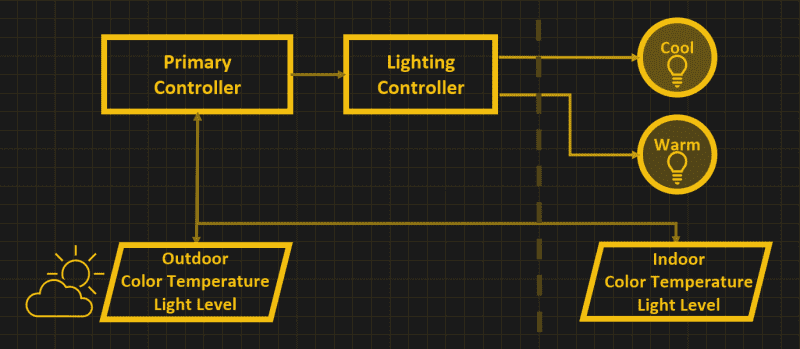

# 定制的在家工作照明

> 原文：<https://hackaday.com/2021/08/27/customized-work-from-home-lighting/>

[Jon]希望他的家庭办公室照明模仿室外光线，至少从色彩角度来看是这样。为此，他[着手进行一项设计](https://hackaday.io/project/180427-making-work-from-home-lighting-work-for-me),该设计既能监控室外光线，也能在他的工作台上监控，并相应地驱动一对不同颜色的 LED 灯。一盏灯的额定温度高于 5000 K，提供“冷”照明，另一盏灯的额定温度低于 3000 K，提供“暖”照明。

商业解决方案确实存在，但它们是专有的，并且在单个灯泡内完成，似乎难以在整个房子内以协调的方式控制。[Jon]计划让他的方法具有可扩展性，最终由单个微控制器组成房子的各种照明区域。

> 这个项目的设计目标之一是创造一些可以消失在房间里的东西，而不是我之前项目的科学博览会美学。

他的项目网站上的一个评论者问为什么[乔恩]要这样做，也就是说，控制你的室内照明的颜色有什么价值？虽然[乔恩]目前没有具体的目标，但他指出，这些技术可能有助于提高生产力，管理昼夜节律，并作为季节性抑郁症的光疗法。

我们报道了[Jon]去年在[写的类似科学博览会的项目。如果您对这个主题感兴趣，可以查看他在项目页面上链接的白皮书，以便进一步阅读。](https://hackaday.io/project/174098-lighting-color-control-with-commodity-lamps)

The [HackadayPrize2021](https://prize.supplyframe.com) is Sponsored by: