# 拆卸:Impassa SCW9057G-433 报警系统

> 原文：<https://hackaday.com/2021/09/09/teardown-impassa-scw9057g-433-alarm-system/>

这一系列每月拆卸始于 2018 年初，作为一项实验，既然你们这些优秀的人继续阅读它们，我就继续制作它们。但事实上，每月寻找一个新的有趣的小玩意有时是件苦差事。这就是为什么当一个读者真的发来他们希望看到被拆开的东西时，我总是很感激，因为这免除了我必须自己做决定的责任。当然，这也意味着如果你不喜欢它，也不能责怪我，所以也要记住这一点。

我们来自宾夕法尼亚州东部的热带天堂，本月的主题是 ADT 品牌的 Impassa SCW9057G-433 报警系统，它显然是在我们好心的顾客搬家时从墙上取下的。正如您可能从型号中猜到的那样，该设备使用 433 MHz 与家中的各种传感器和设备进行通信，还包括 3G 蜂窝连接，即使电话线被切断，它也可以联系警报监控服务。

[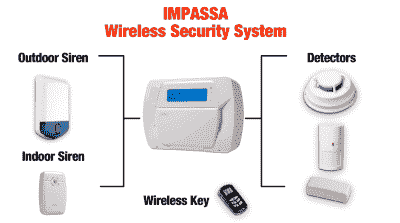](https://hackaday.com/wp-content/uploads/2021/08/impassa_wireless.png)

The alarm can connect to a wide array of 433 MHz devices.

从易贝有多少这样的系统，以及我在一些家庭报警系统论坛上做的研究来看，似乎你可以在二手市场上买到这样的系统，而不需要通过像 ADT 这样的监控公司。来自 Impassa 的大量文档涵盖了如何连接和配置设备，只要您得到它时系统没有锁定，清除配置并从头开始似乎不是问题。

如果有可能以这些单元中的一个为核心组装自己的自制报警系统，那么我们至少可以把它拆开，看看在闪亮的塑料外表下有什么潜在的可修改的好东西在等着我们。

## 伸出手去触摸某人

SCW9057G-433 分为两部分，边缘有点强制，电池和 3G2075“报警通信器”板在后面，主 PCB 在前面。或者，至少*应该*在后舱有一块电池。我们的特殊样本被剥夺了备用能量，所以你得发挥你的想象力。

 [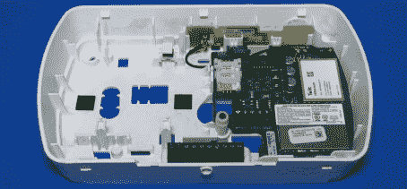](https://hackaday.com/2021/09/09/teardown-impassa-scw9057g-433-alarm-system/impassa_rear/)  [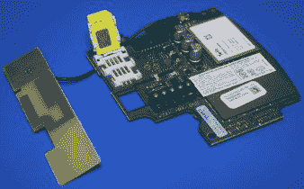](https://hackaday.com/2021/09/09/teardown-impassa-scw9057g-433-alarm-system/impassa_modem/) 

正如我们所看到的，蜂窝通信板具有一个 SIM 卡插槽(一秒钟内没有人占用)，一个外部天线和一个 HE863-NAR 3G 模块，能够通过 HSPA 传输 7.2 Mbps 的数据，并支持语音和短信。我没想到 3G2075 上还有很多其他有趣的东西，但拉开 RF 屏蔽后，发现了一个意想不到的大微控制器。

[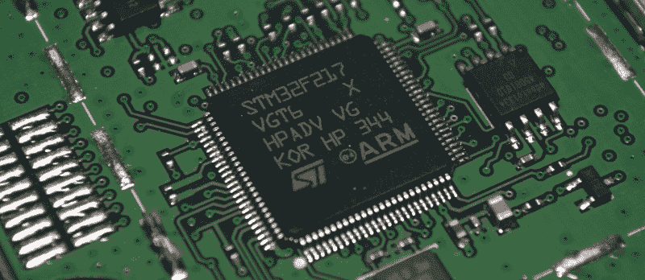](https://hackaday.com/wp-content/uploads/2021/08/impassa_3gpcb.jpg)

STM32F217VGT6 内置一个 120 MHz ARM Cortex-M3 CPU 和一系列令人印象深刻的功能，包括内置以太网和 USB。目前尚不清楚为什么需要如此强大的芯片来促进主 PCB 和 HE863-NAR 之间的通信，尽管其硬件加速加密功能可能会投入使用。MCU 旁边是一个 16 Mb 的 AT45DB161D 串行闪存芯片，在正常情况下，我会假设它持有芯片的固件。但由于 STM32F217VGT6 已经有相当充足的板载闪存，它似乎更有可能被用来保存配置数据。

## 奇普斯嗨！

在这一系列拆解中，我们经常会遇到一些不幸的现实，例如，环氧树脂滴和无标记 IC 如今如此普遍，几乎成了常态。如果能在棋盘上找出一两个筹码，我通常会认为自己很幸运，尤其是那些重要的筹码。但幸运的是，SCW9057G-433 的主板上挤满了可识别的 IC。

[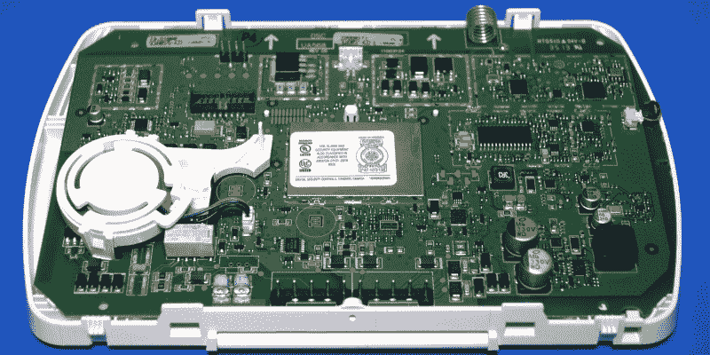](https://hackaday.com/wp-content/uploads/2021/08/impassa_front.jpg)

这里有令人眼花缭乱的组件，但仔细观察，我们可以看到电路板的布局非常合理，因此相对容易分解不同的功能模块。特别是因为如此多的部件显然是打算用卡扣式 RF 屏蔽相互隔离，即使最终大多数部件实际上并没有安装。例如，通过查看电路板顶部线圈天线的端接位置，我们可以看到负责 433 MHz 通信的硬件。

 [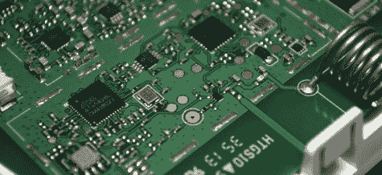](https://hackaday.com/2021/09/09/teardown-impassa-scw9057g-433-alarm-system/impassa_433_wide/)  [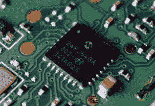](https://hackaday.com/2021/09/09/teardown-impassa-scw9057g-433-alarm-system/impassa_433_close/) 

等式的一半是 Atmel ATA5428 ASK/FSK 收发器，其最大数据速率为 20 Kbit/s，工作频率为 433 或 868 MHz。在这种情况下，无线电与 QFN28 封装的 PIC24FJ64GA002 微控制器配对，从附近的外部振荡器来看，该微控制器的工作频率为 32 MHz。

[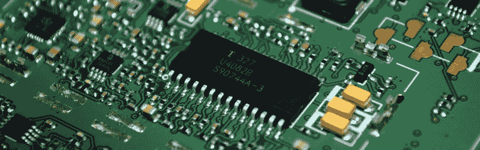](https://hackaday.com/wp-content/uploads/2021/08/impassa_u4082b.jpg)

在它的正下方，紧挨着插入扬声器的地方，我们发现了一个有点不协调的 SOIC28 芯片，标签为 U4082B。它位于一个 MAX9730E 2.4 瓦单声道放大器和一对 MCP6002 运算放大器旁边，起初我以为它可能是某种音频报警 IC。但实际上它是一个扬声器芯片，除了其他功能之外，还负责检测用户何时说话。果然，双向扬声器被列为 SCW9057G-433 的功能之一，可能是为了让监控公司的代表可以通过报警面板直接与客户通话。

## 老可靠

看起来你在这块板上走不了几毫米，就会碰到另一个 IC 来查找，但当然，你一天能看到的稳压器规格表也就这么多。所以，让我们拉下射频屏蔽，看看真正的明星表演。

在这里，我们可以看到三个芯片在其自然栖息地。中间是 STM32F101VF，相对于通信板中使用的 STM32F217，它的性能要差得多。36 MHz ARM Cortex-M3 芯片没有较新的 F2 系列的花哨功能，但它是一款可靠的主力产品，Impassa 可能从以前的产品中获得了经验。在它的右侧，我们看到一个 ST 品牌的 45PE10VP 1 Mb 串行闪存芯片，在左侧，一个微芯片 24LC128 128 K I2C EEPROM。在两个外部芯片和 STM32F101VF 上的 768 Kb 之间，该系统似乎有足够的增长空间。

顺便提一下，早在 2018 年，Aaron Christophel 打开了一个机器人真空，发现了一个非常相似的 MCU。正如我们对这位多产黑客的期望，[他开始为清洁机器人](https://hackaday.com/2018/06/21/wiping-robots-and-floors-stm32duino-cleans-up/)开发自己的固件，其中一部分包括让芯片在 Arduino 环境中工作。目前还不清楚他在这个概念上走了多远，但它至少建立了一个先例，任何人都应该接受为这个单元创建定制固件的挑战。

## 防篡改包装

眼尖的读者可能已经注意到了，但在结束这次拆解之前，我想指出 SCW9057G-433 的一个有趣的小功能:篡改检测器。该功能实际上在手册的第 3.5 节中被引用，并被描述为该单元确定是否有人试图将其从墙上移除的一种方式。

[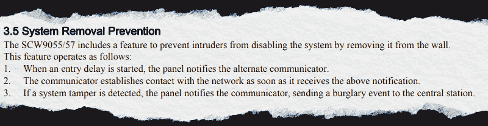](https://hackaday.com/wp-content/uploads/2021/08/impassa_tamper.png)

[很像我](https://hackaday.com/2019/07/08/teardown-verifone-mx-925ctls-payment-terminal/)[在 2018 年](https://hackaday.com/2018/09/17/exploring-an-abandoned-toys-r-us/)从一个倒闭的玩具反斗城解放出来的 VeriFone MX 925CTLS ，这是通过使用一系列策略性放置的柱塞来推动 PCB 上的迹线来实现的。本质上，它是一个露天的瞬时按钮，只要设备的外壳没有打开，它就会保持关闭。通信板背面有一个焊盘，主 PCB 上有两个焊盘。

 [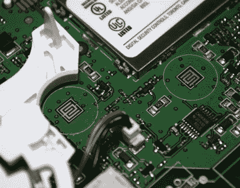](https://hackaday.com/2021/09/09/teardown-impassa-scw9057g-433-alarm-system/impassa_tamper_pad1/) Enclosure tamper pads [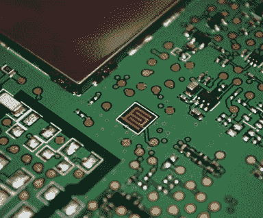](https://hackaday.com/2021/09/09/teardown-impassa-scw9057g-433-alarm-system/impassa_tamper_pad2/) Rear tamper pad

第一个连接到一个小杠杆上，当 SCW9057G-433 被拧到墙上时，这个杠杆就会被推动，这样如果有人移除它，警报就会响起。前 PCB 上的中央焊盘对应于连接到机箱后板上的一个杆，如果面板被打开，它显然会提醒系统。第三个 pad 没有任何明显的配对，所以我只能假设它的对应部分将安装在电池上，或者可能是一些容纳它的机箱组件。这将让系统检测到是否有人足够聪明，试图在电池板还在墙上的时候从电池板的侧面切断电池。

[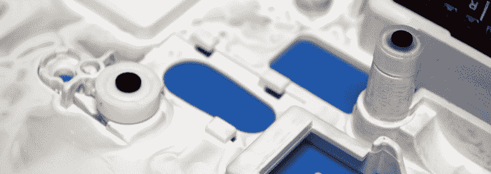](https://hackaday.com/wp-content/uploads/2021/08/impassa_tamper_contacts.jpg)

Note the rocker mechanism on the left pad that contacts the wall.

## 第二人生，还是足够好？

我们有一堆可识别的芯片，一个我们已经看到通过 Arduino IDE 编程的微控制器，以及一些非常明显的编程标题。那么，是什么阻碍了 SCW9057G-433 的开源替代固件呢？

嗯，首先，在你能做出一个真正有用的固件之前，你还需要做很多逆向工程。让 MCU 与 LCD 和键盘对话可能不成问题，但这只是皮毛。如果你想尝试一下，我们已经介绍了一些 [STM32 逆向工程，应该可以让你朝着正确的方向前进](https://hackaday.com/2021/02/15/ghidra-used-to-patch-fahrenheit-into-an-air-quality-meter/)。

也就是说，更大的问题可能只是这个设备不需要定制固件。Impassa 的文档似乎很特别，除非你很不幸地得到了一个被以前的用户或安装者锁定的单元，否则你应该可以自由地将其与你的设备配对，并按照你认为合适的方式进行配置。

虽然我们喜欢在 Hackaday 看到专有代码被开源软件的光辉所掩盖，但我承认偶尔你必须选择你的战斗。虽然只是为了安全起见，我可能会问亚伦克里斯多佛，如果他想要一个新的玩具玩。

* * *

你在这里看到的装置是由我们一位出色的读者慷慨地提供给我们的。如果你有一件有趣的硬件，只是占用了商店的空间，并愿意以匿名或其他方式将其捐赠给我们正在进行的一系列拆卸活动，[请不要犹豫，给我们发邮件。](https://hackaday.com/submit-a-tip/)