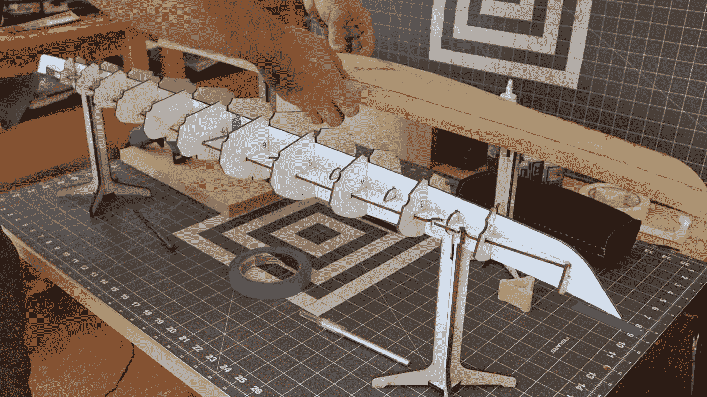
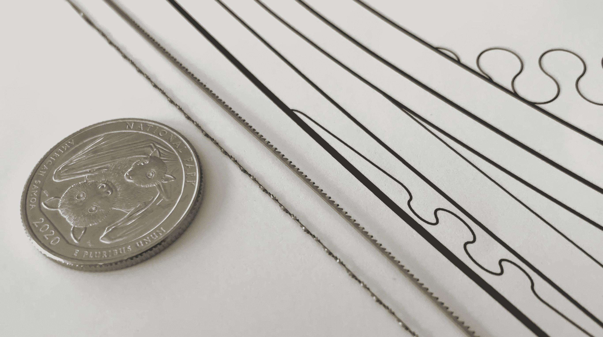

# 木头和胶水比例皮艇是超级的

> 原文：<https://hackaday.com/2021/08/24/wood-and-glue-scale-kayak-is-super/>

虽然我们这里没有很多木工项目，但我们总是喜欢向真正了解各种材料的人学习。[Brian ol trodge]向我们展示了一种不干涉的方式，用这个 [3D 打印砂型铸造项目](https://hackaday.com/2021/06/25/casting-a-simple-3d-print-in-aluminium/)来塑造铝，现在给我们带来了一个非常实用的 kayak 项目。

我们已经看到了由[塑料包装](https://hackaday.com/2020/09/14/its-a-boat-its-a-duck-its-a-diy-plastic-wrap-kayak/)和 [3D 打印部件](https://hackaday.com/2014/03/19/3d-printers-can-only-make-trinkets-what-about-kayaks/)制成的皮划艇，在休息后的视频中，[Brian ol trodge]正在构建一个比例模型，以验证用 Rhino 3D 和 Grasshopper 创建的木制皮划艇设计。除了观看该项目的制作过程是一种享受之外，该视频还充满了精彩的技巧。木材成型的“凸块”放在数控切割台上，切槽插入其中。三层层压单板的厚度符合完美代表 3/4”胶合板的 1:4 比例模型，激光切割零件使用最终全尺寸 CNC 将使用的精确图案。

 

视频中还隐藏了一些很棒的工具。[Brian ol trodge]告诉我们一种可以在任何方向切割的[螺旋卷轴锯片](https://amzn.to/2Pv1bYn)，但作为额外的提示，我们还可以看到一个夹钳在锯片张紧时压缩锯片。观看视频末尾，了解一些巧妙的壁挂支架。

视频没有告诉我们什么是缝合和胶船，或者全尺寸将如何组装。想了解更多，请看切萨皮克轻型飞船的这部迷人的古怪[老式电影。](https://www.youtube.com/watch?v=eWxeNLIoric)

谢谢你的提示[基思·奥尔森]

 [https://www.youtube.com/embed/oXz6BLoQsQI?version=3&rel=1&showsearch=0&showinfo=1&iv_load_policy=1&fs=1&hl=en-US&autohide=2&wmode=transparent](https://www.youtube.com/embed/oXz6BLoQsQI?version=3&rel=1&showsearch=0&showinfo=1&iv_load_policy=1&fs=1&hl=en-US&autohide=2&wmode=transparent)

