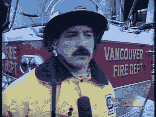
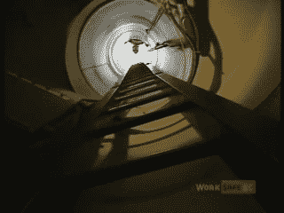
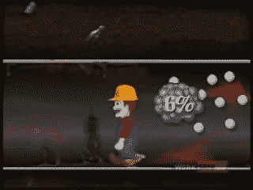
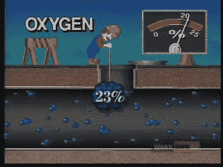

# 逆向技术:受限空间的危险

> 原文：<https://hackaday.com/2021/09/17/retrotechtacular-the-dangers-of-confined-spaces/>

许多人发现自己每天都在狭窄的空间里工作，无论是在下水道系统、下水道还是其他狭窄的地方。这些地区有其独特的生命和肢体风险，必须仔细考虑，以避免灾难。

为此，不列颠哥伦比亚工人赔偿委员会制作了一部关于在这些地区工作的危险性的视频。 *[密闭空间，致命空间](https://www.youtube.com/watch?v=HA6yh0TB5ag)* 强调了这些区域如何杀人，以及解决这些危险的正确方法。

## 事情会在几秒钟内发生变化

*警告:本视频的最后 90 秒画面闪烁，可能会导致感光痉挛。*

 [https://www.youtube.com/embed/HA6yh0TB5ag?version=3&rel=1&showsearch=0&showinfo=1&iv_load_policy=1&fs=1&hl=en-US&autohide=2&wmode=transparent](https://www.youtube.com/embed/HA6yh0TB5ag?version=3&rel=1&showsearch=0&showinfo=1&iv_load_policy=1&fs=1&hl=en-US&autohide=2&wmode=transparent)

Serious business.

该视频像许多安全视频一样，以显示各种工人愉快地忽视他们职业的风险开始。他们窃窃私语地吹嘘他们应对危险的能力，并声称采取预防措施太费时间了。它让我们意识到这些人是绝对错误的，并通过突出几个案例来说明原因。

引用了对导致密闭空间内生命损失的事件的实际研究，以表明正在发生的非常真实的危险。还有密闭空间事故的模拟场景，包括一篇虚构的新闻报道，一名蓄着八字胡的消防员哀叹工人没有遵循正确的程序。这都是典型的安全视频，执行良好，制作干净。

如视频所示，受限空间工作的问题是多方面的。由于通风不良，而且通常在地下，它们很容易充满有毒气体。最常见的两种是硫化氢和一氧化碳。

## 公用事业工人的常见危险

Limited access can make rescues in confined spaces extremely difficult.

由于分解生物物质，硫化氢可能填充空间，或者从化学溢出物或其他来源如下水道中吸取。这非常危险，最明显的是会损害神经系统。在低浓度下，硫化氢有强烈的臭鸡蛋味，会导致眼睛损伤和疲劳等症状。在更高的水平上，它可以破坏嗅觉神经，切断嗅觉。在如此高的浓度下，它可以在几秒钟内导致虚脱和死亡。

一氧化碳作为窒息剂，比氧气更容易与血液中的血红蛋白结合。即使浓度很低，它也会导致死亡，并且是一种无色无味的气体。它通常是在密闭空间中发现的，是碳基燃料不完全燃烧的结果，或者是焊接等操作的副产品。

If dangerous gases were visible as floating bubbles with clearly marked percentages, we suspect there’d be far less accidents.

该视频还指出，其他气体以及氧气耗尽也有广泛的风险。氧气通常占我们周围空气的 21%，但在密闭空间中，这个数字可能会低得多。它会被微生物活动、生锈的金属或其他化学过程耗尽，这些过程会从空气中带走大量的氧气。随着浓度的降低，工人会很快遭受缺氧的影响，从混乱和谵妄一直到死亡。

视频强调了工人在这些情况下面临的各种风险，然后旨在指出缓解这些问题的适当程序。出现问题时依靠救援是正确的。通常情况下，死亡会很快发生，试图救援往往会使救援者自己处于危险之中，无论是什么使第一个工人自己丧失能力。

## 安全装置

不用担心，该视频确实将重点转向了缓解策略。应使用便携式气体监测器仔细检查密闭空间的多个层面的安全氧气浓度和有毒气体的存在。这是必要的，因为不同的气体可能由于它们相对于空气的相对重量而聚集在空间的不同高度。还应该使用通风将新鲜空气泵入空间，以进一步确保安全。并且，在需要救援的情况下，在受限空间之外的观察者应该呼叫帮助，并且救援者应该使用适当的设备来避免自己被征服。

That’s a nice amount of oxygen, right there.

这一切都是以一种非常就事论事的风格呈现的，清晰易懂。它还搭配了 1994 年的创新图形，类似于那个时代流行的 2D 平台游戏。看到我们无畏的地下工作者被硫化氢的绿色斑点淹没，让我们明白了在有限的空间里事情会多么迅速地失控。在视频的最后，用几个主要的点来包装，用闪烁的图形来传递，显然是为了唤醒在强制性培训会议上打瞌睡的无聊工人。然而，这是一个不太好的选择，因为快速闪光可能会导致一些观众的感光痉挛。

总的来说，尽管年代久远，但这是一本关于在密闭空间工作的基本危险和必要预防措施的很好的入门书。它不能代替适当的特定工作场所的培训，但对于那些不熟悉相关实践的人来说，它是一个很好的入门。