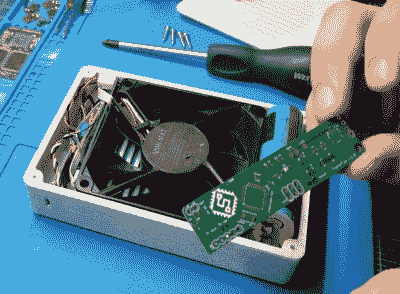

# 定制焊烟风扇不吝啬功能

> 原文：<https://hackaday.com/2021/08/27/custom-soldering-fume-fan-doesnt-skimp-on-features/>

多产的制造商[sjm4306]告诉我们，他的焊接风扇的第一次迭代只不过是一些纸板、绝缘胶带和一根被砍断的 USB 电缆。但是众所周知，这些小项目会随着时间的推移而发展。快进到今天，[和他的定制风扇是一个抛光良好的套件](https://hackaday.io/project/181334-fumefan)，任何一个有烙铁的人都会自豪地在他们的工作台上拥有它。

纸板已经让位于 3D 打印外壳，其中包含风扇，电子设备，一对 18650 电池和一个易于更换的过滤器。在大理石般的细丝、凹陷的标志、适当的埋头螺丝孔和圆角之间，很难夸大这种情况看起来有多好。我们可耻地生产了足够多的方形 3D 打印外壳，知道添加所有这些小细节需要时间，但最终结果真的不言自明。

Fan internals, with a look at the custom PCB.

在有机发光二极管上运行的用户界面也是一个非常好的触摸。当然，风扇不需要图形显示器，并且[sjm4306]可以通过使用交钥匙速度控制器节省大量时间和精力，但是按钮配置以及风扇速度和电池寿命的图形指示确实给最终产品带来了高度专业的感觉。

在下面的视频中，[sjm4306]揭示了虽然成品可能看起来很棒，但道路上有一些颠簸。箱子内部的间隙问题让他重新思考如何布线和安装，导致了比他预期的更拥挤的安排。部分问题是他先设计了外壳，然后试图集成电子设备，而不是反过来；你最好小心一个常见的陷阱。

已经证明，如果没有一些外部输入，[焊料烟雾会直接进入你的脸](https://hackaday.com/2020/06/01/why-does-solder-smoke-always-find-your-face/)。[你是否需要做一些如此复杂的事情](https://hackaday.com/2021/07/20/diy-fume-extractor-keeps-air-clean-while-you-solder/)自然有待讨论，但是如果你[想把那些讨厌的东西从你的肺里赶出去](https://hackaday.com/2018/07/10/do-you-need-a-solder-fume-extractor/)，你最好给你的工作台配备某种风扇。

 [https://www.youtube.com/embed/fqtKTdJRbPI?version=3&rel=1&showsearch=0&showinfo=1&iv_load_policy=1&fs=1&hl=en-US&autohide=2&wmode=transparent](https://www.youtube.com/embed/fqtKTdJRbPI?version=3&rel=1&showsearch=0&showinfo=1&iv_load_policy=1&fs=1&hl=en-US&autohide=2&wmode=transparent)

