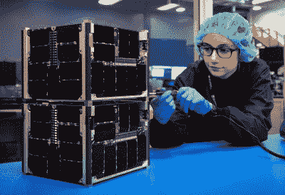
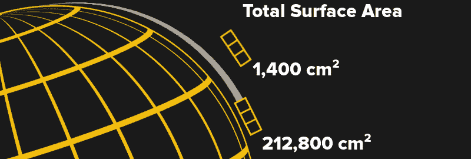
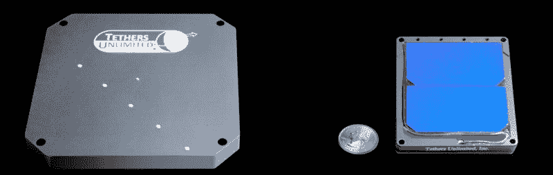

# 给卫星钉上尾巴以防止太空垃圾

> 原文：<https://hackaday.com/2021/09/13/pinning-tails-on-satellites-to-help-prevent-space-junk/>

当只有大公司发射卫星时，低地球轨道已经相对拥挤，但随着进入太空变得越来越便宜，越来越多的硬件开始在头顶上呼啸而过。自 2019 年以来，仅 SpaceX 就已经发射了近 1800 颗卫星，作为其 Starlink 网络的一部分，并可能在未来几十年内再发射多达 4 万颗卫星。他们也不孤单。虽然他们的野心可能没有那么大，但亚马逊和三星等公司已经宣布计划在不久的将来创建自己的卫星“巨型星座”。

至少在纸面上，每个人都有足够的空间。但是当事情出错的时候呢？如果一颗卫星发生故障，变得没有反应，它就再也无法摆脱与轨道上其他物体的密切联系。这是一个特别麻烦的场景，因为不是所有在地球轨道上的东西都有能力移动自己。如果这两个无法控制的物体发现自己处于碰撞过程中，我们在地面上除了观察和期待最好的结果之外什么也做不了。[由此产生的超高速撞击会使弹片和碎片在所有三个维度上飞行](https://hackaday.com/2019/04/09/humanity-creates-a-cloud-of-space-garbage-again/)数百甚至数千公里，对其他车辆造成极其危险的情况。

缓解这个问题的一个方法是设计卫星，使它们能够在任务结束后迅速重返地球大气层并烧毁。理想情况下，如果飞行器变得没有反应或出现严重故障，脱轨程序甚至可以自动启动。自然，为了促进尽可能广泛的采用，这样的系统必须便宜、轻便、易于集成到任意的航天器设计中，并且尽可能可靠。当然，这是一项艰巨的任务。

但也许不是不可能的。波音子公司千年空间系统公司最近宣布，它已经成功部署了一个由系绳无限公司开发的有前途的脱轨装置。这种紧凑的装置被称为终结带，旨在通过增加卫星在稀薄的高层大气中受到的阻力来快速降低轨道卫星的速度。

## 一场真正的太空竞赛

2020 年 11 月 20 日，搭载火箭实验室电子发射到太空，[千禧太空系统的 DRAGRACER 任务](https://www.dragracersat.com/)由两个相同的立方体卫星组成，它们被同时释放到地球上方 400 公里(250 英里)的轨道上。两颗卫星之间唯一的区别是其中一颗名为*炼金术*的卫星配备了终结器磁带装置。另一颗卫星被称为*占卜*，没有主动脱轨能力，作为实验的控制。

一旦两个飞行器安全进入轨道， *Alchemy* 展开了存储在 180 毫米 x 180 毫米 x 18 毫米终端带模块内的紧密包装的 70 米(230 英尺)导电系绳。随着系绳的减速，最初估计 [*炼金术*将撞击地球大气层密度更高的部分，并在 45 天内燃烧殆尽](https://spacenews.com/dragracer-to-demonstrate-the-value-of-tethers-for-satellite-deorbit/)。

The twin stacked satellites separated in orbit.

最终，装有终结者的飞行器花了大约八个月的时间才被动脱离轨道。这比任务前的估计要长得多，但在 SmallSat 虚拟会议期间的后续介绍中，Tethers Unlimited 总裁 Rob Hoyt 表示，该团队仍在收集数据，以改善他们对卫星脱轨率的预测。首先，*炼金术*是第一个在足够低的高度展开系绳的航天器，因此它重返大气层，所以这基本上是一个未知的领域。霍伊特还解释说，系绳的有效性高度依赖于当前的太阳条件，这使得在它实际部署和真实世界的数据开始出现之前，很难确定它将使飞行器减速多少。

尽管如此，八个月与占卜者将要在太空中度过的时间相比还是算不了什么。鉴于其目前的速度和高度，估计控制立方体卫星最早要到 2028 年才能重返大气层。虽然该团队显然需要改进他们估计脱轨时间框架的模型，但毫无疑问，终结者胶带能够大大降低轨道卫星的速度。

## 长尾巴

看一眼你的传统卫星，很明显大气阻力不是设计者最关心的问题。尽管它们有大型太阳能电池板、随意放置的抛物面天线和总体不对称，大多数航天器受到的阻力是如此之小，以至于偶尔的推进器点火足以补偿。即使是国际空间站，人类有史以来送入太空的最大、最笨拙的运载工具，每月也只下降两到三公里。正如你所料，这种影响随着高度的增加而减弱，这意味着一些卫星，如 1958 年发射的先锋 1 号，预计将在轨道上停留数百年。

终止带至少部分是通过大大增加卫星的表面积来工作的。鉴于普通的 3U 立方体卫星只有 30 厘米长，部署 70 米×150 毫米的系绳将使其总表面积增加约 150 倍。系绳像风筝的尾巴一样从卫星上伸出来，只要它处于足够低的高度，仍然会受到显著的大气阻力，它就会被动地降低飞行器的轨道速度。

但不仅仅是增加的表面积将有助于航天器降落。当导电系绳材料穿过地球磁场时，其内会积聚电荷，进而通过洛伦兹力在系统上感应出电磁阻力。系绳本质上将充当一个逆行的无推进剂推进器，不断拉动航天器，剥夺其动量。系绳的这一特性对于高度较高的飞行器尤其重要，因为在这种情况下，大气阻力可能太弱，不足以产生影响。

## 拖动即服务

要将终结带添加到现有的航天器上，只需要有足够平坦的区域来安装 180 毫米见方的设备，并且质量预算中至少有 808 克。你把它固定在飞行器的哪一面，或者飞行器在展开时处于什么方向，都无关紧要，物理学会处理所有这些。

作为一名航天器设计师，你真正需要关心的唯一事情是在适当的时候给它提供激活信号。[根据数据表](https://www.tethers.com/deorbit-systems/)，这意味着向装置的形状记忆合金(SMA)激活器施加 9v 直流电 30 秒，在此期间，热力装置将拉动约 1.9 安培。当使用较小版本的系绳时，仅需要 300 mA @ 3 VDC。在这两种情况下，在正常任务结束时启动设备只需要车辆计算机上的一个空闲 GPIO 引脚和一个 MOSFET。

The two Terminator Tape models currently offered by Tethers Unlimited.

设计者也应该明智地在车辆发生故障时实施第二个自动部署信号。这可以采用专用电池、太阳能电池和电路的形式，不管车辆的状态如何，这些电池和电路都能够在一段设定的时间后提供激活信号。对于寿命相对较短的任务来说，这种应急系统甚至有可能依靠长效原电池运行。

将来，这样的系统甚至不需要电力就能启动。[作为航空航天业日益增长的“消亡设计”倡议的一部分](https://hackaday.com/2019/04/22/why-satellites-of-the-future-will-be-built-to-burn/)，正在对[材料和粘合剂进行研究，这些材料和粘合剂根据时间或外部因素(如温度和阳光照射)可预测地分解](https://hackaday.com/2018/03/12/lost-in-space-how-materials-degrade-in-space/)。最终，我们可能会看到一条系绳，一旦它的盖板被太空环境损坏，它就会自动展开；一个自主和高效的收割机，确保没有卫星停留超过它需要的时间。