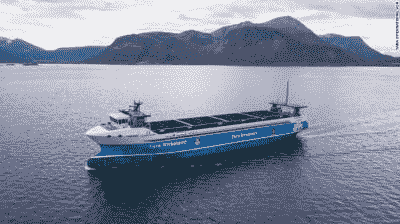
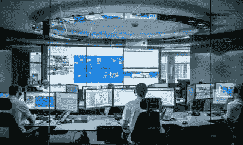
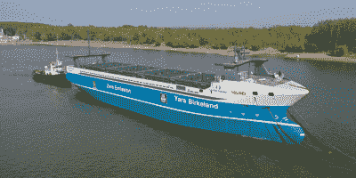

# 世界上第一艘自主电动货船即将起航

> 原文：<https://hackaday.com/2021/09/14/the-worlds-first-autonomous-electric-cargo-ship-is-due-to-set-sail/>

海运是一个大行业，巨大的集装箱船负责将世界上绝大多数的货物从 A 点运送到 B 点、C 点和 d 点。当然，所有这些活动都会对环境产生重大影响，这与我们希望未来的更清洁、更凉爽的世界不符。因此，必须找到旧的化石燃料燃烧船的替代品。为此，挪威公司 Yara International 开发了一艘名为 *Yara Birkeland* 的零排放船只，旨在向[展示一个电动、自主海上运输的世界。](https://edition.cnn.com/2021/08/25/world/yara-birkeland-norway-crewless-container-ship-spc-intl/index.html)

## 水上电力

The *Yara Birkeland* on trial, pictured here with a temporary bridge for manual control of the ship. Credit: Yara International

亚拉国际最初是为了解决 20 世纪初欧洲的饥荒问题而成立的。这主要是通过世界上第一批氮肥的开发实现的，它极大地提高了作物产量。最近，公司开始关注更广泛的可持续发展问题，从而促成了 *Yara Birkeland* 的开发。

这艘船依靠电力，装有 7 兆瓦时的电池。相比之下，普通电动汽车的电池组电量在 40 到 100 千瓦之间。事实上， *Yara Birkeland 的*电池组大约相当于 70 个特斯拉 Model S 电池组的容量。它旨在让船只在港口通过码头设施为电池组充电。

Three separate facilities will monitor the progress of the ship. Credit: Kongsberg

该电池与两个 700 千瓦的隧道推进器配对，用于推进。还有另外两个 900 千瓦的 Azipull 吊舱推进器，除了增加机动性外，还可以推动船只。所有这些动力使亚拉伯克兰的最高时速达到 13 节，大约 15 英里/小时。货物容量是 120 个 20 英尺标准箱，或者用普通的航运术语来说是 TEU。或者，它可以装载 60 个 40 英尺的集装箱。

这艘船是与挪威的海洋系统供应商 Kongsberg 合作建造的。该公司的历史可以追溯到 200 多年前，最初是在 1814 年作为军火工厂成立的。该公司多年来多元化经营，至今在海运业中仍占有一席之地。康斯伯格负责该项目的自主部分，包括所涉及的传感器和集成工作，以及电动传动系统和推进系统。

在今年年底之前，该船将在自己的自主控制下从 herya 航行到 Brevik，同时受到一系列陆基控制中心的监测。在这个早期阶段，该船将由人工装卸，就像任何其他集装箱船一样。然而，我们的目标是在轨道上自动完成这些过程，通过减少人工来降低货物运输的成本。值得注意的是，停泊和离泊将自动处理，无需人工干预或码头上的特殊设备。

## 更清洁的选择

根据最近的研究，航运业占全球温室气体排放的很大一部分，约为 2.5-3%。尽管它只占交通运输总排放量的大约 10%,但一旦将公路旅行、航空、铁路和其他来源考虑在内。不管怎样，温室气体水平和全球气温持续上升，已经到了需要在包括航运在内的所有领域寻求节约的地步。

不幸的是，变化的速度一直很慢。从 2012 年到 2018 年，来自航运的排放量[持续上升，](https://www.greenbiz.com/article/shipping-industry-emissions-keep-sailing-upward)增加了大约 10%。面对这种情况，国际海事组织(IMO)的目标是到 2030 年二氧化碳排放量相对于 2008 年水平减少 40%。到 2050 年，希望能减少 70%。鉴于迄今为止取得的负面进展，这是一个过高的目标。

The ship under tow from a tug, pictured here configured for autonomous operation.

国际海事组织已经制定了一系列的效率要求，试图控制该行业。他们的国际指导方针指出，2022 年建造的船只需要比 2014 年建造的船只节能 30%。这些指导方针原定于 2025 年生效，但在海洋环境保护委员会第 74 次会议上被提前。

这些能效法规将导致国际航运业务的一系列变化。国际海事组织的目标是通过简单的措施，如更好的航行规划和更定期地清洁螺旋桨和船只底部，来实现逐步改善。更深入的技术措施将涉及对船舶进行效率改造，如实施余热回收装置或安装更高效的螺旋桨，以帮助船舶节省燃料，从而减少排放。

## 前进的道路

显然，不排放温室气体的零排放船舶将是实现这些目标的巨大胜利。即使船只使用化石燃料产生的电力，从效率和降低排放的角度来看，将许多船只的污染转移到更少的城市发电厂仍然是一个巨大的胜利。在这方面，这和换成电动汽车的好处差不多。

然而，减缓电动汽车发展速度的类似问题同样会影响电动船舶。港口还没有支持电力船的基础设施，生产支持电力船队所需的电池需要大量的原材料。这些问题都不是不可克服的，但是这些问题需要时间来解决，通常需要几十年的时间。

雅拉国际的这个项目是迈向航运业更大趋势的伟大的第一步。显然，相比之下，当全尺寸集装箱船的容量超过 14，000 标准箱时，一艘运载 120 个集装箱的小型电动船不是解决方案。然而，这是朝着改善全球航运的漫长道路上迈出的第一步。这个项目的成功或失败将会告诉我们很多关于未来的事情。