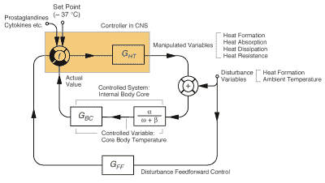
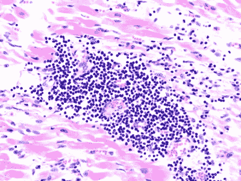

# 疫苗副作用背后的机制:导致手臂疼痛的科学

> 原文：<https://hackaday.com/2021/09/21/mechanisms-behind-vaccine-side-effects-the-science-that-causes-that-sore-arm/>

注射疫苗后，我们可能会感觉到一些副作用。这些症状包括手臂疼痛、淋巴结肿大甚至发烧。预期的副作用取决于确切的疫苗，每种类型和变种都有自己的常见副作用列表。每个人的免疫系统也会有不同的反应，这使得很难说接种疫苗后会发生什么。

我们能做的是更仔细地观察导致这些副作用的潜在机制，试图理解它们为什么会发生以及如何最好地处理它们。这里与初始反应最相关的是身体的[先天免疫系统](https://en.wikipedia.org/wiki/Innate_immune_system)，树突细胞通常是最先接触疫苗并将抗原呈递到身体适应性免疫系统的细胞之一。

发红、肿胀和发热的关键是身体产生的物质，包括各种细胞因子和前列腺素，产生炎症和损伤的症状。

## 对付入侵者

Artistic rendering of a human dendritic cell. (Source: NIH)

疫苗之间的第一个区别在于抗原是如何进入人体的。传统疫苗要么使用弱化的完整病毒，要么使用病毒的部分，因此它们是抗原，或者含有预期抗原作为其结构的一部分。基于病毒载体和 mRNA(脂质载体)的疫苗使用一种载体，将 RNA 转移到身体细胞中，然后细胞的核糖体组装抗原的副本。作为一种外源蛋白，它作为淋巴细胞的抗原呈现在细胞表面。

如果已经存在针对这种特定抗原的抗体，身体适应性免疫系统的淋巴细胞(B 和 T 细胞)将立即作用于这种抗原，从而作用于附着在该抗原上的(假定的)入侵者(病毒、细菌或毒素)。如果没有抗体存在，过程是类似的，但需要更长一点的时间来提高免疫反应。

同时，随着适应性免疫系统的增强，树突状细胞和先天免疫系统的其他细胞(如巨噬细胞和肥大细胞)也释放大量的[细胞因子](https://en.wikipedia.org/wiki/Cytokine)，包括引起血管舒张的炎性细胞因子，这些细胞具有病原体相关分子模式的模式识别受体( [PRRs](https://en.wikipedia.org/wiki/Pattern_recognition_receptor) )。随之而来的血液涌入会导致皮肤变红( *rubor* )和热量增加( *calor* )。

随着血管扩张，其他介质使这些血管的壁更具渗透性，导致血管外(细胞内空间)的液体量增加。这种液体渗出导致肿胀(*肿瘤*)，从而降低病原体接触身体组织的可能性，同时让[巨噬细胞](https://en.wikipedia.org/wiki/Macrophage)和其他[白细胞](https://en.wikipedia.org/wiki/White_blood_cell)(白细胞)自由活动，以便它们能够追捕病原体。

除了血管舒张过程，一些释放的细胞因子引起痛觉过敏( *dolor* )，本质上是对疼痛的敏感性增加。所有这些都是急性炎症过程的一部分，也是接种疫苗后经常出现的“手臂酸痛”的原因。

## 疫苗引起的发烧

Simplified diagram of human thermoregulation (Author: J. W. Dietrich)

在接种某些类型的疫苗后常见的症状中，发烧(伴随头痛)远不如手臂酸痛常见，但仍经常报道。如果我们查看针对新冠肺炎辉瑞-BioNTech mRNA 疫苗的 [CDC 研究结果](https://www.cdc.gov/vaccines/covid-19/info-by-product/pfizer/reactogenicity.html)，其中人们自我报告了他们的症状，我们可以看到头痛是一种经常报告的症状，但是由于这种症状在安慰剂组中的流行，似乎不存在强有力的因果联系。

疫苗和发烧之间存在更明确的联系，因为炎症过程中释放的物质之一是一种叫做前列腺素的类花生酸。这种化合物参与血管扩张，以及抑制血小板聚集(抗凝血)，最重要的是，在这种情况下，强烈影响身体下丘脑中的[体温调节](https://en.wikipedia.org/wiki/Thermoregulation_in_humans)中枢。

简而言之，来自身体先天和适应性免疫系统的炎症反应导致身体体温调节系统的积极输入。由此产生的结果可能不同，从仅仅经历一些热不适，到真正的发烧，一个人的体温可能会大大超过其正常水平。

只要发烧不超过 40 ℃( 104 ℉),这些都没有什么可担心的，因为早期的 CDC 疫苗研究结果显示这是非常罕见的。使用布洛芬等非甾体抗炎药来缓解接种疫苗后可能出现的发烧和疼痛症状是安全的。由于疫苗中没有真正的病原体，唯一重要的因素是适应性免疫系统有机会学习新的抗原，这意味着发烧对免疫没有好处，更不用说注射部位周围的疼痛了。

## 心脏炎症

Microscope image of heart tissue that suffered viral myocarditis.

[心肌炎](https://en.wikipedia.org/wiki/Myocarditis)(炎性心肌病)是一种心肌炎症，最常由病毒感染引起。全世界每年平均有超过一百万人患心肌炎，超过 300，000 名患者死于这种疾病。心肌炎的原因通常是作为对感染的反应，促炎性白细胞渗入心肌。在新型冠状病毒病毒的情况下，这种病原体直接与心脏组织表面的 ACE2 受体结合，使其能够感染这些细胞。

就新型冠状病毒疫苗而言，心肌炎是一种已知的副作用，尽管很罕见。Biykem et al. 的一篇文章推测，其原因是新型冠状病毒病毒的刺突蛋白与自身抗原(包括α-肌球蛋白)之间的分子模拟。这是一种也被称为 [MYH6](https://en.wikipedia.org/wiki/MYH6) 的蛋白质，它在心房和心室中都有显著表达。

在适应性免疫系统错误识别的情况下，这可能导致心肌成为白细胞的目标。无论这是否是真正的原因， [David K. Shay 等人](https://jamanetwork.com/journals/jamacardiology/fullarticle/2781600)报告称，与自然发生的心肌炎相比，在与新冠肺炎免疫相关的病例中，心肌炎的发生极为罕见。即便如此，在不了解确切的相关机制的情况下，任何特定心肌炎病例与新型冠状病毒疫苗接种的联系仍然基于间接证据。

## 安慰剂副作用

正如 CDC 公布的辉瑞-BioNTech 研究结果中指出的，安慰剂组也报告了许多副作用，包括发热、腹泻和呕吐等明显症状。这突出了一个大问题，不仅是在医学试验中安慰剂的问题，也是当人们服用真正的药物时的必然结果。

部分由于媒体报道和人们可能在社交媒体上读到或从朋友和同事那里听到的事情，仅仅是接种疫苗的事实就可能导致恶心和疼痛等症状。当你已经在期待某事发生时，你更有可能找到它。对治疗或疫苗的夸大负面效应通常被称为“ [nocebo](https://en.wikipedia.org/wiki/Nocebo) 效应”，其中对治疗(即使是安慰剂)负面效应的预期可能导致患者遭受这些效应。

正如[Winfried Hauser 等人](https://www.ncbi.nlm.nih.gov/pmc/articles/PMC3401955/)在 2012 年所报告的，由于其对医疗和患者护理的影响，诺西博效应(或现象)正成为更多研究的主题。这里要特别指出的是，与患者就他们的期望进行沟通，并相应地调整这些期望的重要性。在目前新型冠状病毒疫情正在进行的全球疫苗接种运动的背景下，人们也可以考虑(社会)媒体在[大规模心理疾病](https://en.wikipedia.org/wiki/Mass_psychogenic_illness)(“大规模歇斯底里”)方面的影响。

尽管医疗卫生专业人员和其他人试图通过清晰的沟通来设定预期，但通过其他渠道存在足够多的虚假信息，一些人可能已经相信这些疫苗的所谓负面影响。这里的风险是，即使那些不一定反对接种疫苗的人，他们仍然可能下意识地将他们听说过的负面影响的子集投射到自己的身体上，从而产生 nocebo 现象。

## 吃一片止痛片(糖)

随着疫苗变得越来越精细，我们对它们在体内引发的效应和症状(期望的和不期望的)有了更好的理解，它们已经变得足够常规，以至于我们通常几乎意识不到它们是如何保护我们的。在我们的儿童疫苗之后，我们最倾向于处理疫苗的情况是当我们需要破伤风的加强剂时，或者当我们去某个外国要求某些疫苗接种的证明时，或者只是为了保护我们自己免受当地特有疾病的侵害。

由于新型冠状病毒疫情，世界目前正在经历的是(到目前为止)真正独特的，从这个意义上说，这是我们在全球范围内接种的第一个疫情。与耗时数十年的天花根除计划相比，当前的目标是在几年内让全世界接种疫苗。由于如此大规模地同时给如此多的人接种疫苗，即使罕见的副作用也会在纯粹的病例基础上更频繁地发生。

即便如此，对于今天、明天以及未来几个月和几年接种疫苗的绝大多数人来说，手臂酸痛和可能的紧张感将是他们在这场大规模疫苗接种运动中经历过的最多的一次。所有这些仅仅是你身体的免疫系统做它应该做的事情的自然迹象。