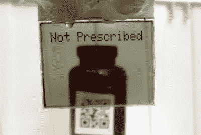

# 诺基亚液晶透明免提提醒

> 原文：<https://hackaday.com/2021/08/29/nokia-lcd-goes-transparent-for-hands-free-reminders/>

如今，每个人都对透明的有机发光二极管面板感到兴奋，但对经典的诺基亚 5110 LCD 的热爱在哪里呢？正如多产的[Nick Bild]在他的最新作品中展示的那样，你所要做的就是剥掉 90 年代末显示器的背面，然后你就可以花几美元买到一个透明的赛博朋克屏幕。

View through the modified LCD.

在这种情况下，[Nick]将修改后的显示器连接到一对框架上，并使用 Adafruit QT Py 微控制器将其连接到 ESP32 供电的 ESP-EYE 开发板和 OV2640 摄像头模块。这使他能够检测佩戴者视野内的二维码，并在硬件上运行 TensorFlow Lite 神经网络。电力由 Adafruit PowerBoost 500 运行的 2000 mAh LiPo 电池提供。

该项目旨在为医疗专业人员提供增强现实提醒，使用二维码来查找患者和药物信息。目前，神经网络被用于检测佩戴者何时洗手，但显然训练模型可以根据需要更换为不同的东西。通过结合这些信息来源，可穿戴设备可以做一些事情，如警告医生，如果病人对他们目前正在看的药物过敏。

相关信息和警告显示在诺基亚液晶显示器上，该显示器放置在离眼睛足够远的地方，用户可以实际阅读文本；几周前，[【扎克·弗里德曼】用他的(故意)难以辨认的可穿戴显示器](https://hackaday.com/2021/08/19/why-you-cant-make-build-a-wearable-display-with-a-just-a-transparent-oled/)展示了一个重要的设计考虑。这确实让设计有点…笨拙，但至少你[不用担心手切到你的镜片](https://hackaday.com/2021/08/14/3d-printed-smart-glasses-put-linux-in-your-face/)