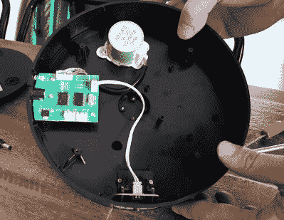

# 通过慢速转盘进行更好的 3D 扫描

> 原文：<https://hackaday.com/2021/08/31/better-3d-scans-through-a-slowed-down-turntable/>

3D 扫描仪并不便宜，购买后你最不想看到的就是坏数据。但这就是[戴夫]和其他人从他们的 Revopoint POP 扫描仪中获得的结果，直到一些公共头脑风暴发现了原因:该产品的 Kickstarter 版本附带的电动转盘旋转速度太快，软件无法准确跟踪该物体。因此，他决定更换转盘中的步进电机控制器，并记录下这个过程，以供其他扫描仪有困难的人使用。

Plenty of room for expansion.

在下面的视频中，[戴夫]打开转盘的塑料外壳，露出了一个相当稀疏的内部。里面有令人难以置信的空间，甚至有一些安装螺栓来拧紧新组件，如果你想进行一些核心升级。但是对于他的目的来说，一个普通的步进电机控制器就足够了。他在网上找到了一个合适的板，价格约为 5 美元，并开始设计一个 3D 打印的支架，与转盘上现有的螺丝孔相匹配。

但这并不是一个简单的替代品。首先，你必须在外壳侧面开一个洞，让电位计旋钮伸出来。你还必须将原来的 DC 插孔和电源开关的电线焊接到新板上，以便将其连接起来，但至少电机可以直接插入。在下面的视频中，你可以看到[戴夫]展示了新车手令人印象深刻的深油门能力。

如果你更愿意建造而不是购买，我们在过去已经介绍了一些令人印象深刻的 DIY 转盘，它们可以很好地满足需求，从处理相机控制的自动模型到全 3D 打印版本，你可以自己动手制作。

 [https://www.youtube.com/embed/JYtewGHnEb0?version=3&rel=1&showsearch=0&showinfo=1&iv_load_policy=1&fs=1&hl=en-US&autohide=2&wmode=transparent](https://www.youtube.com/embed/JYtewGHnEb0?version=3&rel=1&showsearch=0&showinfo=1&iv_load_policy=1&fs=1&hl=en-US&autohide=2&wmode=transparent)

