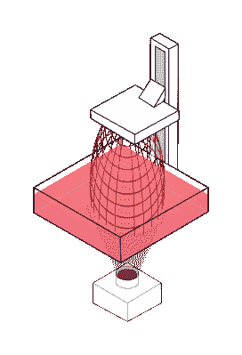

# 连续树脂打印机显示速度

> 原文：<https://hackaday.com/2021/09/16/continuous-resin-printer-shows-the-speed/>

Redditor [No-Championship-8520]又名[Eric Potempa]提出了一个关于目前由[碳公司](https://en.wikipedia.org/wiki/Carbon_(company))拥有和开发的[连续液体界面生产(CLIP)工艺](https://en.wikipedia.org/wiki/Continuous_Liquid_Interface_Production)的[有趣的 DIY take](https://old.reddit.com/r/3Dprinting/comments/pcb8it/diy_continuous_resin_printer/?sort=top) 。

你可能熟悉的普通树脂 3D 打印机是一种非常简单的机器。机器只有一个轴，即垂直移动的构建平台。光线使光敏树脂曝光，光敏树脂在透明窗口上固化，然后在下一层曝光之前被拉离透明窗口。

Typical resin printer setup

CLIP 是一种连续的树脂打印过程，通过取消这种剥离过程来加快打印速度。它利用了氧气可渗透的底膜。边界处的少量氧气防止固化树脂粘到底部，使 Z 轴不断向上移动，显著加快打印速度。

[Eric]使用的方法是基于一个连续旋转的浴槽，以保持树脂移动，在活性聚合区补充树脂。浴槽底部由坚硬的 PDMS 表面制成，用橡胶滚轴不断擦拭以补充氧气层。他指出，碳在获得足够的氧气进入建造层方面仍然存在问题，他认为这就是为什么他们只显示较小或网格结构的印迹。他的方法应该可以解决这个问题。构建平台缓慢向上移动，零件在一个长时间的连续移动中出现。他报告的印刷速度为 280 毫米/小时，这至少可以说是相当快了。更多的细节非常缺乏，嵌入的视频有点不清楚，但正如一位评论员所说“我认为我们刚刚看到树脂印刷的发展！”下一个尖刻的评论把“进化”改成了“旋转”，这让我们咯咯地笑了起来。

现在，我们都知道 3D 打印一点都不新鲜，只是专利的到期和阿德里安·鲍耶和 reprap 团队的及时工作才启动了 FDM 打印机的当前爆炸。树脂打印机可能会受到同样问题的阻碍，直到一些全新的东西启动下一次进化。也许这就是进化？我们真的希望[埃里克]决定写下他的项目的一些细节，我们将坐等所有血淋淋的细节。手指交叉！