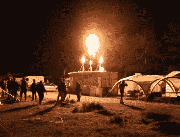
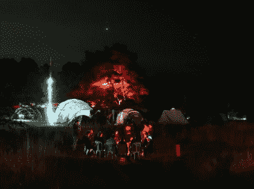
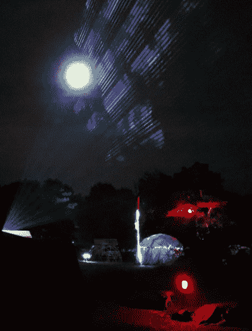
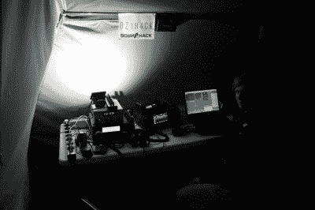
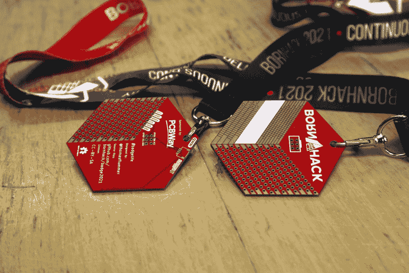
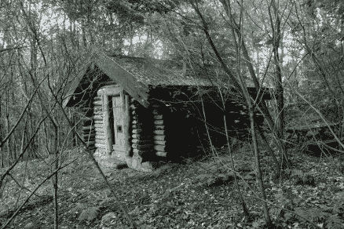
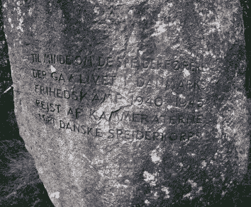

# 来自博恩哈克 2021 的报道:黑客训练营成功穿越疫情

> 原文：<https://hackaday.com/2021/08/31/reporting-from-bornhack-2021-hacker-camps-making-it-through-the-pandemic/>

在一个正常的夏天，我们会在欧洲这里被宠坏的选择，当涉及到我们的社区活动时，有一个大营地和一系列远近的小营地。只有最铁杆的旅行者才能到达所有的目的地，但通常一季中至少有一两个目的地是可能的。当然，这不是一个普通的夏天。我们中的许多人现在可能已经接种了新冠肺炎疫苗，但我们仍处于全球疫情的掌控之中。庞大的荷兰妇幼保健营地被推迟到 2022 年，由于不确定性，大多数较小的营地已经半途而废。但是一个黑客阵营继续存在。

丹麦的 BornHack 是 2020 年世界上唯一一次面对面的夏季黑客活动，上周[它的回归](https://bornhack.dk/bornhack-2021/)使它成为 2021 年欧洲唯一一次这样的活动。今年早些时候，当他们开始打折的时候，我拿到了一张票，在疫情中穿行于复杂的欧洲跨境旅行世界，在来自北欧各地的黑客的陪伴下，前往丹麦 Fyn 岛上的 Hylkedam 童子军营地，进行为期一周的活动。BornHack 又一次完成了不可能的任务，是时候在黑客训练营享受一周了。

## 安全地聚集在丹麦的森林里

  Flamethrowers provided plenty of entertainment  This is a scout camp, of course it’s got a full-sized fire pit!  Lasers and the moon made for a great shot after a lot of trying.

Hylkedam 位于一片茂密的森林中，从主干道通往这里大约有半英里的土路，这条土路一直延伸到主要的 BornHack 场。在这里，我找到了 orga 和咨询台，以及大多数村庄。沿着场地的轨道和小路走一小段路就是酒吧、喧闹和安静的田野，还有演讲者的帐篷和童子军建筑，里面有营地的许多工作室。

和往常一样，第一个订单是登记入住，这一次值得注意，因为需要提供疫苗接种证明或 COVID 测试。与去年相比，气氛更加轻松，社交距离和卫生都很远，但仍然强调营地不会成为一个传播事件。现场有 310 人，是其前身的两倍多，所以这是 orga 非常重视的事情。

作为今年夏天黑客在某个领域呆上一段时间的唯一机会，该活动吸引了来自斯堪的纳维亚国家以及德国、荷兰、比利时的与会者，甚至像我一样的少数美国人和英国人。村庄平均分布在不同的国家、群体、编码语言和黑客空间中，所以有很多地方可以闲逛和打招呼

The BornHack amateur radio station.

对于我们当中的无线电业余爱好者来说，有一个特殊的活动站，呼号是 OZ1H4CK，晚上我们受到了 Dimitri Modderman 的热情款待，他的工作多年来已经成为黑客营地的固定节目。

热闹的酒吧供应令人印象深刻的丹麦啤酒，我们已经习惯了，餐饮由优秀的东亚食品卡车提供，所以我们所有的需求都得到了满足，因为我们在吊床上打发时间，通过我们的 PMR446 收音机相互发送慢扫描电视 meme 图片。

黑客营是关于放松和与你的朋友一起闲逛的，当然它也是关于一个完整的讲座和研讨会的项目。其中一些是我亲自参加的，比如安妮·奥格伯恩的 SWI·普洛斯研讨会，而另一些是我在 YouTube 上看到的。以下是供你观赏的精选作品。

## 黑客营会谈

首先是 Jr gen Kragh Jakobsen，他的*用于 IC 开发的开源工具*将带领观众了解芯片设计的基本知识以及为生产准备新器件的过程。它被博恩哈克变幻莫测的流媒体系统分成两部分，所以这里是[第一部分](https://www.youtube.com/watch?v=39TOZQgBxtc?t=240s)，然后是[第二部分](https://www.youtube.com/watch?v=TKfxdQqTc3I)。

然后是 Mikkel mikjr Christensen 带着 [*丹麦彗星——第一台丹麦微型计算机！*](https://www.youtube.com/watch?v=8oiOrfVRILI) ，深入了解上世纪七八十年代丹麦制造的一系列电脑。我们以前顺便提到过他的工作，他在逆向计算领域的知识深度和艰苦研究是首屈一指的。

与此同时，我们都知道互联网是如何工作的，但仍然有很多东西要从威廉·本·恩巴雷克的 [*开始你自己的 ISP(或只是学习 ISP 如何工作)*](https://www.youtube.com/watch?v=i2pFmtcNX_M&t=230s) 中学习。马克-简·巴斯蒂安的 [*电源稳定性和风险*](https://www.youtube.com/watch?v=3tvFJMbwzDw) 应该会吸引任何面临 PSU 挑战的硬件工程师。而[Moem]的 [*面向普通用户的 Ubuntu Touch*](https://www.youtube.com/watch?v=tNVcE4EqmzY)则是在提醒人们，移动 OS 依然生机勃勃。

## 芯片短缺中的徽章

A little more than just a prototyping board: the BornHack 2021 badge.

2021 年不仅是全球疫情的一年，也是半导体短缺的一年。博恩哈克徽章设计师 Thomas Flummer 因此选择今年生产一款没有组件的博恩哈克徽章，但[它远不只是一个花哨的原型板](https://www.youtube.com/watch?v=qXahAHCUwSA)。相反，他制作了一个低劣的附加原型板，基于大多数与会者可能会随身携带 [2019](https://hackaday.com/2019/09/13/hands-on-bornhacks-light-sabre-badge/) 或 [2020](https://hackaday.com/2020/08/27/hands-on-bornhack-2020-badge-has-9x32-of-bling-fed-by-circuitpython/) 博恩哈克徽章的可能性。

该设计具有通孔和 SMD 原型制作区域，中央放置 SAO 连接器，其线路延伸至原型制作焊盘。在 badge hacking tent 上有各种各样的独立组件可用，用它们创建了一些最小的 blinkies 和一些更令人印象深刻的项目。我们认为他做出了正确的决定，因为供应链问题很有可能会干扰更复杂徽章的交付。

## 一个远离这一切的机会

  One of the scouting buildings dotted throughout the woodland.  The memorial to fallen members of the Danish scouting movement during the Second World War.

像博恩哈克这样的营地的真正价值，尤其是在疫情期间，是它提供了一个难得的机会，在长期与世隔绝后再次见到朋友。一起出去玩，去波罗的海游泳，去乐高之家旅行，这些都是很久以来被剥夺的事情，而疫苗意味着我们现在可以稍微安全地做这些事情。最后是这个地方本身，正如我前面提到的，Hylkedam 位于一片茂密的森林中，但这不足以描述这个地方的一些部分是多么的宁静和美丽。很容易离开营地，进入森林，尽管有点担心虱子，但有很多安静的角落可以放松。到达这个营地需要长途跋涉，但是丹麦人的友好欢迎和周围环境的吸引力意味着它是我行程中的一个固定项目。