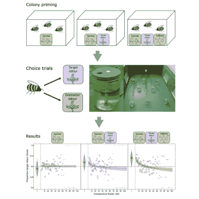

# 甚至蜜蜂也在谈论咖啡因

> 原文：<https://hackaday.com/2021/09/13/even-bees-are-abuzz-about-caffeine/>

我们中的许多人每天至少要喝一杯咖啡，或者至少，我们不想尝试。无论你如何选择摄入咖啡因，它都是一种令人敬畏的能量来源，也是众多黑客和人类关注的焦点。显然，授粉蜜蜂也是如此。

你可能听说过没有足够的蜜蜂来给所有需要授粉的作物授粉。那是旧闻了。一个解决办法是商业化养殖，然后用卡车运到农民需要的地方。新的问题是，蜜蜂四处游荡，给野花授粉，而不是给它们应该授粉的田地授粉。但是这些分散注意力的蜜蜂还是有希望的:格林威治大学的科学家发现，受到咖啡因影响的[蜜蜂在闻到它们应该授粉的花的气味时，更有可能留在轨道上](https://www.scientificamerican.com/article/caffeine-boosts-bees-focus-and-helps-them-learn/)。

Image via [Cell](https://www.cell.com/current-biology/fulltext/S0960-9822(21)00897-6?utm_source=EA)

## 渗透证明

为了实验的目的，科学家将一群蜜蜂分成三组:第一组喝含咖啡因的糖水和一阵草莓花香，第二组喝普通糖水加香味，第三组喝普通糖水不加香味。

关键时刻到了——他们将蜜蜂放入室内的机器人花地里。有些花散发出草莓的味道。其他的花散发出一种不同的气味来分散蜜蜂的注意力，所有的花都含有普通的糖水作为对发现的奖励。

结果表明咖啡因和气味之间有很强的联系:70.4%的含咖啡因的蜜蜂会直接吃草莓花，而只有 60%的普通糖水蜜蜂会先吃草莓。

过了一会儿，所有三组的蜜蜂最终都选择了分散注意力的花朵。但是实验的这一部分似乎有点倾斜，因为这些分散注意力的花比它们在真实世界中更接近目标花。因此，直到农民们在工作前为他们的蜜蜂设置了含咖啡因的糖水槽，我们才知道这种震动可能会有多有效或持久。

有研究表明，咖啡因确实能提高人类的记忆能力，至少对那些正在经历清晨考试的大学生来说是如此。[我们中的许多人在大学毕业后都享受着大量的咖啡因来保持注意力](https://www.ncbi.nlm.nih.gov/pmc/articles/PMC5107567/)，包括你的 truly 和我们自己的【Jenny List】。

通路〔t0〕adafruit〔t1〕

图片来自 [@chrisdubai](https://unsplash.com/photos/EuM7efqpKFg)