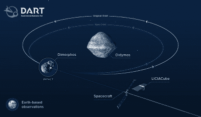
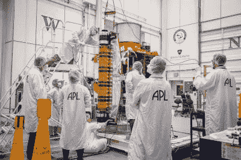
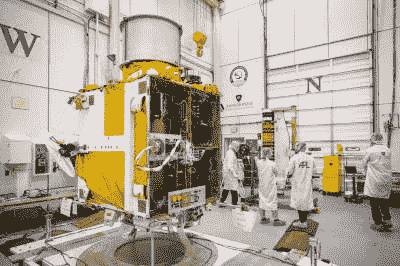

# 美国国家航空航天局正全力应对小行星的威胁

> 原文：<https://hackaday.com/2021/09/10/nasa-are-squaring-up-against-the-asteroid-threat/>

世界现在面临许多地球危机，所以很容易忘记巨大的太空岩石可能有一天会威胁到整个文明的存在。是的，小行星撞击的威胁很遥远，但不管怎样，人类有一天可能不得不面对，而且很快就会有一天。

美国宇航局认真对待这个问题，并自 2016 年以来为其行星防御协调办公室配备了人员。为了服务于这些努力，它也在发展一项任务，研究危险的机器人可以被偏转到什么程度。双小行星重定向试验，简称 DART，[将于明年启动。](https://dart.jhuapl.edu/Mission/index.php)

A graphic outlining the basics of the DART mission. The DART spacecraft intends to impact the Dimorphos asteroid, changing its rotational period around Didymos, while the LICIACube satellite images the impact event.

DART 旨在通过动能撞击，或者通俗地说，通过撞向小行星来改变小行星的路径。该飞行器的目标将是 Didymos，这是一个双星小行星系统，由 Didymos 本身和围绕它运行的较小的小行星 Dimorphos 组成。这颗小行星将在地球附近经过，距离 1100 万公里，不在碰撞轨道上，这使它成为人类首次尝试小行星偏转的良好候选。

这对小行星中较大的 Didymos 直径为 780 米，而 Dimorphos 则小得多，直径仅为 160 米。飞镖飞船的目标是迎面撞上狄摩福斯，这样做可以缩短它围绕狄摩福斯的轨道周期。轨道的这种变化将由地球上的观测站来测量，以衡量任务的成功。

DART 飞船的主体尺寸仅为 1.2 x 1.3 x 1.3 米，整个飞船重约 500 千克。DART 计划以 6.6 公里/秒的速度撞击 Dimorphos。这样，它将使轨道周期改变 4.2 分钟，从 11.9 小时变为 11.8 小时。轨道周期的变化预计在 10 分钟左右。这听起来可能不是一个很大的变化，但希望是在数百万公里的范围内，它将使小行星系统的原始轨道发生重大转变。

The roll-up solar wings that will power DART are similar to those recently installed on the International Space Station.

DART 任务还将用于测试几种创新技术。该项目的新内容是推出太阳能电池阵列，或 ROSA。这些柔性太阳能电池板可以卷起来发射，一旦飞船进入太空就可以展开。它们比传统阵列更轻、更紧凑，同时也更坚硬。当完全展开时，这两个展开式面板的跨度分别为 8.5 米。类似的技术最近被部署到国际空间站，国际空间站在其原始的刚性太阳能电池板上铺设了可展开的电池板，以改善老化的空间站的电力预算。ROSA 阵列还将有一小部分用于试验转换太阳能阵列技术，该技术使用反射聚光器结合高效太阳能电池，有可能提供三倍于典型太阳能阵列的电力。

推进是通过美国宇航局的 NEXT-C 氙燃料[网格离子推进器。](https://www1.grc.nasa.gov/space/sep/gridded-ion-thrusters-next-c/)它利用电场将离子加速到大约 40 公里/秒的巨大速度，以便为航天器产生推力。虽然产生的推力很小，大约几百毫牛顿，但离子推进器非常节省燃料。因此，它可以运行很长一段时间，慢慢地加速到很高的速度。[在](https://hackaday.com/2021/04/19/space-propulsion-separating-fact-from-science-fiction/)之前，我们已经展示了这项技术，它有望在各种远程太空任务中发挥作用。

为了瞄准小行星并准确无误地击中它，DART 任务需要一个顶级的导航系统。因此，该飞船的特点是搭载了用于光学或 DRACO 的 Didymos 侦察和小行星照相机。这个装置用于终端导航，以确保 DART 与小行星进行良好的固体撞击。高分辨率相机输入到[智能导航自主导航系统](https://www.jhuapl.edu/interactive/navigating-double-asteroid-redirection-test-on-its-own)中，该系统将在飞船飞向小行星的最后四个小时中控制飞船。让宇宙飞船自己导航是很重要的，因为涉及的距离，来自地球的指令的往返延迟将是 1.5 分钟。因此，飞行器必须自己飞向目标。

The DART craft under construction at NASA’s Johns Hopkins APL facility.

DART 任务还将携带 LICIACube，这是一个由意大利航天局建造的小型立方体卫星。撞击前五天，将部署 LICIACube，以便对 DART 撞击 Dimorphos 的情况进行成像。目的是捕捉撞击点本身的照片，以及撞击后立即喷出的物质云。这将为分析 DART 任务重定向小行星的有效性提供大量材料。

这是解决小行星偏转问题的一个有趣的方法。用相对较小的航天器在小行星接近的早期漂亮地撞击小行星，用目前的技术应该很容易实现，DART 将证明这一点。它也没有其他想法那么绝望和激烈，包括最后使用核武器来赶走或摧毁来袭物体。

目前，预计在不久的将来不会有大的小行星撞击地球。然而，这并不是说没有大量的小行星漂浮在那里。截至 2019 年初，行星防御协调办公室已经探测到超过 [19，000 颗近地小行星](https://www.nasa.gov/planetarydefense/faq)，平均每周探测到 30 颗新天体。这些探测和跟踪努力是行星防御的关键。我们越早意识到一个物体向地球飞来，我们就有越多的时间来计划应对它的任务，也就有更多的选择。让小行星靠得太近，使其偏离地球所需的能量就会变得更大，任务也会变得更加困难。

虽然 DART 的影响很小，但这只是人类第一次尝试改变小行星的方向。地球上勇敢的人们将可以更轻松地休息了，因为他们知道伟大的思想正在解决如何保护我们免受来自上方的大岩石伤害的难题。