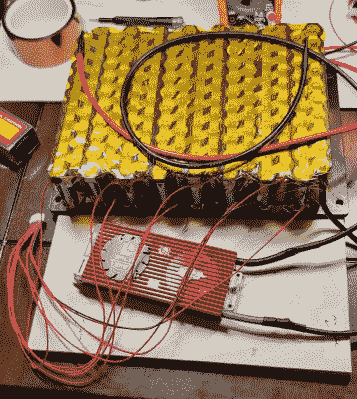

# 坚固的太阳能发电机包装一拳

> 原文：<https://hackaday.com/2021/09/07/rugged-solar-generator-packs-a-punch/>

2021 年 Hackaday Prize 的参赛者菲利普·伊恩·哈斯努特(Philip Ian Haasnoot)一直在打造一个精心打造的电力银行。但这不是一个普通的小能量银行，你可以把它放在背包里外出一天。不，这个 [2.5 千瓦的便携式电源组](https://hackaday.io/project/180457-rugged-solar-generator-25kw)被整齐地装在一个坚固的防水鹈鹕 1550 箱子里，并适当地配备了所有你可能需要在野外露营和摄影的长周末使用的电源插座。

Boy, that’s a lot of tab welding

这个盒子有 USB-C 和 USB 3.0 连接器用于小工具充电，还有 12 VDC 点烟器和 XT-60 端口用于高阻力设备。此外，它还通过集成逆变器提供了一对 120 VAC 插座，如果你真的绝望，1.5 千瓦可以运行一个小加热器，但更可能有用的是让你的笔记本电脑运行一段时间。现在，如果你能在沙漠里无线上网就好了！

[Philip]实际上并没有过多地谈论太阳能电池板本身，但我们知道盒子里有一个 600 W 的 MPPT 升压转换器来接收太阳能，并以正确的方式给 LiPo 电池组供电。

正如你所料，电池组是由经过回收和测试的 18650 个电池定制而成的，我们认为手工制作这种电池花费了绝对长的时间。整个项目很好地完成了，看起来像是我们很乐意在前往我们当地的荒野之前扔在汽车后面的东西。

正如[菲利普]在项目描述中所说，携带足够的电力并为他所有的无人机、相机和照明设备充电是一项艰巨的工作，更不用说在亚利桑那州寒冷的夜晚帮助营地居民避免整夜受冻了。

多年来，许多电源库设计为这些公平的页面增光添彩，就像这个[相当精致的版本](https://hackaday.com/2019/06/05/overengineering-the-humble-usb-power-bank/)，希望他们能继续这样做。

The [HackadayPrize2021](https://prize.supplyframe.com) is Sponsored by: