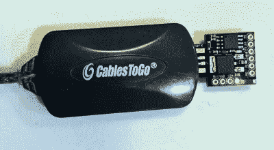

# 幽灵般的 USB 婴儿打出来自远方的信息

> 原文：<https://hackaday.com/2021/09/08/spooky-usb-baby-types-out-messages-from-beyond/>

你可能会认为我们运行万圣节黑客有点早，但不要担心。虽然这个[配备微控制器的娃娃模仿 USB 键盘以尽可能令人毛骨悚然的方式输入信息](https://www.robopenguins.com/haunted-doll/)可能*看起来*像是你在参加了某人令人不寒而栗的节日狂欢后得到的恶作剧礼物，但创造者【乔纳森】实际上是为朋友的婚礼组装的。因此，这不仅是一个有趣的拼凑硬件，而且也是一个伟大的提醒，有一个婚礼登记处的重要性。

即使从局外人的角度来看，这似乎是一份相当不寻常的结婚礼物(从学生时代起，涉及这个“闹鬼的娃娃”的恶作剧就一直是他们之间的一个笑话)，我们也不禁对[乔纳森]实施它的方式留下了深刻的印象。[一个 ATtiny85 供电的 Digispark](https://hackaday.com/2012/08/13/teensy-tiny-arduino-board-with-an-attiny85/) 藏在娃娃里面，还有一个简单的 USB 2.0 集线器[据说可以缓解一些初期问题](https://arduino.stackexchange.com/questions/63137/digispark-micro-attiny85-not-working-on-macbook-pro-2016)小型开发板与更新的 USB 3.0 端口。通过使用 V-USB，一旦插入接收者的电脑，婴儿就可以打出信息。

Soldering the Digispark to a cheap USB hub keeps newer computers happy.

现在他可以就此打住，但[乔纳森]希望这是一次互动的体验。具体来说，他希望婴儿向新婚夫妇展示各种各样的个人测试，这意味着接受用户的输入。他想出了下面视频中展示的智能用户界面，该界面对系统的“大写锁定”状态的变化做出响应。

这种平台无关的解决方案允许用户通过点击一个键来导航娃娃的菜单系统，尽管 Chromebook 用户必须打破 Alt 键才能玩下去。这是一个在没有任何客户端软件的情况下，在 MCU 和计算机之间进行双向通信的巧妙技巧，值得为未来的非闹鬼项目记住。同样值得一提的是[乔纳森]为优化一切以适应芯片微不足道的 6012 字节闪存所付出的努力。

顺便说一句，这是提醒读者的好时机，我们的 [*万圣节黑客节*比赛现在正在直播](https://hackaday.com/2021/08/10/new-contest-halloween-hackfest/)并在 10 月 11 日之前接受报名。如果你有任何被诅咒的犹太成年礼礼物，你一直在画龙点睛，我们很想看看。

 [https://www.youtube.com/embed/L9BVZdRDygo?version=3&rel=1&showsearch=0&showinfo=1&iv_load_policy=1&fs=1&hl=en-US&autohide=2&wmode=transparent](https://www.youtube.com/embed/L9BVZdRDygo?version=3&rel=1&showsearch=0&showinfo=1&iv_load_policy=1&fs=1&hl=en-US&autohide=2&wmode=transparent)

