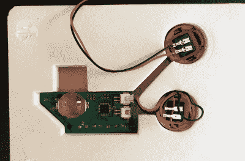
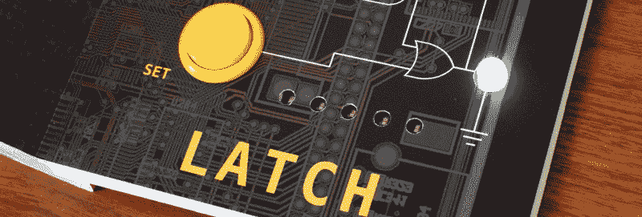

# 一个人寻求用大脑建造一本婴儿书

> 原文：<https://hackaday.com/2021/09/07/one-mans-quest-to-build-a-baby-book-with-brains/>

经常阅读的读者会知道，Hackaday 通常会避开活跃的众筹活动。但是偶尔我们确实会遇到一个非常独特的项目，以至于我们不得不掸掉身上的批准印记。尤其是如果这场运动已经超过了它的资金目标，我们也不必为让你们这些优秀的人对 vaporware 感到兴奋而感到难过。

带着这些警告，我们向你呈现 [*婴儿计算机工程，*【蔡斯·罗伯茨】](https://computerengineeringforbabies.com/)。经过五年的研究和开发，这本书利用内部微控制器来帮助说明布尔逻辑运算的功能，如与、或、异或。这本书面向初学走路的孩子，但适合所有年龄的好奇者，在撰写本文时，这本书已经在 Kickstarter 上超过了 500%的资金目标，没有放缓的迹象。

The electronics as seen from the rear of the book.

为了使事情简单，Kickstarter 页面上的技术细节很少，但当我们联系他时，[Chase]很乐意谈论细节。他解释说，最初的计划是使用谨慎的组件，早期的原型只是简单地将按钮穿过给定页面上指定的门。这是可行的，但并不像他希望的那样是一个健壮的解决方案。因此，最终决定将这本书转移到低功耗 ATmega328PB 微控制器上，并利用 MiniCore 项目，这样这些书就可以用 Arduino IDE 编程。

显然，电池寿命是这个项目的一个主要关注点，因为一本书在书架上放上几个星期后就会死去是绝对不行的。为此，[Chase]说他的代码大量使用了 Arduino 低功耗库。本质上，固件每 15 毫秒唤醒 ATmega 一次，以查看是否按下了按钮或翻页，并相应地更新 LED 状态。如果大约两分钟后没有观察到任何变化，芯片将进入深度睡眠，直到按下黄色按钮触发中断，才会再次唤醒。他说，在一些边缘情况下，这种设置可能会出现问题，但总的来说，这本书应该能够在硬币电池上运行大约一年。

[Chase]告诉我们，最大的问题是找到一种可靠的方法来确定这本书当前翻到哪一页。事实上，他希望继续修补这方面的设计，直到书籍真正上市。目前的解决方案使用五个光电晶体管连接到 MCU 的 ADC 引脚，随着页面越来越少，它们接收的光越来越多。当书的第二页被打开时，第一个传感器被暴露，因此，例如，如果三个传感器看到升高的光水平，代码将假设用户在第四页。

Opening to the last page exposes all five light sensors.

书籍和印刷电路板是分开生产的，因为正如你所料，很难找到一家在这两方面都有经验的公司。[Chase]计划在家庭成员的帮助下，在内部完成每个副本的最后组装和编程；鉴于在竞选初期已经卖出了这么多，我们希望他有很多表亲。

那么，当 Junior 厌倦了 Arduino 兼容的书籍时，你会怎么做呢？这正是我们特别想知道的。[Chase]表示，在 Kickstarter 活动尘埃落定后，他愿意将固件作为开源项目发布，这将为想要推出自己的定制固件的所有者提供一个基础。显然，这本书的外围硬件相当有限，但没有什么能阻止你在 I2C 总线上悬挂一些传感器或劫持未使用的 GPIO 引脚。

如果你最终教你的那本*婴儿计算机工程*一些新的技巧，[我们很乐意听到这些](https://hackaday.com/submit-a-tip/)。

 [https://www.youtube.com/embed/OBTDAtedYPQ?version=3&rel=1&showsearch=0&showinfo=1&iv_load_policy=1&fs=1&hl=en-US&autohide=2&wmode=transparent](https://www.youtube.com/embed/OBTDAtedYPQ?version=3&rel=1&showsearch=0&showinfo=1&iv_load_policy=1&fs=1&hl=en-US&autohide=2&wmode=transparent)

