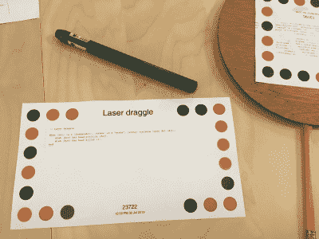

# Dynamicland 让整栋大楼都变成了电脑

> 原文：<https://hackaday.com/2021/09/18/dynamicland-makes-the-whole-building-the-computer/>

每隔一段时间就会有一个研究项目出现，它有可能彻底改变计算，甚至改变与系统交互的方式。这个项目[Dynamicland.org](https://dynamicland.org/)，是[【布雷特·维克多】多年来研究旅程](https://vimeo.com/115154289)的成果，研究人类计算机交互的各个方面，以及它对*像人类一样思考*意味着什么。

One of the overhead projectors tied to a realbox

In Realtalk, paper is your programming medium

Dynamicland 是一个部署在整个建筑中的 [Realtalk](https://harc.ycr.org/project/realtalk/) 生态系统的实例。桌子被用作计算表面，物理对象如纸片、笔记本、任何可以被头顶摄像机读取的东西，成为程序列表，以及用户界面。相机与投影仪相关联，实际硬件连接到所谓的“Realboxes ”,这是运行 Realtalk 软件的 Linux 机器。独立的 Realboxes(以及其他硬件，如[的 Raspberry Pi，运行 Realtalk](https://omar.website/posts/notes-from-dynamicland-programming-raspberry-pis/) )都使用 Realtalk 协议联合在一起，这允许从天花板上的硬件到桌子上的任何硬件，以及其他桌子和计算表面的通信。

Realtalk 本身被描述为创作和使用计算媒体的环境。Realtalk 系统提供了对 [Lua 的语言扩展。这些一起形成了一种](https://en.wikipedia.org/wiki/Lua_(programming_language))[特定领域语言](https://en.wikipedia.org/wiki/Domain-specific_language)。Realtalk 也是一种 *[反应式](https://en.wikipedia.org/wiki/Reactive_programming)数据库*，这意味着重点是数据的流动以及数据生产物和数据消费物之间的联系。关于如何在现代关系数据库中使用反应式编程的更多解释，[查看这篇关于主题](https://spring.io/blog/2018/12/07/reactive-programming-and-relational-databases)的文章。

从编程的角度来看，要想很好地了解这在实践中是如何工作的，请查阅[Omar Rizwan]关于他的[“geo kit”项目](https://omar.website/posts/notes-from-dynamicland-geokit/)的文章。另一个有趣的读物是 T2 的作品。]

Dynamicland 是一个受 Covid 影响的活跃研究项目。显然，整个事情是关于人与人之间的交流，学习和合作，利用建筑来实现计算流程。Covid 关闭了实体建筑，这就是为什么 twitter 帐户看起来有点死气沉沉。我们就项目状态联系了[Bret],他很快回复说，在关闭期间，团队一直在积极实施 Dynamicland 的下一个版本，社区现在正在使用最新版本。他指给我们看项目 501(c)(3)叙述，它描述了项目背后的精神。最后，twitter 项目是查看正在发生的事情的必去之地，因此值得一试。我们将让[Bret]说最后的话:

> 这就是关于[@ dynamic LAN D1](https://twitter.com/Dynamicland1)无法传达的东西
> 
> ——这些推文中看起来像“演示”或“项目”的东西实际上只是在真实的地方与真实的人进行对话、讨论、探索、玩耍、开玩笑、即兴创作时剩下的草稿纸

> 拨入&漂移'[@ dynamic and](https://twitter.com/DynamicLand?ref_src=twsrc%5Etfw)
> (树莓派实录作者 [@rsnous](https://twitter.com/rsnous?ref_src=twsrc%5Etfw) )
> (打开声音)[pic.twitter.com/wbVyvakzHM](https://t.co/wbVyvakzHM)
> 
> —Bret Victor(@ worry dream)[2018 年 6 月 7 日](https://twitter.com/worrydream/status/1004736901062934529?ref_src=twsrc%5Etfw)