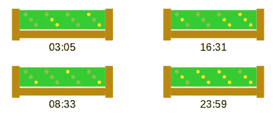

# 时钟:因为看时钟太容易了

> 原文：<https://hackaday.com/2021/09/13/clocktal-for-when-reading-a-clock-is-just-too-easy/>

在 Hackaday.io 上，[danjovic]展示了 [clOCkTAL，这是一款简单的 LED 时钟](https://hackaday.io/project/181418-clocktal),适用于我们这些努力让时间变得简单的人。撇开二进制时钟，你很容易*，让我们谈谈二进制编码的八进制。是的，这是一件事。我们将让[danjovic]来描述如何从中读取时间:*

 *> 不要试图用 6 位来计算。读取该时钟的技巧是读取二进制的每个 3 位数字，并将 msb 乘以 8，然后对 LSB 求和。

简单。如果你足够清醒的话。无论如何，我们是一个大风扇的剥离下来的原始建设方法使用性能板，和废料木材。这里没有隐藏细节。电路非常简单，基于驱动 PIC16F688 所需的最低配置和排列成 3×4 矩阵的几个 led。

一个有趣的细节是使用 [Bresenham 的算法](https://www.romanblack.com/one_sec.htm)来导出跟踪时间所需的每秒一个事件。不，这不是你可能更熟悉的更著名的[布雷森汉姆线算法](https://en.wikipedia.org/wiki/Bresenham%27s_line_algorithm)，它简单得多，但工作原理与用增量误差代替昂贵的算术除法运算相同。Bresenham 最初的算法是为使用 X-Y 绘图仪而设计的，X-Y 绘图仪具有有限的分辨率，旨在允许与该分辨率成不完美比例的运动。它发展成为一种近似直线的方法，然后扩展到包括圆、椭圆和其他类型的可绘制图形。

Bresenham 的算法允许你创建你想要的事件，从*任何*振荡器频率的*任何*周期，这确实非常有用。现在显然你不会不劳而获，缺点是周期性抖动，但至少是确定性的。它的工作方式是在两个 2 的幂分频比之间交替计算周期(或者很容易从中产生的东西)，这样平均周期就是你想要的。周期与周期之间存在误差，但总的来说，这些误差不会累积，我们可以获得所需的平均周期。[罗曼·布莱克]描述中给出的例子是交替 16 个周期和 24 个周期，得到 20 个周期的平均值。

软件方面的东西可以通过前往 [clOCkTAL GitHub](https://github.com/Danjovic/clOCkTAL) 进行检查，它利用了[小型设备 C 编译器](http://sdcc.sourceforge.net/)，该编译器支持相当多的设备，如果亲爱的读者，你还没有遇到它。

视频显示时钟正在接受一个简单的测试，演示 LED 根据环境光进行调光。总而言之，这是一个非常简单而有效的构建。

 [https://www.youtube.com/embed/9L4YnC_nUW0?version=3&rel=1&showsearch=0&showinfo=1&iv_load_policy=1&fs=1&hl=en-US&autohide=2&wmode=transparent](https://www.youtube.com/embed/9L4YnC_nUW0?version=3&rel=1&showsearch=0&showinfo=1&iv_load_policy=1&fs=1&hl=en-US&autohide=2&wmode=transparent)

*