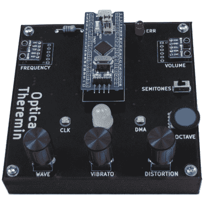

# 光学特雷门琴用很少的部件制造怪异的音频

> 原文：<https://hackaday.com/2021/09/19/optical-theremin-makes-eerie-audio-with-few-parts/>

【无畏之夜】的[光学特雷门项目](https://www.fearlessnight.com/optical_theramin/index.html)利用了高度集成的部件，现代黑客和爱好者可以通过所有正确的方式获得这些部件。其结果是一个带有软件的紧凑仪器，可以使用 Arduino IDE 进行修改，以将它带到最初的 [Theremin](https://hackaday.com/2020/10/30/the-theremin-is-100-years-old-celebrating-the-spookiest-of-instruments/) 设计永远无法到达的地方。

该设计基于一个“[蓝色药丸](https://stm32duinoforum.com/forum/wiki_subdomain/index_title_Blue_Pill.html)”STM 32 MCU 开发板和两个 Avago APDS-9960 手势传感器分线板，以及一些其他支持组件。最初的特雷门琴使用两个类似天线的电容传感器来控制音符频率和音量，这种设计依靠两个光学传感器来完成相同的工作。

[无畏之夜]提供原理图、代码、零件清单，甚至外壳的 3D 模型的下载。PCB 文件也包括在内，以便于组装，但由于元件数量相当少，有耐心的黑客应该能够轻松地手工焊接。

该项目利用 STM32 的直接数字合成(DDS)功能和一个简单的低通滤波器来创建音频，并有多种方法来微调输出。DDS 是什么？[我们自己的埃利奥特·威廉姆斯从微控制器的音频输出方面解释了这一点](https://hackaday.com/2016/02/12/embed-with-elliot-audio-playback-with-direct-digital-synthesis/)，如果你想要更全面的概述， [Bil Herd 将很乐意告诉你这一切](https://hackaday.com/2014/11/24/direct-digital-synthesis-dds-explained-by-bil-herd/)。