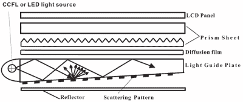

# 驱逐僵尸-b-消失的清晨僵尸化！

> 原文：<https://hackaday.com/2021/09/17/banish-early-morning-zombification-with-the-zom-b-gone/>

[应用拖延]又名[西蒙·e·索伦森]有一个简单的项目来帮助我们这些与清晨僵尸化作斗争的人。通过利用损坏的液晶显示器的背光光学器件，可以在您选择的醒来时间之前创建一个优秀的漫射光源来模拟日光。该理论认为，比闹钟更缓慢地醒来对大脑的冲击更小。增加的光线水平是为了让大脑在被闹钟正确唤醒之前，准备好缓慢增加的光线水平，这让人想起黎明，而不管室外的实际光线水平如何。这对我们这些生活在更北部地区的人来说尤其有用，比如[西蒙]的家乡挪威，那里冬天的早晨非常黑暗。

然而，日光不是纯粹的漫射光源，它取决于大气散射的程度，局部反射等等，但是就我们这里所关心的而言，我们可以尽可能地瞄准漫射光源。

Source: DOI:10.1117/12.797854

该实施利用了现有的 LCD 金属框架、光导面板(通常是一大块丙烯酸树脂，在一侧覆盖有蚀刻标记)、漫射片/增亮片和[棱镜片](https://www.laserfocusworld.com/optics/article/16552684/flatpanel-displays-wavy-prism-sheet-makes-lcds-look-better)。安装在框架边缘的白色 LED 灯带将光导入光导，光导仅在一侧结合了全内反射和散射，有效地将光转过 90 度，并将其均匀地散布在整个表面上。这种光学夹层的结果是平坦、均匀的光，这正是你想要的显示器，也是为了模拟日光。

坐落在预期的 3D 打印框架下的是一个定制的 PCB，通过将 Adafruit DS3231 RTC 模块和 Arduino Nano 的设计融合在一起，一个额外的按钮和旋转编码器完成了极简 UI，并允许该设备在白天兼作通用灯。尽管组装框架时有一些摇晃，还有一些不正确的 PCB 足迹，但整个过程非常完美。这是处理坏了的液晶显示器的一件完美的事情，寻找新的生命，并保持垃圾填埋量最小。

有关硬件和代码的更多细节，请参见 [Zom-b-Gone Github](https://github.com/appliedprocrastination/Zom-B-Gone/) 。

 [https://www.youtube.com/embed/7YvWAb6U9Zk?version=3&rel=1&showsearch=0&showinfo=1&iv_load_policy=1&fs=1&hl=en-US&autohide=2&wmode=transparent](https://www.youtube.com/embed/7YvWAb6U9Zk?version=3&rel=1&showsearch=0&showinfo=1&iv_load_policy=1&fs=1&hl=en-US&autohide=2&wmode=transparent)

