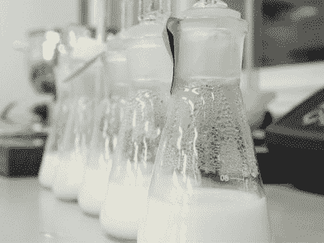
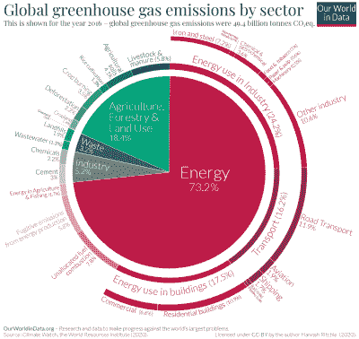

# 他们挤牛奶，不是吗？

> 原文：<https://hackaday.com/2021/10/18/they-milk-cows-dont-they/>

毫无疑问，你已经听说过牛奶的许多替代品。也许你已经尝试了一些来避免乳糖。一些咖啡馆已经放弃了豆奶，只提供燕麦或杏仁牛奶，而不是 2%和全脂牛奶。他们的理由是，豆奶是一种高度加工的产品，无法追溯到单一来源，这与所有那些单一来源的咖啡豆形成鲜明对比。

这些基于坚果的替代品引发了所谓的牛奶战争——乳制品行业反对将基于植物的乳制品替代品贴上“牛奶”等标签的斗争。现在事情变得更有趣了。一家名为 Perfect Day 的公司正在利用分泌乳蛋白的微生物制造牛奶。这听起来可能有点恶心，但它本质上是微生物发酵，这是制作面包、奶酪、酸奶、葡萄酒和啤酒的正常过程。

公平地说，Perfect Day 和其他公司正在做的是在生物反应器中使用基因工程微生物进行精确发酵，所以这比你可能在地下室完成的要复杂一些。精确发酵介于两个现代极端之间——植物性肉类和养殖肉类。后者是从干细胞中生长出来的真正的动物组织，只有在高档餐厅才能以高昂的价格买到。

## 牛奶到底是什么？

Flasks of lab-grown milk. Image via [Perishable News](https://www.perishablenews.com/dairy/lab-grown-dairy-is-the-future-of-milk-researchers-say/)

Perfect Day 生产的是真正的牛奶，这一点毋庸置疑。事实证明，牛奶相对容易制造——它由六种蛋白质，加上一些脂肪、糖和矿物质组成，所有这些都在水悬浮液中。

即便如此，美国和英国对“牛奶”、“奶酪”和“乳制品”都有相当严格的定义。[在美国，FDA 目前对牛奶](https://www.accessdata.fda.gov/scripts/cdrh/cfdocs/cfcfr/CFRSearch.cfm?fr=133.3)的定义是“从一头或多头健康奶牛的完全挤奶中获得的几乎不含初乳的乳汁分泌物，这听起来似乎没有给微生物发酵留下空间。然而，美国食品和药物管理局已经批准了奶酪等的发酵，所以他们的处境有点困难。

在池塘的另一边，事情甚至更加严格，那里植物性的乳制品替代品基本上不受欢迎。2017 年，[欧洲法院裁定](https://eur-lex.europa.eu/legal-content/EN/TXT/?uri=CELEX%3A32013R1308)“牛奶”、“奶酪”、“黄油”等乳制品术语只能用于描述动物产品，而不能用于描述植物产品。2020 年，[第 117 号修正案通过，赞成将两者之间的任何比较都定为非法](https://www.foodingredientsfirst.com/news/amendment-171-34-politicians-protest-plant-based-dairy-censorship-in-european-parliament.html)。

## 杯子是半满的

Image via [Our World in Data](https://ourworldindata.org/emissions-by-sector)

乳制品行业肯定会游说反对实验室培育的牛奶——他们可能已经游说了。但是乳制品行业并没有真正站得住脚。它伴随着各种问题，从过度挤奶到过度繁殖，再到经常拆散奶牛家庭。

此外，乳制品行业排放了 4%的温室气体，比航运和航空业排放的总和还要多。考虑到气候危机，阻碍这方面的进展是完全荒谬的。

实验室制造的牛奶有很多好处。由于精确的发酵，它可以被酿造得比牛奶更健康。未来他们需要从奶牛身上提取干细胞，只需要进行小的组织活检。

没有整头奶牛，就不需要激素或抗生素，牛奶可以不含乳糖，甚至充满健康的脂肪和营养。也就是说，如果公司愿意的话。我当然希望看到这种情况发生，如果是这样，我会用我的钱包投票。