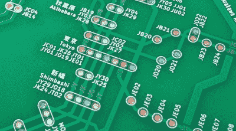

# PCB 地铁地图是一个爱的华丽劳动

> 原文：<https://hackaday.com/2021/09/19/pcb-metro-maps-are-a-gorgeous-labor-of-love/>

你对公共交通的热爱仅仅与你设计定制 PCB 的热情相匹配吗？如果是这样，那么你会爱上这些由柴家洵创作的非凡的交通地图。利用在他的详细文章中概述的精心提炼的原则[，他为东京、新加坡和相对简朴的旧金山湾区创造了版本。你所需要的是为你的家乡创造一个令人难以置信的耐心和奉献。没问题吧？](https://chaijiaxun.com/pcb-metro-map-build-log/)

正如[Xun]解释的那样，创建这些地图的第一部分与生成普通 PCB 没有什么不同。只需为车站画一个脚印，与谷歌地图协商它们应该放在板上的什么地方，然后用轨迹将它们连接起来，代表铁路线。一点丝网印刷的工作，你就完成了。

 嗯……除非你想让它们亮起来，反正。为了实现这一点，[Xun]制作了第二块 PCB，在前一块电路板上钻的每个站孔后面放置一个 LED。通过微控制器和移位寄存器，他能够有选择地照亮单个线路，并运行不同的模式。为了防止光线透过 PCB，两块电路板之间放置了一块 3 mm 的 CNC 切割 MDF，以确保每个 LED 只能通过顶面的相应孔看到。

如果你不介意所有的车站都变成白色的话，你也可以说地图已经完成了。如果你想让它们有不同的颜色，你需要插入一些彩色的扩散器。[Xun]在这里尝试了几种不同的方法，但最终，似乎最有效的方法是简单地将所有彩色点打印在一张透明纸上，然后使用第二张描图纸来柔化光线。这里的校准很关键，但是一旦一切都调整好了，结果会非常令人印象深刻。

这是相当多的工作，我们甚至没有提到这样一个事实，即[Xun]在绘制东京地图时必须修改电路，因为必须将一些 MOSFETs 添加到混合中，以便微控制器能够可靠地控制 350+led。因此，当它们开始销售时，简单地买一个而不是试图从头再来一个当然没有什么丢人的。假设你住在他提供的城市之一。否则，你可能想[看看我们在 KiCad](https://hackaday.io/course/172360-introduction-to-kicad-and-freecad) 上的 HackadayU 课程，给自己找一把舒服的椅子。