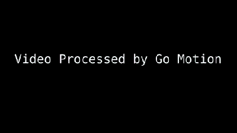

# 通过机器学习掌握停止运动

> 原文：<https://hackaday.com/2021/09/20/mastering-stop-motion-through-machine-learning/>

众所周知，定格动画很难做好，很大程度上是因为这是一个令人麻木的缓慢过程。最终视频中的每一帧都是独立的照片，对于其中的每一帧，角色和道具都需要移动适当的量，这样最终的结果看起来才会平滑。你甚至不想知道龙奔·怀亚特是如何为周二的创作*安魂曲的，尽管公平地说，它仍然可能在下一部*阿凡达*之前完成。*

但是[【Nick Bild】认为他的最新项目可能能够在经典技术](https://github.com/nickbild/go_motion)的基础上，通过 Jetson Xavier NX 提供的少量人工智能进行改进。基本上，杰特森从摄像机观看现场直播，并使用手部姿势检测模型，等待直到画面中没有人手。一旦安全了，它就开一枪，然后继续等待下一次免提机会。由于照片是自动拍摄的，你可以自由地专注于让你的角色以一种令人信服的方式移动。

 如果你还是不点击，看看下面的视频。[Nick]首先展示了未经编辑的原始视频，主要是他移动三个乐高玩具，然后是他的系统制作的最终产品。他摆弄场景的所有图像都被自动修剪了，留下了一个简短的动画剪辑，其中的人物在自己移动。

现在不要被愚弄，这仍然需要一段时间。根据我们的计算，移动迷你图花了整整两分钟才制作出几秒钟的动画。因此，虽然我们可以说这比传统的定格制作快，但肯定没有*快*。

机器学习并不是唯一可以简化定格制作的现代技术。[我们已经看到了一些使用 3D 打印物体](https://hackaday.com/2020/02/05/3d-printed-gifs-for-stop-motion-memes/)代替手动调整图形的例子。它仍然需要很长时间来打印，当然它会消耗掉一吨的灯丝，[但是打印场景的机械精度](https://hackaday.com/2016/09/29/3d-printing-a-stop-motion-animation/)使得最终结果非常干净。

 [https://www.youtube.com/embed/zxzlnXLueIg?version=3&rel=1&showsearch=0&showinfo=1&iv_load_policy=1&fs=1&hl=en-US&autohide=2&wmode=transparent](https://www.youtube.com/embed/zxzlnXLueIg?version=3&rel=1&showsearch=0&showinfo=1&iv_load_policy=1&fs=1&hl=en-US&autohide=2&wmode=transparent)

