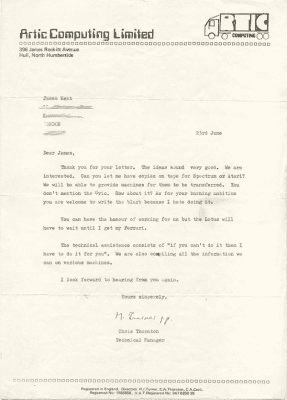

# 如何在 1982 年进入电脑游戏开发

> 原文：<https://hackaday.com/2021/09/26/how-to-get-into-computer-game-development-in-1982/>

如果你是 retrocomputing 的追随者，也许你看过互动版*黑镜*插曲 *Bandersnatch* 在网飞上映。它描绘了一个年轻的英国卧室程序员在 20 世纪 80 年代初进入家用电脑游戏行业，这当然是虚构和戏剧化的，但对于那些对现实生活感兴趣的人来说，主角不会沉迷于超自然的书籍,[最近有一条史诗般的 Twitter 帖子](https://twitter.com/shahidkamal/status/1436771192892018693)描绘了一位行业老手进入该行业的道路。

An acceptance letter like this from Artic Software would have been the wildest dream of any early-80s bedroom coder.

[Shahid Kamal Ahmad] [现在拥有令人印象深刻的投资组合](https://www.mobygames.com/developer/sheet/view/developerId,33707/)，跨越了他在游戏领域近四十年的前沿，但他的故事始于 1982 年，当时他是一名患有糖尿病的英国巴基斯坦少年，来自伦敦的一个非特权背景，在他的 Atari 400 上用 BASIC 语言写作。他的基本游戏很好，但还不足以获得出版商的认可，所以他卖掉了自己珍贵的 BMX 自行车，去买关于 Atari 6502 汇编程序、咖啡渗滤器的书，出于好奇，他还编写了 Z80 的[罗德尼·扎克斯']*。接下来是对 6502 编程和雅达利架构为期三个月的痴迷学习，他的游戏*茶杯里的风暴*卖给了 Artic Software。他是专业游戏开发者。*

我们跟随他经历了另外几个项目，直到他到达利物浦的软件项目，试图出售他的游戏《Haar ne 的面孔》,他获得了出版权，但也获得了一个千载难逢的机会。 *Jet Set Willy* 是 ZX 光谱上的年度红极一时，他们迫切需要一个 Commodore 64 端口。他能在四周内完成吗？如果他能完成三周，还有奖金。随后陷入高压汇编编码和学习两种完全不同的 8 位架构之间的怪癖本身就是一部史诗，但他在三周内勉强做到了这一点，他们还是付给他奖金。他在电脑游戏行业的职业生涯已经结束了。

通过这个故事，20 世纪 80 年代的英国随处可见，远不是一个复古的天堂，而是一个被工业衰落掏空的地方，对于那些处于社会底层的人来说，没有什么值得乐观的。他对偶然的种族主义的描述是有力的，但是学校里的一群沉迷于电脑的朋友可能是那个时代所有对那个方向感兴趣的青少年都能理解的。这个故事的真正英雄可能是他的母亲，她以某种方式找到了 Atari 400 的资源，并为他提供了急需的支持和鼓励。

这条线索抓住了一个独一无二的、永远不会重复的时代，在这个时代，青少年可以掌握一种新兴技术，并以此谋生，而无需昂贵的教育。就像比尔·赫德在同一时期描述他在海军准将的职业生涯一样，这本书非常值得一读。