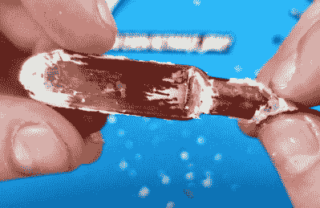

# 探索售后 LED 大灯改装套件

> 原文：<https://hackaday.com/2021/09/23/exploring-an-aftermarket-led-headlight-retrofit-kit/>

有很多关于嵌入式 LED 头灯灯泡的争论，特别是当它们与为卤素灯泡设计的老式反光罩一起使用时。无论你个人是否觉得超高亮的灯很讨厌，甚至很危险，有一点我们都同意，那就是它们显然是一些令人印象深刻的工程的结果。

这就是为什么我们着迷于看到[拆卸【tech chick】GTR 照明](https://www.youtube.com/watch?v=rMtQIENkySA)的“Ultra 2 LED”改造。显然，其中一个二极管出现了故障，作为保修更换过程的一部分，她被告知必须让它完全无法工作。听起来像是梦想成真。如果一个制造商曾经告诉我们，我们需要带着极端的偏见把某样东西拆开，并提供照片证据证明该行为已经完成，我们会非常乐意去做。

 车手本身最终完全被灌封胶填满，所以她没有在那里花太多时间。毫无疑问，有些人会对[TechChick]没有打破小而尖的工具并挖掘出所有的化合物感到恼火，但我们都非常清楚在驱动 led 时会发生什么。真正有趣的是灯泡本身。

与这些高输出汽车 led 一样，Ultra 2 通过一个实际上封装在散热器内的小风扇进行主动冷却。移除风扇和两件式散热器后，她可以接触到 LED 模块本身。这里，两个 PCB 背靠背夹在中间，带有一个从模块后部引出的空心铜室。当[TechChick]切入铜时，她说她听到了嘶嘶声，并认为这是某种液体冷却设备。具体来说，我们认为这是一个蒸汽室，用于将热量从二极管带走，进入模块后部的散热器，这表明了使这些灯泡成为可能的先进技术。

虽然激光头灯可以说是汽车照明的未来，但它还需要一段时间才能普及到我们这些没有超级跑车的人身上。在此之前，当负责任地使用时，这些 LED 改造可以为你的旧搅拌器注入一点尖端技术，而不会倾家荡产。

 [https://www.youtube.com/embed/rMtQIENkySA?version=3&rel=1&showsearch=0&showinfo=1&iv_load_policy=1&fs=1&hl=en-US&autohide=2&wmode=transparent](https://www.youtube.com/embed/rMtQIENkySA?version=3&rel=1&showsearch=0&showinfo=1&iv_load_policy=1&fs=1&hl=en-US&autohide=2&wmode=transparent)

